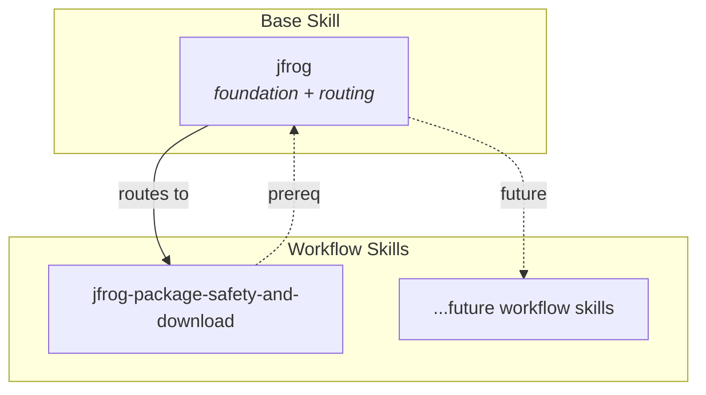
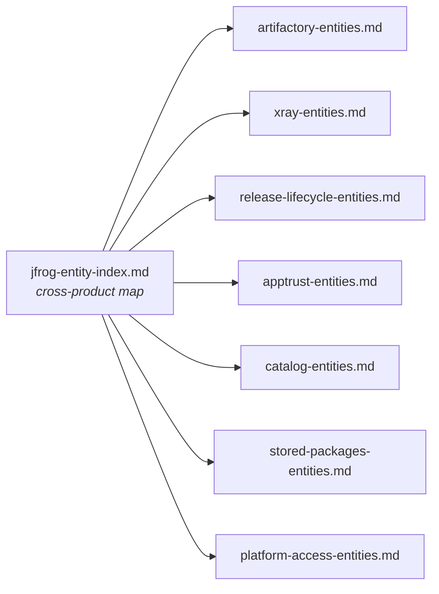

# Skills Architecture

This document describes the architecture of the JFrog skills — how they are organized, how the base `jfrog` skill is structured internally, and how workflow skills extend it.

## Layered skill architecture

Skills live in a **flat directory structure** (`skills/<name>/`) but are logically organized into two layers: one base skill and N workflow skills. Layering is expressed through SKILL.md metadata (`role: base` vs `role: workflow`) and prerequisite declarations, not directory nesting.



**Base skill (`jfrog`)** — the single foundational skill. Covers platform concepts, CLI setup and authentication, REST/GraphQL API patterns, and intent routing to workflow skills. Every other skill declares it as a prerequisite.

**Workflow skills** — domain-specific skills that handle a focused category of operations. Each declares `jfrog` as a prerequisite so the agent loads foundational context first.

**Adding a new skill:** create `skills/jfrog-<name>/SKILL.md` with `metadata.role: workflow` and a `Prerequisites` section pointing to `../jfrog/SKILL.md`. Update the base skill's routing section to reference the new workflow.

---

## Base skill: `jfrog` — internal architecture

The base skill is the largest and most complex component. Its structure is designed for **progressive disclosure**: the agent reads only the sections and reference files relevant to the current task, avoiding unnecessary context loading.

### Entry point: SKILL.md

`skills/jfrog/SKILL.md` is the agent's entry point. It covers:

| Section | Purpose |
|---------|---------|
| **Prerequisites** | Required tools (`jq`) — `jf api` handles all HTTP traffic |
| **Environment check** | Cached CLI detection via `scripts/check-environment.sh` |
| **Network permissions** | `full_network` requirement for all JFrog traffic |
| **Server management** | `jf config` for server CRUD, multi-instance targeting |
| **Command discovery** | CLI namespace table, `--help` patterns, sunset notices |
| **Artifactory operations** | Routing to `references/artifactory-operations.md` (mandatory first read) |
| **Platform administration** | Routing to `references/platform-admin-operations.md` |
| **Invoking platform APIs with `jf api`** | Single unified API entry point covering Artifactory, Xray, Access, Evidence, AppTrust, Distribution, Lifecycle, Curation, and OneModel GraphQL |
| **Structured inputs** | Template workaround via REST GET instead of interactive wizards |
| **Gotchas** | Non-interactive CLI, `jf api` product prefixes and exit-code semantics, build scope, auth errors, NDJSON |
| **Cautious execution** | Confirm-before-mutate, read-first patterns |
| **Batch/parallel execution** | Three-tier parallelism model |
| **Preserving command output** | Temp-file patterns to avoid duplicate network calls |
| **When to read reference files** | Index of all reference files with load conditions |

The final section — "When to read reference files" — acts as a routing table. It maps task categories to specific reference files so the agent loads only what it needs.

### Reference files

The `references/` directory contains markdown files organized into four categories:

#### Domain model (entity definitions and relationships)

These files define what JFrog entities are, their relationships, and their access patterns. The entity index is the starting point for cross-product disambiguation.

| File | Domain |
|------|--------|
| `jfrog-entity-index.md` | Cross-product |
| `artifactory-entities.md` | Artifactory |
| `xray-entities.md` | Xray |
| `release-lifecycle-entities.md` | Release Lifecycle |
| `apptrust-entities.md` | AppTrust |
| `catalog-entities.md` | Catalog |
| `stored-packages-entities.md` | Stored Packages |
| `platform-access-entities.md` | Platform / Access |



#### Operations (CLI commands and API patterns)

These files tell the agent *how* to perform specific operations.

| File | Scope |
|------|-------|
| `artifactory-operations.md` | `jf rt` commands, build scope discovery, AQL workflows (AQL executed via `jf api`) |
| `platform-admin-operations.md` | Tokens, stats, projects, system health |
| `artifactory-aql-syntax.md` | AQL domains, criteria, query construction |
| `projects-api.md` | Access API for JFrog Projects (via `jf api`) |

#### API gaps (REST-only operations)

When the CLI does not cover an operation, these files document the REST API fallback.

| File | Scope |
|------|-------|
| `artifactory-api-gaps.md` | REST-only Artifactory operations |
| `platform-admin-api-gaps.md` | Access/admin REST endpoints |

#### Infrastructure and patterns

Cross-cutting concerns — authentication, credential management, parallelism, bulk operations, and styling.

| File | Purpose |
|------|---------|
| `jfrog-login-flow.md` | Web login security rules, session scripts |
| `jfrog-cli-install-upgrade.md` | Install/upgrade procedures for `jf` |
| `jfrog-url-references.md` | docs.jfrog.com link catalog |
| `jfrog-brand-html-report.md` | HTML report styling |
| `general-parallel-execution.md` | Three-tier parallelism: shell batch, parallel tool calls, subagents |
| `general-bulk-operations-and-agent-patterns.md` | List-vs-detail, N+1, timeouts, NDJSON, concurrency |
| `general-use-case-hints.md` | Living table of edge cases and mitigations |

### Scripts

Helper scripts in `scripts/` handle environment bootstrapping and credential management:

| Script | Purpose | When called |
|--------|---------|-------------|
| `check-environment.sh` | Verifies `jf` CLI is installed and current; caches result for 24h | First JFrog operation in a session |
| `jfrog-login-register-session.sh` | Registers a browser login session; outputs `SESSION_UUID` and `VERIFY_CODE` | Adding a new server via web login |
| `jfrog-login-save-credentials.sh` | Retrieves token from completed login session and runs `jf config add`; verifies with `jf api /artifactory/api/system/version` | Completing a web login flow |

### Local cache

`local-cache/` (gitignored) is **only** for:

- **`jfrog-skill-state.json`** — output of `check-environment.sh`
- **`onemodel-schema-<server-id>.graphql`** — cached OneModel supergraph per configured CLI server

Agents must **not** store HTTP responses, GraphQL results, or other scratch files there; use `/tmp` (or `mktemp`) per the base skill's SKILL.md.

---

## REST API invocation — unified through `jf api`

The base skill routes **all** JFrog HTTP API traffic through the single
`jf api` command. This replaces the previous three-tier model (`jf rt curl`
/ `jf xr curl` / plain `curl` + credential extraction) and gives the agent
one authentication mechanism, one invocation pattern, and one exit-code
contract across every JFrog product.

```
┌─────────────────────────────────────────────────────────────┐
│  jf api /<product>/api/...                                  │
│                                                             │
│  Product prefix decides the target service:                 │
│    /artifactory/api/...   — Artifactory                     │
│    /xray/api/...          — Xray + Curation                 │
│    /access/api/...        — Access, users, projects, tokens │
│    /evidence/api/...      — Evidence                        │
│    /apptrust/api/...      — AppTrust                        │
│    /distribution/api/...  — Distribution                    │
│    /lifecycle/api/...     — Release Lifecycle               │
│    /onemodel/api/v1/graphql — OneModel GraphQL              │
│                                                             │
│  Authentication: the active `jf config` server (or          │
│  --server-id=<id>). No token extraction, no Authorization   │
│  headers, no JFROG_ACCESS_TOKEN env var.                    │
└─────────────────────────────────────────────────────────────┘
```

Binary artifact content (downloads, uploads) still goes through the native
CLI commands — `jf rt dl`, `jf rt u`, `jf rt cp`, etc. — which are
**kept** because they are not thin HTTP wrappers; they implement
multipart, checksum, and redirect-follow behaviour `jf api` does not.

---

## Progressive disclosure model

The skill is designed so agents load context incrementally rather than reading everything upfront:

```
Agent receives user request
    │
    ├─ Read SKILL.md (always — entry point)
    │
    ├─ Run check-environment.sh (first operation only)
    │
    ├─ Match task to "When to read reference files" index
    │   │
    │   ├─ Entity disambiguation? → jfrog-entity-index.md → domain file
    │   ├─ Artifactory operation? → artifactory-operations.md (mandatory)
    │   ├─ AQL query?            → artifactory-aql-syntax.md
    │   ├─ Platform admin?       → platform-admin-operations.md
    │   ├─ API gap?              → artifactory-api-gaps.md / platform-admin-api-gaps.md
    │   ├─ Login needed?         → jfrog-login-flow.md
    │   ├─ Bulk/parallel?        → general-parallel-execution.md
    │   └─ ... (2-3 files max per operation)
    │
    └─ Execute operation
```

This keeps the agent's context window focused. Most operations require reading SKILL.md plus 1–3 reference files.
