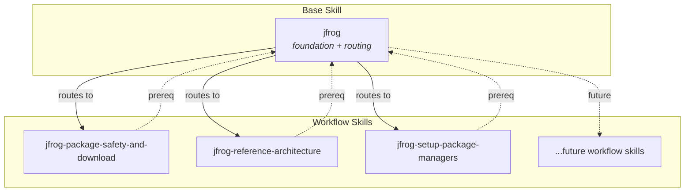
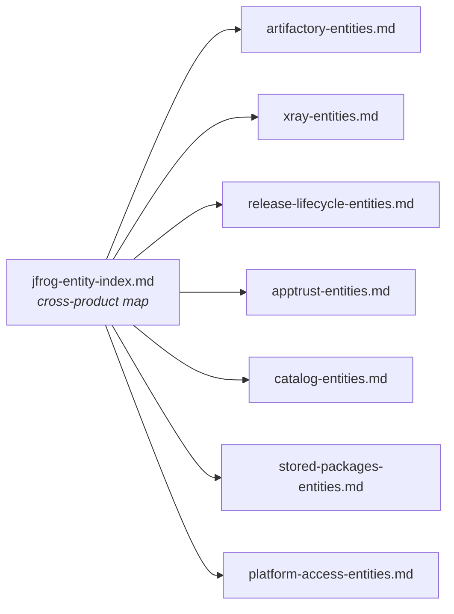

# Skills Architecture

This document describes the architecture of the JFrog skills — how they are organized, how the base `jfrog` skill is structured internally, and how workflow skills extend it.

## Layered skill architecture

Skills live in a **flat directory structure** (`skills/<name>/`) but are logically organized into two layers: one base skill and N workflow skills. Layering is expressed through SKILL.md metadata (`role: base` vs `role: workflow`) and prerequisite declarations, not directory nesting.


```mermaid
flowchart TD
    subgraph base ["Base Skill"]
        JF["jfrog<br/><i>foundation + routing</i>"]
    end

    subgraph workflows ["Workflow Skills"]
        PS["jfrog-package-safety-and-download"]
        RA["jfrog-reference-architecture"]
        SPM["jfrog-setup-package-managers"]
        Future["...future workflow skills"]
    end

    JF -->|"routes to"| PS
    JF -->|"routes to"| RA
    JF -->|"routes to"| SPM
    JF -.->|"future"| Future
    PS -.->|"prereq"| JF
    RA -.->|"prereq"| JF
    SPM -.->|"prereq"| JF
```

**Base skill (`jfrog`)** — the single foundational skill. Covers platform concepts, CLI setup and authentication, REST/GraphQL API patterns, and intent routing to workflow skills. Every other skill declares it as a prerequisite.

**Workflow skills** — domain-specific skills that handle a focused category of operations. Each declares `jfrog` as a prerequisite so the agent loads foundational context first.

**Adding a new skill:** create `skills/jfrog-<name>/SKILL.md` with `metadata.role: workflow` and a `Prerequisites` section pointing to `../jfrog/SKILL.md`. Update the base skill's routing section to reference the new workflow.

### Workflow skill: `jfrog-reference-architecture`

Planning skill for topology, sizing (RPM / t-shirt templates), deployment patterns, and documented use cases. It does **not** duplicate reference-architecture content in the repo.

**Content access:** agents `WebFetch` [llms-full.txt](https://jfrog.com/reference-architecture/llms-full.txt) at session start (~120 KB today), parse sections by `URL:` headers, and cite those HTML links. Fallbacks: [llms.txt](https://jfrog.com/reference-architecture/llms.txt), [sitemap.xml](https://jfrog.com/reference-architecture/sitemap.xml), per-page `index.md`. Size governance and the fetch ladder live in `skills/jfrog-reference-architecture/references/doc-access.md`.

**Deployment policy:** prefer Kubernetes and the [jfrog-platform](https://github.com/jfrog/charts/tree/master/stable/jfrog-platform) Helm chart even for Artifactory-only installs.

No `jf` CLI is required for planning-only questions.

### Workflow skill: `jfrog-setup-package-managers`

Binds local package managers (npm, pip, maven, gradle, go, docker, helm, nuget, …) to Artifactory repositories via `jf setup`, then records the decision in the workspace binding file `.jfrog/local/package-resolution.json`. It does not discover repos on its own — it uses the repo keys resolved by the Package Resolution session hook. Reference details live in `skills/jfrog-setup-package-managers/references/`.

---

## Base skill: `jfrog` — internal architecture

The base skill is the largest and most complex component. Its structure is designed for **progressive disclosure**: the agent reads only the sections and reference files relevant to the current task, avoiding unnecessary context loading.

### Entry point: SKILL.md

`skills/jfrog/SKILL.md` is the agent's entry point. The sections below appear in source order; the file is deliberately ordered for **chunked-read robustness**, so the safety-critical and routing sections (`Cautious execution`, `Server selection rules`, `When to read reference files`) appear early enough to land in the first chunk an agent reads.

| Section | Purpose |
|---------|---------|
| **Prerequisites** | Required tools (`jq`); per-runtime network and filesystem permission table (Cursor / Claude Code / Other) — replaces the old standalone "Network permissions" section |
| **Tool selection strategy** | Three-tier routing: JFrog MCP tools (preferred), `jf` CLI commands (fallback), `jf api` (last resort). Defines when to move to the next tier and how to handle cross-tier permission errors |
| **Environment check** | Cached CLI detection via `scripts/check-environment.sh <model-slug>`; script prints the user-agent value on stdout following RFC 7231 product/comment grammar — `jfrog-skills/<v> [(tool=<harness>; model=<slug>; ...)] jfrog-cli-go/<v>` — where the parens carry semicolon-separated `key=value` annotations (harness auto-detected from env signals like `CLAUDECODE` / `CURSOR_AGENT` / `GEMINI_CLI`, naming aligned with the JFrog CLI's `DetectExecutionContext()`; whole parens block omitted when there's nothing to annotate) for the agent to remember and `export JFROG_CLI_USER_AGENT='<value>'` once at the top of every bash invocation that runs `jf` (covers any number of `jf` calls in that invocation; works in runtimes that do not persist shell state across tool invocations); exit-code contract (MCP Tier 1 can proceed without this check; exit 2/3 means CLI tiers are unavailable) |
| **`~/.jfrog/skills-cache/` — allowed files only** | Restricts the cache to two artifacts; routes everything else to `/tmp` |
| **Cautious execution** | Confirm-before-mutate (all tiers), ask-on-ambiguity, never invent preparatory mutations, never guess tool names or API paths (anti-hallucination rule) |
| **Server selection rules (mandatory)** | Single-server resolution; `awk` one-liner for the default server; no silent fallback; MCP/CLI auth independence warning; standard error-response template |
| **When to read reference files** | Domain-organized routing index that maps task categories to specific reference files; includes JFrog MCP tool suggestions before CLI/API fallback guidance |
| **Command discovery** | CLI namespace table, `--help` patterns, sunset notices |
| **Invoking platform APIs with `jf api`** | Tier 3 entry point for JFrog Platform REST and GraphQL endpoints, auto-authenticated against the resolved server |
| **Structured inputs** | Template workaround via REST GET instead of interactive wizards |
| **Gotchas** | MCP structured-data handling; non-interactive CLI; `jf api` product prefixes and exit-code semantics; build scope; auth errors; NDJSON |
| **Batch and parallel execution** | Three-tier parallelism model |
| **Preserving command output** | Temp-file patterns to avoid duplicate network calls |

### Reference files

The `references/` directory contains markdown files organized into five categories:

#### Domain model (entity definitions and relationships)

These files define what JFrog entities are, their relationships, and their access patterns. The entity index is the starting point for cross-product disambiguation.

| File | Domain |
|------|--------|
| `jfrog-entity-index.md` | Cross-product |
| `artifactory-entities.md` | Artifactory |
| `xray-entities.md` | Xray |
| `release-lifecycle-entities.md` | Release Lifecycle |
| `apptrust-entities.md` | AppTrust |
| `catalog-entities.md` | Catalog |
| `stored-packages-entities.md` | Stored Packages |
| `platform-access-entities.md` | Platform / Access |


```mermaid
flowchart LR
    Index["jfrog-entity-index.md<br/><i>cross-product map</i>"]

    Index --> ArtE["artifactory-entities.md"]
    Index --> XrayE["xray-entities.md"]
    Index --> RLE["release-lifecycle-entities.md"]
    Index --> AppE["apptrust-entities.md"]
    Index --> CatE["catalog-entities.md"]
    Index --> SPE["stored-packages-entities.md"]
    Index --> PlatE["platform-access-entities.md"]
```

#### Operations (CLI commands and API patterns)

These files tell the agent *how* to perform specific operations.

| File | Scope |
|------|-------|
| `artifactory-operations.md` | `jf rt` commands, build scope discovery, AQL workflows (AQL executed via `jf api`) |
| `platform-admin-operations.md` | Tokens, stats, projects, system health |
| `artifactory-aql-syntax.md` | AQL domains, criteria, query construction |
| `projects-api.md` | Access API for JFrog Projects (via `jf api`) |

#### OneModel (GraphQL)

The OneModel GraphQL API has its own family of references because the query
surface, schema cache, and pagination model differ from the REST endpoints
above. The schema is cached per-server under `~/.jfrog/skills-cache/onemodel-schema-<server-id>.graphql`.

| File | Scope |
|------|-------|
| `onemodel-graphql.md` | GraphQL endpoint overview, schema-discovery flow, query catalog |
| `onemodel-query-examples.md` | Domain-specific query templates (applications, packages, evidence, release bundles, catalog, public security / CVE lookups) |
| `onemodel-common-patterns.md` | Pagination, filtering, GraphQL variables, date formatting |

#### API gaps (REST-only operations)

When the CLI does not cover an operation, these files document the REST API fallback.

| File | Scope |
|------|-------|
| `artifactory-api-gaps.md` | REST-only Artifactory operations |
| `platform-admin-api-gaps.md` | Access/admin REST endpoints |

#### Infrastructure and patterns

Cross-cutting concerns — authentication, credential management, parallelism, bulk operations, and styling.

| File | Purpose |
|------|---------|
| `jfrog-login-flow.md` | Web login security rules, session scripts |
| `jfrog-cli-install-upgrade.md` | Install/upgrade procedures for `jf` |
| `jfrog-url-references.md` | docs.jfrog.com link catalog |
| `jfrog-brand-html-report.md` | HTML report styling |
| `general-parallel-execution.md` | Three-tier parallelism: shell batch, parallel tool calls, subagents |
| `general-bulk-operations-and-agent-patterns.md` | List-vs-detail, N+1, timeouts, NDJSON, concurrency |
| `general-use-case-hints.md` | Living table of edge cases and mitigations |

### Scripts

Helper scripts in `scripts/` handle environment bootstrapping and credential management:

| Script | Purpose | When called |
|--------|---------|-------------|
| `check-environment.sh` | Verifies `jf` CLI is installed and current; caches result for 24h | First JFrog operation in a session |
| `jfrog-login-register-session.sh` | Registers a browser login session; outputs `SESSION_UUID` and `VERIFY_CODE` | Adding a new server via web login |
| `jfrog-login-save-credentials.sh` | Retrieves token from completed login session and runs `jf config add`; verifies with `jf api /artifactory/api/system/version` | Completing a web login flow |

### Skill cache (`~/.jfrog/skills-cache/`)

The runtime cache lives outside the installed skill tree, at
`${JFROG_CLI_HOME_DIR:-$HOME/.jfrog}/skills-cache/` — co-located with
`jf config`. This keeps the skill itself read-only-installable. The directory
holds **only**:

- **`jfrog-skill-state.json`** — output of `check-environment.sh`
- **`onemodel-schema-<server-id>.graphql`** — cached OneModel supergraph per configured CLI server

Agents must **not** store HTTP responses, GraphQL results, or other scratch files there; use `/tmp` (or `mktemp`) per the base skill's SKILL.md.

---

## Tool selection: JFrog MCP, CLI, `jf api`

The base skill uses a three-tier tool selection strategy. **JFrog MCP** tools
are the preferred tier when available. When a JFrog MCP tool does not exist
for the operation or fails, the agent falls back to dedicated `jf` CLI
subcommands. When neither covers the operation, `jf api` is the last resort. `jf api` replaces the previous `jf rt curl` / `jf xr curl` /
plain `curl` model and gives the agent one authentication mechanism, one
invocation pattern, and one exit-code contract across every JFrog product.

```
┌─────────────────────────────────────────────────────────────┐
│  jf api /<product>/api/...                                  │
│                                                             │
│  Product prefix decides the target service:                 │
│    /artifactory/api/...   — Artifactory                     │
│    /xray/api/...          — Xray + Curation                 │
│    /access/api/...        — Access, users, projects, tokens │
│    /evidence/api/...      — Evidence                        │
│    /apptrust/api/...      — AppTrust                        │
│    /distribution/api/...  — Distribution                    │
│    /lifecycle/api/...     — Release Lifecycle               │
│    /onemodel/api/v1/graphql — OneModel GraphQL              │
│                                                             │
│  Authentication: the active `jf config` server (or          │
│  --server-id=<id>). No token extraction, no Authorization   │
│  headers, no JFROG_ACCESS_TOKEN env var.                    │
└─────────────────────────────────────────────────────────────┘
```

Binary artifact content (downloads, uploads) still goes through the native
CLI commands — `jf rt dl`, `jf rt u`, `jf rt cp`, etc. — which are
**kept** because they are not thin HTTP wrappers; they implement
multipart, checksum, and redirect-follow behaviour `jf api` does not.

---

## Progressive disclosure model

The skill is designed so agents load context incrementally rather than reading everything upfront:

```
Agent receives user request
    │
    ├─ Read SKILL.md (always — entry point)
    │
    ├─ Try JFrog MCP tool (Tier 1 — no env check needed)
    │   └─ If a JFrog MCP tool exists and succeeds → done
    │
    ├─ Run check-environment.sh (first CLI/API operation only)
    │
    ├─ Match task to "When to read reference files" index
    │   │
    │   ├─ Entity disambiguation? → jfrog-entity-index.md → domain file
    │   ├─ Artifactory operation? → artifactory-operations.md
    │   ├─ AQL query?            → artifactory-aql-syntax.md
    │   ├─ Platform admin?       → platform-admin-operations.md
    │   ├─ OneModel GraphQL?     → onemodel-graphql.md (+ ...)
    │   ├─ API gap?              → artifactory-api-gaps.md / platform-admin-api-gaps.md
    │   ├─ Login needed?         → jfrog-login-flow.md
    │   ├─ Bulk/parallel?        → general-parallel-execution.md
    │   └─ ... (2-3 files max per operation)
    │
    └─ Execute via CLI (Tier 2) or jf api (Tier 3)
```

This keeps the agent's context window focused. Most operations require reading SKILL.md plus 1–3 reference files.
