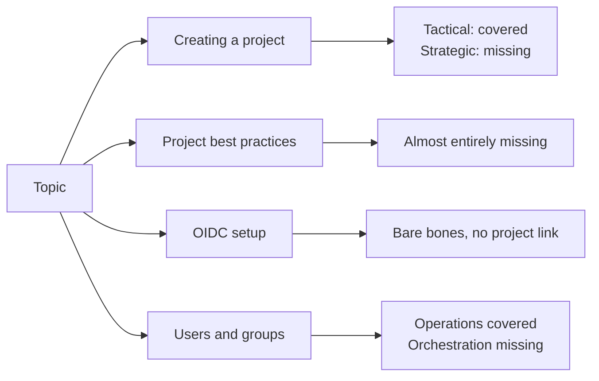
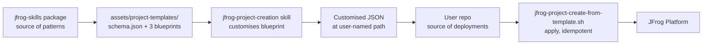
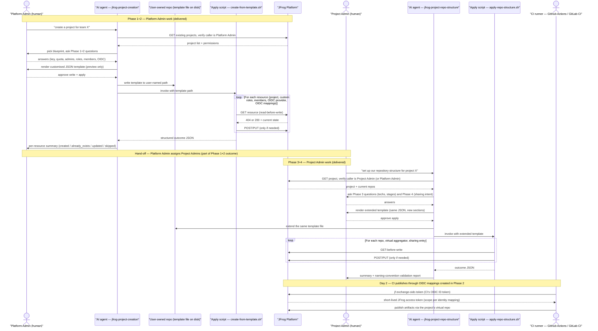
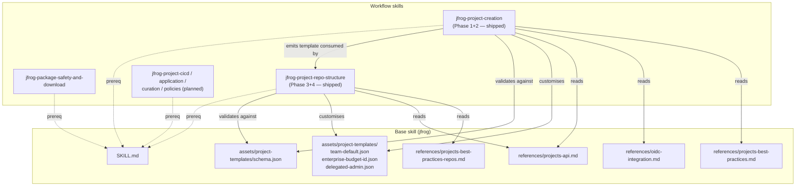
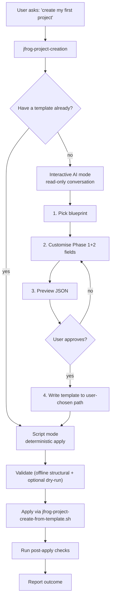
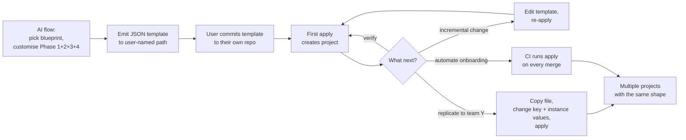
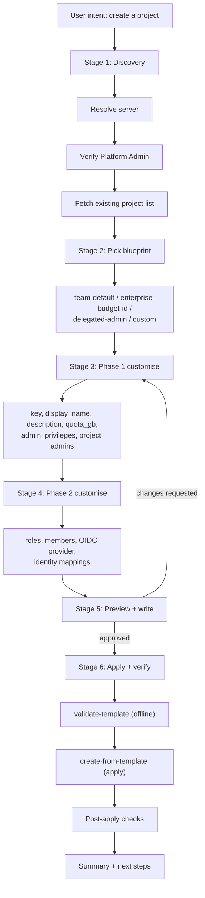
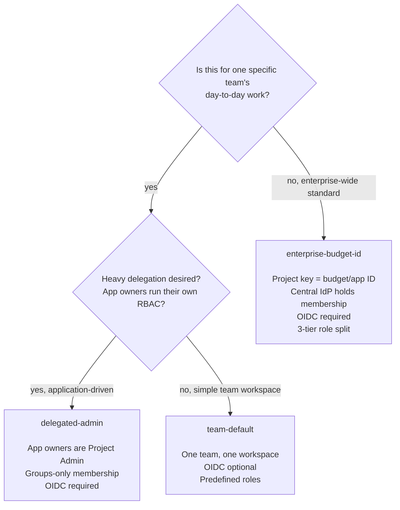
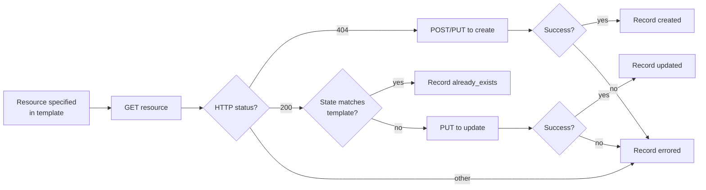
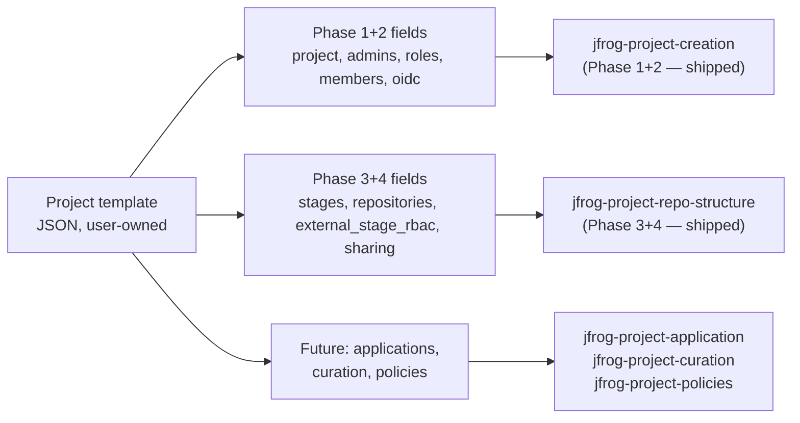

> **Status: review preview, not for merge.** This design doc lives on a stakeholder-review branch and is not intended to ship as-is.

# JFrog Project Skills — Design and Implementation

A standalone summary of the discovery work against the public
[`jfrog/jfrog-skills`](https://github.com/jfrog/jfrog-skills) repository,
the resulting design, and the Phase 1+2+3+4 implementation across two
stacked workflow skills (`jfrog-project-creation` and
`jfrog-project-repo-structure`). Published on a stakeholder-review
branch alongside the proposed skill changes so reviewers can read code
and design context in one place.

## Executive summary

### Why now

JFrog Skills today gives AI agents a strong foundation for package
safety and platform interaction, but provides **no opinionated path
for setting up a JFrog Project**. Customers fall back to free-form
chats with the agent, which produces inconsistent project shapes
across teams: drifted naming conventions, ad-hoc role definitions,
manually wired OIDC, no audit trail. Onboarding a new team takes days
of repeated platform-admin attention; replicating the same shape
across many teams is a manual copy-and-pray exercise.

### Approach

Two stacked workflow skills work against a single JSON template the
customer owns and version-controls. **`jfrog-project-creation`**
(Phases 1+2) runs an interactive AI flow with the Platform Admin to
customise one of three shipped **blueprints** (team-default,
enterprise-budget-id, delegated-admin) into a template that captures
the project key, quota, admin privileges, custom roles, group-based
membership, and OIDC provider plus identity mappings for CI.
**`jfrog-project-repo-structure`** (Phases 3+4) extends the same
template with SDLC stages, the four-part repository naming
convention, virtual aggregators with explicit resolution order,
External-stage RBAC, and cross-project sharing (push or pull).
Deterministic, idempotent shell scripts then apply each phase to the
JFrog server. The same template can be re-run for verification,
copied and edited to onboard the next team, or invoked from CI for
fully automated provisioning.

The implementation is intentionally **opinionated** (best-practices
by default), **deterministic** (scripts apply the result idempotently),
and **safe** (read-before-write per resource; the AI never mutates
the JFrog server outside the script).

### What ships now

- **Doctrine references** — `projects-best-practices.md`,
  `projects-best-practices-repos.md`, and `oidc-integration.md`.
- **Three template blueprints** — covering single-team projects,
  central IdP-managed enterprise projects keyed by budget ID, and
  delegated-admin (application-owner) projects, all conforming to a
  draft-07 JSON schema. Each carries archetype-sized Phase 1+2 and
  Phase 3+4 sections.
- **Two stacked workflow skills** —
  `jfrog-project-creation` (Phases 1+2, Platform-Admin persona) and
  `jfrog-project-repo-structure` (Phases 3+4, Project-Admin persona).
  Both follow the same two-mode design (interactive customisation
  vs. deterministic apply), share the same template format, and use
  the same idempotency contract.
- **Four scripts** —
  `jfrog-project-create-from-template.sh` and
  `jfrog-project-validate-template.sh` (Phase 1+2);
  `jfrog-project-apply-repo-structure.sh` and
  `jfrog-project-validate-repo-structure.sh` (Phase 3+4).

### What comes next

- **`jfrog-project-cicd`** — pipeline templates and OIDC handshake
  wiring that consumes the `oidc` block of the template.
- **`jfrog-project-application`** — AppTrust application creation and
  version linking against an existing project.
- **`jfrog-project-curation`** — curation indexing, policy creation,
  and dry-run analysis on the External stage.
- **`jfrog-project-policies`** — unified gates and lifecycle policies
  on top of the repo structure.

### Outcome

- Onboarding a project shifts from a multi-day, free-form chat to a
  reviewable JSON file plus a one-command apply.
- Replicating the same project shape across N teams becomes a
  copy-and-edit operation, not a fresh design conversation.
- Templates can be committed to the customer's own repository, giving
  a full audit trail of who provisioned what and when.
- CI pipelines can self-onboard their own projects against the same
  template with no platform-admin intervention.

## Table of contents

- [Executive summary](#executive-summary)
- [Source documents driving the design](#source-documents-driving-the-design)
- [Discovery findings](#discovery-findings)
  - [1. Creating a project — covered tactically, not strategically](#1-creating-a-project--covered-tactically-not-strategically)
  - [2. Project best practices — almost entirely missing](#2-project-best-practices--almost-entirely-missing)
  - [3. OIDC setup — minimal and disconnected from projects](#3-oidc-setup--minimal-and-disconnected-from-projects)
  - [4. Adding users and groups — operations covered, orchestration missing](#4-adding-users-and-groups--operations-covered-orchestration-missing)
  - [Cross-cutting Q&A coverage gaps](#cross-cutting-qa-coverage-gaps)
  - [Discovery summary](#discovery-summary)
- [Design decisions](#design-decisions)
  - [Decision A — Phase 1+2 are bundled into one skill](#decision-a--phase-12-are-bundled-into-one-skill)
  - [Decision B — Template authority: ship blueprints, user owns the output](#decision-b--template-authority-ship-blueprints-user-owns-the-output)
- [Master end-to-end flow (who does what)](#master-end-to-end-flow-who-does-what)
- [Layered architecture](#layered-architecture)
- [Two-mode design](#two-mode-design)
- [Template lifecycle: from design to repeated use](#template-lifecycle-from-design-to-repeated-use)
- [Phase 1+2 conversation flow](#phase-12-conversation-flow)
- [Three blueprints — when to use each](#three-blueprints--when-to-use-each)
- [Idempotency: per-resource state machine](#idempotency-per-resource-state-machine)
- [Phase 1+2 implementation details](#phase-12-implementation-details)
- [Phase 3+4 implementation details](#phase-34-implementation-details)
- [How each gap is addressed](#how-each-gap-is-addressed)
- [Mapping to the seven-skill roadmap](#mapping-to-the-seven-skill-roadmap)
- [Open questions to resolve with reviewers](#open-questions-to-resolve-with-reviewers)
- [How to share with reviewers](#how-to-share-with-reviewers)
- [Verification performed locally](#verification-performed-locally)
- [Where to read more](#where-to-read-more)

## Source documents driving the design

- [Get Started with Projects](https://docs.jfrog.com/projects/docs/projects)
- [Projects Best Practices](https://docs.jfrog.com/projects/docs/projects-best-practices)
- [Projects Setup Best Practices](https://docs.jfrog.com/projects/docs/projects-setup-best-practices)
- [Create a Project](https://docs.jfrog.com/projects/docs/create-a-project)
- [Project Roles and Members Concepts](https://docs.jfrog.com/projects/docs/project-roles-and-members-concepts)
- [Sharing repositories between projects](https://docs.jfrog.com/projects/docs/sharing-repositories-between-projects)
- [OpenID Connect Integration](https://docs.jfrog.com/administration/docs/openid-connect-integration)
- The existing skill repo's `ARCHITECTURE.md`, `CONTRIBUTING.md`, base
  `SKILL.md`, and `references/` directory.

## Discovery findings

Four topic areas, scored as "covered well", "covered partially", or
"missing", with concrete evidence.

### 1. Creating a project — covered tactically, not strategically

- **What's there.** [`references/projects-api.md`](https://github.com/jfrog/jfrog-skills/blob/main/skills/jfrog/references/projects-api.md)
  has the full endpoint set (CRUD, members, roles, environments, repo
  assignment), error codes, and `project_key` rules.
  [`references/platform-access-entities.md`](https://github.com/jfrog/jfrog-skills/blob/main/skills/jfrog/references/platform-access-entities.md)
  has the entity model with an ER diagram and two anti-pitfall rules.
- **Quality.** Strong as endpoint reference. Each call has payload, auth
  note, and error codes.
- **Gaps.**
  - No procedural orchestration of the four-tab official creation flow
    (Configure → Admins → Repositories → Destinations).
  - No best-practice opinionation: "Team = Project" model, key
    conventions, storage-quota semantics.
  - Distribution targets / Edge nodes never mentioned in project context.
  - The `project_key` rule was incomplete: the skill said "lowercase
    alphanumeric, hyphens"; the official UI doc adds **must start with a
    letter**.

### 2. Project best practices — almost entirely missing

- **What's there.** Two narrow agent rules in
  `platform-access-entities.md` (don't infer `projectKey` from repo name;
  fetch roles per project). That's it.
- **Quality.** N/A — content category does not really exist.
- **Gaps.** All four phases of the
  [Setup Best Practices](https://docs.jfrog.com/projects/docs/projects-setup-best-practices)
  are absent:
  - Phase 1 — Project entity (scope, key conventions, quota).
  - Phase 2 — Identity and access (RBAC by stage, group-first, OIDC).
  - Phase 3 — Repository scoping (4-part naming, virtual aggregator,
    External stage).
  - Phase 4 — Collaboration (push vs pull sharing, read-only consumer).
  The three customer archetypes (mapped-by-budget-ID, delegated-admin,
  zero-touch onboarding) are also unrepresented.

### 3. OIDC setup — minimal and disconnected from projects

- **What's there.** Two endpoints in
  [`references/platform-admin-api-gaps.md`](https://github.com/jfrog/jfrog-skills/blob/main/skills/jfrog/references/platform-admin-api-gaps.md)
  §OIDC (list, create generic provider). `exchange-oidc-token` is listed
  as a top-level CLI command in `SKILL.md` but documented nowhere.
- **Quality.** Bare bones. Cannot get a user to a working CI integration
  from this content.
- **Gaps.**
  - **Identity mappings** — *the* mechanism that binds an OIDC claim
    (e.g., GitHub repo + branch) to a project role. Completely absent.
  - Provider-type templates for GitHub Actions, GitLab CI, Azure.
  - Claim mapping cookbook for common CI systems.
  - End-to-end `exchange-oidc-token` workflow.
  - The conceptual link between Phase 2 of best practices and OIDC.

### 4. Adding users and groups — operations covered, orchestration missing

- **What's there.** Full user/group CRUD in `platform-admin-api-gaps.md`,
  group CLI in `artifactory-operations.md`, project membership in
  `projects-api.md`, SCIM list endpoint, group fields in entity reference.
- **Quality.** Good at the endpoint level.
- **Gaps.**
  - No bulk onboarding flow.
  - "Prefer groups over users" doctrine is not stated anywhere.
  - SAML/LDAP/SCIM provisioning has no setup workflow.
  - No project-token-strategy guidance (when to use a project-scoped
    token vs an OIDC-issued token).

### Cross-cutting Q&A coverage gaps

- No reasoning content for "given my org, how should I structure
  projects?"
- No template/blueprint pattern, despite the docs explicitly calling out
  "automated self-service" and "zero-touch onboarding" as customer goals.
- No project verification helpers — "after I create it, what do I
  check?".

### Discovery summary



## Design decisions

Two key choices made before implementation, recorded here for review.

### Decision A — Phase 1+2 are bundled into one skill

The seven-skill roadmap separates "Project creation" and "Project
identity and access configuration". This implementation **collapses
Phase 1+2 into a single workflow skill** because they are both Platform-
Admin work performed at first project setup. Splitting them creates an
artificial seam (the agent has to switch skills mid-conversation just to
add OIDC).

The standalone "Project identity and access" skill — if still desired —
naturally becomes the *post-creation* identity skill: rotate OIDC, add a
second IdP, manage more groups later. **This is flagged for review
before merging.**

### Decision B — Template authority: ship blueprints, user owns the output

Two alternatives considered:

- **A.** AI emits a JSON template; the user owns and version-controls it.
  No blueprints in the package.
- **B.** Skills package ships canonical blueprints; AI customises one;
  customised output is written to the user's repo.

Picked **B with the output path of A**. The package ships three
blueprints; the AI helps the user pick and customise one; the customised
result is written to a path the user names (typically inside their own
repo). From that moment, the user owns the file — they version it, PR-
review it, run the apply script from CI.

This delivers best-practices-by-default while keeping the user-owned
deployment boundary clean.



## Master end-to-end flow (who does what)

A single sequence diagram covering the full project lifecycle: Phases
1+2, Phases 3+4, and Day 2 CI use. Three human actors and two AI
agents each have a distinct lane.



Reading the diagram:

- **Boxed lanes** are software (AI agents, scripts, the platform, the
  template file). **Stick figures** are humans.
- **AI agents only read** — they ask questions, fetch state for context,
  preview JSON, and invoke scripts. They never mutate the JFrog server
  directly.
- **Scripts are the only mutators**. They are deterministic, idempotent,
  and emit structured outcome JSON.
- **The template file is the contract** between AI and script, and
  between Phase 1+2 and Phase 3+4. Both phases extend the same file.
- **The persona switches** between phases: Phase 1+2 needs Platform-Admin
  rights, Phase 3+4 needs Project-Admin rights (or Platform-Admin), Day 2
  uses scoped OIDC-issued tokens with no human in the loop.

## Layered architecture



## Two-mode design

Each skill operates in two distinct modes, chosen automatically based on
whether a template already exists.



The cautious-execution gate is at step 3/4: nothing on the JFrog server
is mutated until the user has reviewed the JSON and approved writing it
to disk. The script is the **only** thing that mutates state.
`jfrog-project-repo-structure` follows the identical model — its
"interactive AI mode" stages cover the Phase 3+4 questions
(stages, technologies, repo plan, virtual aggregator, External-stage
RBAC, optional sharing) and its "script mode" calls
`jfrog-project-apply-repo-structure.sh`.

## Template lifecycle: from design to repeated use

The template is the persisted record of every Phase 1+2+3+4 decision
made during the AI conversations. Once it exists on disk, the JFrog
Platform can be reconstructed from it any number of times, against any
compatible JFrog server, with no human in the loop.

The template moves through five stages:

1. **Authoring (AI flow).** The agent picks one of the three shipped
   blueprints and customises it field-by-field through Phase 1+2
   questions; later, the second skill extends the same file with
   Phase 3+4 sections. The template is **never written to disk and
   the JFrog server is never mutated** until the user explicitly
   approves at the cautious-execution gate.
2. **Emission (handoff).** When the user approves, the AI writes the
   customised JSON to a path the user chooses (typically
   `./projects/<project-key>.json` inside their own repo). **Ownership
   transfers from the skill package to the user at this moment.** The
   shipped blueprints stay frozen as patterns; the emitted file becomes
   the user's source of truth.
3. **Validation (offline).** Before any apply, the matching `*-validate-*.sh`
   script runs offline structural checks against the schema
   (`project_key` regex, member `oneOf`, OIDC scope syntax, role
   cross-references for Phase 1+2; locator-conditional repo shape,
   four-part naming, virtual-aggregator coherence, sharing
   role-conditional shape for Phase 3+4). Optional `--check-platform`
   adds read-only platform lookups via the apply script's `--dry-run`
   mode.
4. **Application (idempotent apply).** The matching `*-apply-*.sh`
   script reconciles the template against the live JFrog server. For
   each resource: GET; on 404 → POST/PUT to create; on 200 + matching
   state → record `already_exists`; on 200 + differing state → PUT to
   update. Every action lands in a structured outcome JSON.
5. **Reuse (the deterministic phase).** The same template now has four
   operational uses, each deterministic:
   - **Verify** — re-run apply; everything reports `already_exists`.
   - **Incremental update** — edit a field, re-run; only the changed
     resource reports `updated`.
   - **Replicate** — copy the file, change `project.key` and other
     instance-specific values, apply.
   - **CI-driven onboarding** — commit the template, run the apply
     script from a pipeline.



### Cross-project replication

The `enterprise-budget-id` archetype is the canonical example. After
the AI flow produces the first template (say `fin-1042.json`):

1. Copy to `fin-1043.json`.
2. Change `project.key`, `display_name`, the budget-specific group
   names, and the OIDC `claims.repository`.
3. Apply.

Every other decision — `admin_privileges` flags, role split, OIDC
`provider_type` and `audience`, identity-mapping shape, `expires_in`,
the strict three-tier role doctrine, the Phase 3+4 stages and repo
shape — carries over unchanged. A reviewer comparing two templates
side-by-side can verify in one diff that the only differences are
intentional instance-specific values. This is what enables zero-touch
onboarding for hundreds of projects from a small platform team.

## Phase 1+2 conversation flow



The Phase 3+4 conversation flow follows the same shape with eleven
stages (discovery, stages, technologies, repo plan with
`name_override` for legacy repos, virtual aggregator, External-stage
RBAC, optional sharing, preview, write, apply, verify); see
`skills/jfrog-project-repo-structure/references/repo-structure-flow.md`.

## Three blueprints — when to use each

A short decision tree:



Each blueprint is a starting point; the AI flow customises every field
the user wants to change. The blueprint name is recorded in the
customised template so reviewers know which archetype it derived from.

## Idempotency: per-resource state machine

Every resource the apply scripts touch follows the same state machine.
This is what makes re-running either script safe.



Special cases (Phase 1+2):

- **PREDEFINED roles** are skipped at the create step (the platform
  ships them) but used at the member-assignment step. Outcome:
  `skipped` with `note: predefined`.
- **Missing platform principals** (group/user does not exist) are
  recorded as `skipped` with `error: principal_missing`. The script
  never creates users or groups; the user fixes that and re-runs.
- **`project_key` mismatch** between template and live project is a
  hard stop: outcome `skipped` with `error: key_mismatch`. The script
  never deletes a project to recreate it.

Special cases (Phase 3+4):

- **Project-assignment conflict** — repo already exists on the
  platform but is owned by a different project. Outcome: `skipped`
  with `error: project_assignment_conflict`.
- **Tech drift** — repo's `packageType` on the platform differs from
  what the template declares. Outcome: `skipped` with
  `error: tech_drift`.
- **Producer mismatch on a sharing entry** — repo named in a producer
  share entry isn't owned by the template's project. Outcome:
  `skipped` with `error: not_producer`.
- **Consumer not yet shared** — consumer-side direct entry where the
  producer hasn't yet shared with us. Outcome: `skipped` with
  `error: not_shared_with_consumer`.
- **Cross-project write grant** — sharing entry that would grant a
  write action across the project boundary. Outcome: `skipped` with
  `error: writer_grant_cross_project`.

The script writes a single structured JSON document to stdout
summarising every action. The agent re-reads this file rather than
rerunning the script.

## Phase 1+2 implementation details

Eleven changes across the base skill and the new
`jfrog-project-creation` workflow skill. All respect the existing repo's
[`ARCHITECTURE.md`](https://github.com/jfrog/jfrog-skills/blob/main/ARCHITECTURE.md)
and
[`CONTRIBUTING.md`](https://github.com/jfrog/jfrog-skills/blob/main/CONTRIBUTING.md)
conventions.

### Base skill additions (`skills/jfrog/`)

- **`references/projects-api.md`** — fixed `project_key` rule (must
  start with a letter; immutable; used as repo prefix).
- **`references/projects-best-practices.md`** *(new, ~315 lines)* —
  Phase 1+2 doctrine: "Team = Project" model, key conventions, quota
  semantics, admin-privilege decisions, RBAC-by-stage, group-first
  membership, OIDC strategy, three customer archetypes, anti-patterns,
  verification checklist.
- **`references/oidc-integration.md`** *(new, ~290 lines)* — provider
  CRUD, identity mappings (the missing piece), per-CI claim recipes for
  GitHub Actions / GitLab CI / generic, `jf exchange-oidc-token`
  workflow, listing/revoking issued tokens, common errors.
- **`references/platform-admin-api-gaps.md`** — OIDC section trimmed
  to a one-line pointer at the new file (no duplication).
- **`assets/project-templates/schema.json`** *(new)* — JSON Schema
  with strict Phase 1+2 validation; reserved-but-loose Phase 3+4
  slots (later filled in by the Phase 3+4 commit).
- **`assets/project-templates/{team-default,enterprise-budget-id,delegated-admin}.json`**
  *(new)* — three shipped blueprints, one per customer archetype.
- **`SKILL.md`** — Platform-administration routing updated to point
  at the two new doctrine files and the new workflow skill.

### New workflow skill (`skills/jfrog-project-creation/`)

- **`SKILL.md`** — workflow-role frontmatter, prereq on the base
  skill, mandatory entry steps (server resolution, environment check,
  platform-admin verification, existing-project list), routing to
  references and scripts.
- **`references/creation-flow.md`** — six-stage conversational
  walkthrough.
- **`references/verification-and-idempotency.md`** — per-resource
  idempotency contract, outcome-JSON schema, post-apply checks,
  partial-failure recovery.
- **`scripts/jfrog-project-create-from-template.sh`** — idempotent
  applier (GET-before-PUT/POST), `--server-id` and `--dry-run` flags,
  refuses non-1.x `template_version`, structured outcome JSON.
- **`scripts/jfrog-project-validate-template.sh`** — offline
  structural checks; optional `ajv` schema validation;
  `--check-platform` delegates to apply `--dry-run`.

### Repo-level updates

- **`README.md`** — added the new skill to the install commands.
- **`ARCHITECTURE.md`** — workflow-skills diagram and reference-files
  table updated.

## Phase 3+4 implementation details

Implemented as the new workflow skill `jfrog-project-repo-structure`
on the stacked branch `design/project-repo-structure` (off
`design/project-creation-phase-1-2`). Same two-mode design
(interactive AI + deterministic script), same template-as-contract
model, same idempotency guarantees. The skill is a **direct
continuation** of `jfrog-project-creation`: it extends the same JSON
template the user wrote in Phase 1+2 with new top-level sections, and
the agent never needs to re-collect Phase 1+2 information.

### Persona

Phase 1+2 is Platform-Admin work. Phase 3+4 is **Project Admin** work
per the official docs ("the Project Admin primarily manages this
phase once the Platform Admin has established the project"). The new
skill verifies caller permissions before proceeding and accepts
either Project-Admin or Platform-Admin rights.

### Phase 3 — repository and technology scoping

What the skill collects from the Project Admin and applies:

- **Technology stacks.** Multi-select from the package types the
  project needs (Maven, npm, PyPI, Docker, Go, NuGet, Helm, etc.).
  Each tech gets its own repository set rather than reusing one
  global repo.
- **SDLC stages.** Defaults to `DEV`, `QA`, `PROD`, plus a
  recommended `External` stage for third-party packages. Project
  Admin can rename or add stages per their lifecycle.
- **4-part naming convention.** Every repository name is enforced as
  `<project_key>-<tech>-<maturity>-<locator>` (e.g.
  `team-x-maven-dev-local`, `team-x-npm-prod-virtual`,
  `team-x-docker-external-remote`). The validator warns on
  convention violations and offers strict mode for CI gates.
- **Per-tech repo blueprint.** For each selected tech: one local
  repository per stage, one remote repository for the External stage
  (with the canonical upstream URL preconfigured per tech), and one
  virtual aggregator that resolves all of them.
- **Virtual aggregator with explicit ordering.** Resolution order is
  written deterministically as `prod → dev → external → smart-remotes`,
  matching the recommended best-practice order. The script never
  relies on insertion order — it always sets `repositories[]`
  explicitly.
- **External-stage RBAC pattern.** Developers get read+write on the
  External stage so they can pull and cache new third-party packages,
  and read-only on internal DEV/PROD so they cannot bypass the
  External flow with a manual upload. The skill updates the project's
  member roles to reflect this.

### Phase 4 — collaboration and sharing

What the skill supports:

- **Direct sharing (push).** Producer project marks its Prod local
  as Shared via the Access API. Consumer projects then add the
  shared repo to their virtual aggregator. Producer manages the
  lifecycle — if it deletes the repo, consumers lose access. Best
  for tightly-coupled internal sharing.
- **Smart Remote (pull).** Consumer creates a smart-remote repository
  pointing at the producer's URL. Cache lifetime is independent —
  consumer survives producer-side deletion. Best for stricter
  segregation or contractual independence between teams.
- **Read-only consumer rule.** Regardless of method, consumers must
  hold read-only permissions on the producer's assets. The script
  enforces this when it adds members to shared repos and refuses to
  apply a sharing entry that would grant write access cross-project.

### Files added

In the base skill:

- `skills/jfrog/references/projects-best-practices-repos.md` (new) —
  Phase 3+4 doctrine: technology scoping, SDLC stages, four-part
  naming, per-tech repo blueprint, virtual-aggregator ordering,
  External-stage RBAC table, Phase 4 push vs pull comparison,
  read-only-consumer rule, and verification steps. Honours the
  forward reference that already lived in
  `projects-best-practices.md`.
- `skills/jfrog/assets/project-templates/schema.json` — extended in
  place with full validation of `stages`, `repositories`
  (locator-conditional shape: `url` required for remote,
  `aggregates` + `resolution_order` required for virtual),
  `external_stage_rbac`, and `sharing` (role-conditional shape:
  producer with `consumer_projects`, consumer with `via: direct` or
  `via: smart-remote`). Non-breaking: Phase 1+2 templates still
  validate.
- The three shipped blueprints updated in place with archetype-sized
  Phase 3+4 sections:
  - `team-default` — Maven + npm with `DEV`, `PROD`, `External`,
    virtual aggregator per tech, and the External-stage RBAC overlay.
  - `enterprise-budget-id` — Maven + npm + Docker with
    `DEV/QA/PROD/External`, full virtual ordering, and a producer
    sharing entry to two sibling finance projects.
  - `delegated-admin` — Docker-only minimal set with a self-service
    expansion note and a consumer-side smart-remote sharing entry.

In a new workflow skill (`skills/jfrog-project-repo-structure/`):

- `SKILL.md` — workflow-role frontmatter, prereq on the base skill,
  rich description with verb-led intents, keyword bag, and negative
  scoping (declines AppTrust / curation / CI/CD / unified policies
  and routes Phase 1+2 work to `jfrog-project-creation`).
- `references/repo-structure-flow.md` — eleven-stage conversational
  walkthrough for Phase 3 (discovery, stages, technologies, repo
  plan with `name_override` for legacy repos, virtual aggregator,
  External-stage RBAC, optional sharing, preview, write, apply,
  verify) with explicit cautious-execution gates.
- `references/sharing-patterns.md` — Phase 4 push vs pull decision
  tree, producer-side flow, consumer-side direct flow, consumer-side
  smart-remote flow, read-only-consumer rule, anti-patterns.
- `references/verification-and-idempotency.md` — Phase 3+4
  idempotency contract per resource (project environments,
  local/remote/virtual repos, project assignment, External-stage
  RBAC, sharing producer and consumer variants), structured outcome
  JSON shape, and five post-apply checks.
- `scripts/jfrog-project-apply-repo-structure.sh` — idempotent
  applier that reuses the Phase 1+2 helper patterns
  (`http_status_of`, `api_call`, `record_resource`, `write_action`),
  verifies the project exists and the caller has the right scope,
  applies stages → repos (locals → remotes → virtuals, two passes so
  virtuals reference already-applied repos) → External-stage RBAC →
  sharing, with refusals for `project_assignment_conflict`,
  `tech_drift`, `not_producer`, `principal_missing`,
  `not_shared_with_consumer`, and `writer_grant_cross_project`.
  Supports `--server-id`, `--dry-run`, and `--strict-naming`. Emits
  the same structured JSON outcome as Phase 1+2.
- `scripts/jfrog-project-validate-repo-structure.sh` — offline
  validator that runs structural checks (stage format, repo
  locator-conditional shape, virtual aggregator coherence, naming
  convention with strict mode, External-stage RBAC action format,
  sharing role-conditional shape, refusal to share dev-local,
  duplicate name detection) plus `ajv` schema validation when
  installed. With `--check-platform`, delegates to the apply script
  in dry-run mode.

### Template extensions

The Phase 1+2 template gains four new top-level sections:

```json
{
  "stages": ["DEV", "QA", "PROD", "External"],
  "repositories": [
    { "tech": "maven", "maturity": "dev",      "locator": "local"   },
    { "tech": "maven", "maturity": "prod",     "locator": "local"   },
    { "tech": "maven", "maturity": "external", "locator": "remote",
      "url": "https://repo.maven.apache.org/maven2/" },
    { "tech": "maven", "maturity": "all",      "locator": "virtual",
      "aggregates": ["prod", "dev", "external"],
      "resolution_order": ["prod", "dev", "external"] }
  ],
  "external_stage_rbac": {
    "Developer":       ["READ_REPOSITORY", "ANNOTATE_REPOSITORY", "DEPLOY_CACHE_REPOSITORY"],
    "Release Manager": ["READ_REPOSITORY"]
  },
  "sharing": [
    { "role": "producer",
      "repository": "team-x-maven-prod-local",
      "consumer_projects": ["team-y", "team-z"] },
    { "role": "consumer", "via": "smart-remote",
      "from_project": "team-platform",
      "from_repository": "team-platform-maven-prod-local",
      "into_repository": "team-x-platform-maven-remote" }
  ]
}
```

### Risks specific to Phase 3+4

- **Sharing endpoint shape stability.** The cross-project share API
  has changed shape historically; verify against a current platform
  version before locking the script.
- **Action-vocabulary coupling.** The External-stage RBAC pattern
  relies on specific Artifactory action names (READ, ANNOTATE,
  DEPLOY, DELETE_OVERWRITE, etc.). The exact set varies by platform
  version — the script should fetch the live vocabulary rather than
  hard-code it.
- **Migration of existing repos.** Many users will have repos that
  predate this skill and don't follow the 4-part convention.
  Phase 3+4 must handle "rename or accept-as-is" decisions
  gracefully and never delete or rename a repo without an explicit
  user instruction.

## How each gap is addressed

| Gap area | Pre-existing state | After Phase 1+2+3+4 |
| --- | --- | --- |
| Procedural orchestration of project creation | None — endpoints only | `jfrog-project-creation` skill walks the four-tab UI flow conversationally |
| `project_key` rule completeness | Missing "starts with a letter" | Fixed in `projects-api.md`; enforced in schema regex and apply-script regex |
| Best-practice doctrine (Phase 1+2) | Two narrow agent rules | New `references/projects-best-practices.md` with full Phase 1+2 doctrine and three archetypes |
| Best-practice doctrine (Phase 3+4) | Absent | New `references/projects-best-practices-repos.md` with four-part naming, External-stage pattern, virtual-aggregator ordering, push vs pull sharing |
| OIDC identity mappings | Absent | New `references/oidc-integration.md` with full provider CRUD, identity mappings, per-CI claim recipes |
| `exchange-oidc-token` workflow | Listed only as a CLI command name | Documented end-to-end in `oidc-integration.md` |
| Project ↔ OIDC linkage | Conceptually unsupported | Mappings in the template directly bind claims to project-scoped groups via `applied-permissions/groups:<group>` |
| Bulk member onboarding | Required composing 3-4 endpoints by hand | Single `members[]` array in the template; apply script handles the orchestration |
| Group-first doctrine | Not stated | Stated in `projects-best-practices.md`; validate script warns when admins are users-only |
| Template / blueprint pattern | Absent | Three shipped blueprints + JSON Schema + customised output owned by the user |
| Verification helpers | Absent | Per-skill `references/verification-and-idempotency.md` files define five-check post-apply sweeps for each phase |
| Customer archetypes | Absent | Three blueprints implemented; zero-touch onboarding is the script-mode use case |
| Repository structure orchestration | Absent | `jfrog-project-repo-structure` skill walks Project Admins through stages, technologies, four-part naming, virtual aggregators, External-stage RBAC |
| Cross-project sharing orchestration | Absent | Phase 4 producer/consumer flow with read-only-consumer enforcement and refusal of cross-project write grants |
| Non-deterministic AI behaviour for project setup | Inherent risk | AI never mutates; the scripts are the authority. AI emits JSON, scripts apply it deterministically |

## Mapping to the seven-skill roadmap

| Roadmap item | Status |
| --- | --- |
| Project creation | **Done** as part of `jfrog-project-creation` (Phase 1) |
| Project identity and access configuration | **Done** as part of `jfrog-project-creation` (Phase 2). Could be re-split into a post-creation skill if preferred — flagged for review |
| Project repository structure configuration | **Done** as `jfrog-project-repo-structure` (Phases 3+4) |
| Project CI/CD | Planned. Depends on the OIDC reference shipped in Phase 1+2; consumes the `oidc` block of the template |
| Project application creation | Planned. Will consume `apptrust-entities.md` (already exists) plus a new operations file |
| Project curation enablement | Planned. Curation entities exist in `xray-entities.md`; needs an operations file |
| Project unified policies | Planned. Will build on `release-lifecycle-entities.md` |

The shared template is the integration contract:



Each downstream skill consumes a slice of the same template, so no
information has to be re-collected from the user. This is how the
seven roadmap skills avoid overlap with each other and with the
existing base skill.

## Open questions to resolve with reviewers

1. **Skill collapsing.** Is it acceptable to bundle Phase 1+2 into one
   `jfrog-project-creation` skill, with "Project identity and access
   configuration" repurposed as a post-creation skill? Splitting them
   is possible but creates a clumsy mid-conversation skill switch.
2. **OIDC payload shape.** The identity-mapping payload
   (`/access/api/v1/oidc/<provider>/identity_mappings`) was assembled
   from the public docs. Before locking the apply script, run a live
   verification against a target platform version — the field names
   and the `priority` semantics have changed historically.
3. **Storage-quota blocking semantics.** The
   [Create a Project](https://docs.jfrog.com/projects/docs/create-a-project)
   doc says deployments are blocked at 100%; the
   [Setup Best Practices](https://docs.jfrog.com/projects/docs/projects-setup-best-practices)
   doc says quotas "do not block actions". The skill currently warns
   the user that behaviour may depend on platform version. Resolve
   which is authoritative and update the doctrine file.
4. **Custom-role action vocabulary.** The schema accepts CUSTOM roles
   with `actions[]` but does not enumerate the valid action names
   (the list varies by platform version). Consider shipping a fetch
   helper that pulls the live action vocabulary into the conversation
   when a user wants a custom role.
5. **Blueprint maintenance cadence.** The three blueprints will drift
   when JFrog publishes new best-practice guidance. Decide a review
   cadence and a versioning story (the schema already supports
   `template_version` major-version refusal).
6. **Drift detection cadence.** The apply scripts are idempotent, but
   there's no scheduled drift report yet. Decision: leave to CI
   pipelines the customer owns, or ship a `*-diff-template.sh`
   helper?
7. **Template ownership boundary.** Today the skill ships blueprints,
   the customer owns emitted templates. Confirm we don't want a
   JFrog-hosted template registry for centrally managed conventions.
8. **CI for the new skills.** The repo's
   [validate-release.yml](https://github.com/jfrog/jfrog-skills/blob/main/.github/workflows/validate-release.yml)
   only checks file presence. Worth adding (a) a `bash -n` syntax
   check on every script, (b) `jq -e .` on every JSON file, and (c)
   a blueprint-validates-against-schema check, before this lands
   upstream.

## How to share with reviewers

- This document — high-level rationale and reviewer-facing summary
  including the executive summary at the top.
- The plan files at `.cursor/plans/project-creation-skill_*.plan.md`
  and `.cursor/plans/project-repo-structure-phase-3-4_*.plan.md` —
  detailed technical plans with todos.
- The diff of the local clone at
  `~/SourceCode/Projects-skills/jfrog-skills/` — every file added or
  changed across both stacked branches, ready to PR upstream once the
  open questions above are resolved.

## Verification performed locally

Phase 1+2:

- Bash syntax check (`bash -n`) on both new scripts: pass.
- `jq -e .` on the schema and all three blueprints: pass.
- `jfrog-project-validate-template.sh` against all three blueprints:
  pass.
- `jfrog-project-validate-template.sh` against a deliberately broken
  template: catches eight crafted errors with clear messages.
- Cursor lint check on every changed/added file: pass.

Phase 3+4 (added on top):

- Bash syntax check on the new apply and validate scripts: pass.
- `jq -e .` on the extended schema and the three updated blueprints:
  pass.
- `jfrog-project-validate-repo-structure.sh` against all three
  blueprints: pass (one warning each, the `ajv_missing` notice).
- `jfrog-project-validate-repo-structure.sh` against a deliberately
  broken Phase 3+4 template: catches sixteen crafted errors with
  clear messages.
- Cursor lint check on every changed/added file: pass.

## Where to read more

- Code: `skills/jfrog-project-creation/`,
  `skills/jfrog-project-repo-structure/`, and
  `skills/jfrog/{references,assets}/`.
- All Phase 1+2 decisions are visible as commits C1–C5 (plus a C6
  description refinement) on the
  `design/project-creation-phase-1-2` branch.
- All Phase 3+4 decisions are visible as commits C1–C5 on the stacked
  branch `design/project-repo-structure` (off
  `design/project-creation-phase-1-2`). Both branches are local-only
  until you decide to publish.
