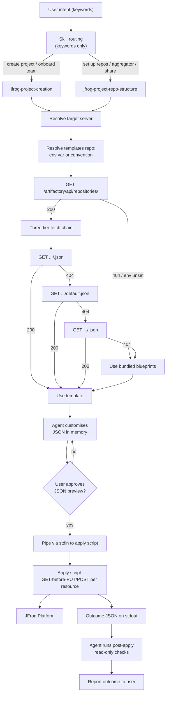

# JFrog Project Skills — v2 Architecture Summary

**Status: review preview, not for merge.** Published on a
stakeholder-review branch alongside the proposed v2 skill changes.
Will be removed before any non-draft PR.

The first iteration ([v1 PR
#10](https://github.com/jfrog/jfrog-skills/pull/10)) of these skills
got substantial SME feedback. v2 is a rewrite that incorporates the
feedback, on a fresh branch off `main`. v1 PR #10 stays open as a
historical reference.

## Executive summary

Two stacked workflow skills —
[`jfrog-project-creation`](../../skills/jfrog-project-creation/SKILL.md)
and
[`jfrog-project-repo-structure`](../../skills/jfrog-project-repo-structure/SKILL.md)
— each fetch a JSON project template from the org's Artifactory
templates repo (with a bundled fallback), customise it in memory
through a guided conversation, and pipe the result to a deterministic
read-before-write script that emits a structured outcome JSON on
stdout. The agent **never writes any file to disk**. Routing between
the two skills is by user-intent keywords only; the agent does not
probe the caller's role before starting.

## SME feedback → v2 response

| SME finding | v1 implementation | v2 response |
| --- | --- | --- |
| **RBAC blindness.** Agent can't read tokens to determine the user's role; routing must not branch on permissions. | v1 SKILL.md called `GET /access/api/v1/system/permissions` and split flow by Platform Admin vs Project Admin. | All `system/permissions` calls removed. Skill split survives but is justified by **keyword intent**, not persona. The platform's 403 is the agent's permission signal, surfaced verbatim. |
| **Stateless execution.** Skills are read-only and stateless; no local writes. | v1 wrote the customised template to a user-chosen path on disk; apply script took a `<template.json>` file argument. | Agent never writes. Apply script accepts **stdin** by default or **`--template-url`** (Artifactory path). Customised JSON lives only in the agent's context window between fetch and apply. |
| **Context window optimisation.** Files >500 lines cause LLM laziness. | v1 design doc was 975 lines; doctrine + references were borderline. | Every SKILL.md and every reference the agent loads is under 500 lines. Heavy doctrine split by topic; design doc replaced with this 300-line summary. |
| **Hallucination mitigation.** Agent invents REST APIs when confused; constrain to explicit endpoints. | v1 mixed prose and endpoint snippets; some references described mutations in prose. | New [`project-templates-artifactory-repo.md`](../../skills/jfrog/references/project-templates-artifactory-repo.md) carries an explicit endpoint table. Each script lists every endpoint it touches at the top in a comment block. Mutating calls in references are literal method + path + payload. |
| **State via Artifactory.** Org-custom templates live in a dedicated Artifactory repo; if 404, fall back to defaults. | v1 shipped three bundled blueprints as the source of truth; customised output landed on user disk. | Templates resolve via env var → convention (`project-templates-generic-local`) → three-tier fetch (per-project / org-default / archetype) → bundled fallback. The bundled blueprints become read-only patterns the org's platform team seeds into Artifactory once. |

## End-to-end flow

## What changed vs v1

### Architecture

- **No persona-based routing.** v1 SKILL.md descriptions named
  Platform Admin / Project Admin; v2 SKILL.md descriptions use
  intent keywords only ("create a project", "onboard a team", "set
  up repos", "share my prod repo with team Y").
- **No RBAC preflight.** The "verify caller has platform-admin
  scope" entry step is removed from both skills. The platform's
  403 is the only signal.
- **Templates in Artifactory.** New base-skill reference
  [`project-templates-artifactory-repo.md`](../../skills/jfrog/references/project-templates-artifactory-repo.md)
  owns discovery, fetch, audit, and seeding. Both workflow skills
  delegate to it.

### Scripts

- **Input is a stream, not a file.** Apply and validate scripts
  accept stdin or `--template-url`. Drop the positional
  `<template.json>` argument entirely.
- **Endpoint reference at the top.** Each script lists every API
  call it makes in a comment block immediately after the
  description.
- **`--audit` flag.** Opt-in PUT of the applied template to
  `/artifactory/<templates-repo>/applied/<key>-<ts>.json` after a
  successful apply. Off by default; surface the option to users who
  want a durable record.
- **Outcome JSON `schema_version` bumped to `2.0`.** Field renames:
  `id` → `key`, `outcome` → `status`. Added `input_source`,
  `template_url`, `audit`.

### Documentation

- **Design doc deleted; replaced with this short summary.** v1's
  [`docs/design/jfrog-project-skills-design.md`](https://github.com/jfrog/jfrog-skills/blob/design/project-repo-structure/docs/design/jfrog-project-skills-design.md)
  (975 lines) was a reviewer convenience but exceeded the 500-line
  rule; v2 keeps reviewer context here at ~300 lines.
- **Blueprint README.** New
  [`skills/jfrog/assets/project-templates/README.md`](../../skills/jfrog/assets/project-templates/README.md)
  re-documents the bundled blueprints as last-resort fallbacks
  with seeding instructions.
- **Base SKILL.md routing block** updated to drop Phase-1+2 /
  Phase-3+4 framing in favour of intent-keyword descriptions.

### Removed

- Local-disk template emission.
- `jf api /access/api/v1/system/permissions` preflight.
- Persona-keyed routing prose.
- The v1 design doc (975 lines).

## Recommended Artifactory templates discovery model

After researching how orgs structure JFrog generic repos and how the
SME's "state via Artifactory" guidance lands cleanly, v2 ships
**convention + env-var override + bundled fallback**. Mechanics:

1. **Convention default:** `project-templates-generic-local`. Follows
   the JFrog four-part repo-naming convention
   (`<team>-<tech>-<maturity>-<locator>`) with team-as-purpose
   (`project-templates`), generic maturity (org-wide), local locator.
2. **Override:** environment variable
   `JFROG_PROJECT_TEMPLATES_REPO`. The agent reads it once per
   conversation.
3. **Three-tier fetch inside the resolved repo:**
   - Per-project: `<project_key>.json`
   - Org default: `default.json`
   - Archetype: `<archetype>.json` (`team-default`,
     `enterprise-budget-id`, `delegated-admin`)
4. **Bundled fallback** in `skills/jfrog/assets/project-templates/`
   if neither the env var nor the convention resolves, or if every
   tier inside the resolved repo 404s.

The agent reports which source resolved at the start of every
conversation, so the user knows whether they're working from an
org-curated template or the bundled fallback.

## What's worth testing in v2

- **Stdin / template-url shapes** — confirm both input paths produce
  identical outcome JSON for the same template content.
- **Three-tier fallback chain** — seed a templates repo with each
  tier configuration (per-project only / default only / archetypes
  only / mix) and confirm the agent reports the right source.
- **Bundled fallback** — unset `JFROG_PROJECT_TEMPLATES_REPO`, point
  at a server where the convention repo is missing; confirm
  bundled blueprints kick in.
- **No-RBAC happy path** — run as Platform Admin and as Project
  Admin; confirm the skills route by keyword identically, and the
  apply script's outcome differs only where the platform's 403s
  appear.
- **403 surfacing** — run as a user without `manage_resources`;
  confirm the apply script records `errored` resources with the
  platform's 403 verbatim instead of retrying or guessing.
- **Audit trail** — run with `--audit` and confirm the
  `/applied/...` record appears in the templates repo with a 201.
- **Idempotency** — re-pipe the same JSON; confirm every resource
  reports `already_exists`.
- **Outcome JSON `schema_version` 2.0** — confirm the new field
  names (`key`, `status`) and new fields (`input_source`,
  `template_url`, `audit`) are correct in your downstream tooling.

## Open questions still pending from v1

These survived the v2 refactor unchanged and are worth resolving
before any non-draft PR:

1. **OIDC payload shape stability.** Verify
   `/access/api/v1/oidc/<provider>/identity_mappings` field names
   and `priority` semantics against the target platform version.
2. **Storage-quota blocking semantics.** Docs disagree; the skill
   warns the user.
3. **Custom-role action vocabulary.** v2's apply script reads it
   live where possible, but the validate script does not yet
   constrain `actions[]` strictly.
4. **Blueprint maintenance cadence.** Bundled blueprints will drift
   when JFrog publishes new best-practice guidance.
5. **CI hardening.** `validate-release.yml` still only checks file
   presence. Worth adding `bash -n`, `jq -e`, schema-validates-each
   blueprint, and a smoke test that pipes each blueprint through
   `--dry-run`.

## Where to read more

Best paths through the v2 changes:

1. This summary (you are here).
2. [`skills/jfrog/references/project-templates-artifactory-repo.md`](../../skills/jfrog/references/project-templates-artifactory-repo.md)
   — the discovery and fetch contract.
3. [`skills/jfrog-project-creation/SKILL.md`](../../skills/jfrog-project-creation/SKILL.md)
   — the creation workflow entry point.
4. [`skills/jfrog-project-creation/scripts/jfrog-project-create-from-template.sh`](../../skills/jfrog-project-creation/scripts/jfrog-project-create-from-template.sh)
   — the only mutation surface for project creation.
5. [`skills/jfrog-project-repo-structure/SKILL.md`](../../skills/jfrog-project-repo-structure/SKILL.md)
   and the matching apply script for the repo-structure workflow.
6. [`skills/jfrog/assets/project-templates/README.md`](../../skills/jfrog/assets/project-templates/README.md)
   — bundled fallback blueprints, seeding instructions.

## Migration from v1

- Customers who already used v1 have a customised template JSON file
  on their disk. v2 can still consume it:
  `cat my-project.json | jfrog-project-create-from-template.sh`. The
  file's `template_version` 1.0 is accepted unchanged.
- The recommended migration is to upload the file to the org's
  Artifactory templates repo (e.g. as `<project_key>.json`) and let
  v2 fetch it from there going forward.
- v2 PR opens against `main` from a fresh branch
  (`design/v2-projects-skills`); v1 PR #10 stays open as a
  historical reference and will be closed once v2 lands.
