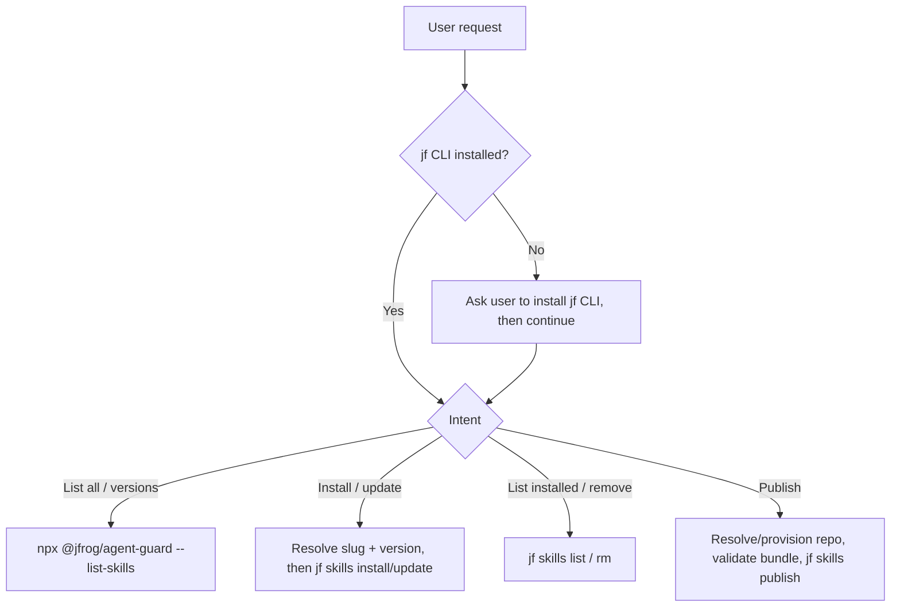

# JFrog AI Catalog Skills

Discover, install, and manage agent skills from the JFrog AI Catalog
(Artifactory skills repositories), and publish your own skills back to it, all
through the JFrog CLI (`jf skills`) and the JFrog Agent Guard.

## Choose a reference file

Pick the row matching the user's intent and read that reference file.

| Intent | Read |
|--------|------|
| "What skills are available?" / browse the catalog / list versions / search by name | [references/discovering-skills.md](references/discovering-skills.md) |
| Install or update a skill (latest or a pinned version), or a download is blocked | [references/installing-skills.md](references/installing-skills.md) |
| "What's installed?" / remove an installed skill | [references/managing-installed-skills.md](references/managing-installed-skills.md) |
| Publish / upload / release a skill to the catalog | [references/publishing-skills.md](references/publishing-skills.md) |

## Prerequisites

- **JFrog CLI required.** This skill drives the `jf` CLI. Confirm `jf` is
  available before the first `jf` call via the base `jfrog` skill's
  [Environment check](../jfrog/SKILL.md#environment-check). If it is missing,
  install it (per that skill) and re-check.
- **Agent Guard registry.** Catalog discovery and repo provisioning run through
  `npx --yes @jfrog/agent-guard`. Substitute `<REGISTRY_URL>` from
  `JFROG_AGENT_GUARD_REPO` if set, else use
  `https://releases.jfrog.io/artifactory/api/npm/coding-agents-npm/`.
- **Resolve the server once (`<SID>`), then reuse it for the whole session.**
  Resolve in this order, and **do not re-ask on later requests** once you have an
  `<SID>`:
  1. If `JFROG_URL` (or `JF_URL`) is set, that is the target. Match its host to a
     server id from `jf config show` and use it **without asking**. Agent Guard
     reads the same env vars directly.
  2. Otherwise follow the base `jfrog` skill's
     [Server selection rules](../jfrog/SKILL.md#server-selection-rules-mandatory):
     use the configured default, and ask only when there are multiple servers and
     no default.

  List servers only with `jf config show`, which redacts secrets. **Never `cat`
  or parse `~/.jfrog/jfrog-cli.conf.v6` directly** (it can hold access tokens), and
  do not read it through any other tool or script. Pass `--server-id <SID>` after the
  subcommand on every `jf` call (e.g. `jf skills list --server-id <SID>`), and
  pass the same id to Agent Guard as `--server "<SID>"`.

- **Resolve the project (`<PROJECT>`) only when needed.** It is required for
  `--list-skills` (browse/name-search), `--list-skill-versions`, and
  `--provision-skills-repository` (auto-creating a publish repo when the user
  names none). Resolve it from `JF_PROJECT`, else ask the user. Never assume
  `default`, never invent one. Install, update, remove, and publishing to an
  explicit `--repo` are keyed by skill **name** and/or **repo**, not a project.

## Workflow overview

## Gotchas

Cross-cutting rules only. Flow-specific rules live in the reference files above.

- **Single server**: pass the same `--server-id <SID>` to every `jf` call in a
  flow, and never switch servers mid-flow.
- **On any `jf` error, stop**: if a call returns 401/403/404, a network error, or
  a timeout, stop with no further `jf` calls and report it. Never switch servers,
  and do not retry against another configured server unless the user explicitly
  names one.
- **Confirm before mutating**: install and list are read-mostly. Remove, registry
  delete, and publish mutate state. Confirm with the user first, prefer a read to
  check current state, and never invent preparatory mutations (creating repos,
  deleting versions) the user did not ask for.
- **Session pickup**: installs, updates, and removals usually take effect only at
  the next agent session start, so tell the user to restart.
- **Don't leak the plumbing**: present skills/versions/repos to the user, never
  the `npx`/Agent Guard commands, `--registry`, flags, or cursors. Run follow-ups
  yourself.
- **Use the response templates verbatim**: where a reference file gives a "reply
  using this exact template" block, fill the placeholders and send exactly that,
  with the same wording every time and no extra preamble or commentary.
