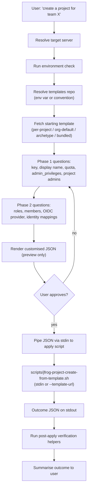

# JFrog Project Creation

Stateless workflow skill. The agent fetches a template, customises it
in conversation, and pipes the result to an apply script that owns all
mutations. **The agent never writes any file to disk.**

## Prerequisites

- Read `../jfrog/SKILL.md` for JFrog Platform concepts, server
  selection rules, the `jf api` invocation pattern, and network
  permissions. Every API call below runs through `jf api` with
  `required_permissions: ["full_network"]` on the Shell tool.
- Read `../jfrog/references/project-templates-artifactory-repo.md` —
  it owns the templates-repo discovery and fetch chain that this
  skill consumes.
- Read `../jfrog/references/projects-best-practices.md` for the
  doctrine the conversation enforces (Team = Project model, key
  conventions, RBAC-by-stage, group-first membership).
- Read `../jfrog/references/projects-api.md` for project / member /
  role endpoint shapes.
- Read `../jfrog/references/oidc-integration.md` when the user wants
  to wire OIDC for CI as part of project creation.

The skill does **not** probe the caller's token for Platform Admin
scope. JFrog will return 403 if the caller lacks the rights to create
a project, members, or OIDC; the agent surfaces that 403 verbatim
rather than guessing the user's role up front.

## Flow



## Mandatory entry steps

Before any conversation about project shape, run these steps **in
order**:

1. **Resolve the target server** per the base SKILL.md *Server
   selection rules*. Do not silently pick a default; if the user did
   not name a server and there is more than one, ask. Capture the
   resolved server-id for use in every later call.
2. **Run the environment check** if not already done in this session
   (`<base_skill_path>/scripts/check-environment.sh`).
3. **Resolve the templates repo** per
   `../jfrog/references/project-templates-artifactory-repo.md`
   §*Resolving the templates repo*. Use the first of: env var
   `JFROG_PROJECT_TEMPLATES_REPO`, the conventional key
   `project-templates-generic-local`, or the bundled fallback. Record
   the resolution outcome — the agent reports it to the user.
4. **Fetch the existing project list** so the conversation can avoid
   colliding on `project_key`:

   ```http
   GET /access/api/v1/projects
   ```

   Save to a temp file per the base SKILL.md *Preserving command
   output* pattern.

## Workflow

The full conversational walkthrough — fetch chain, Phase 1 questions,
Phase 2 questions, preview, apply, verify — lives in
`references/creation-flow.md`. Read it once at the start of the first
project-creation turn.

### Post-apply checks

After the apply script returns, run these read-only checks against
the live platform and confirm they match the template the agent
piped in. Save each response to a temp file per the base SKILL.md
*Preserving command output* pattern.

- `GET /access/api/v1/projects/<project_key>` — expect 200 with
  `display_name`, `description`, `admin_privileges`, and
  `storage_quota_bytes` matching the template.
- `GET /access/api/v1/projects/<project_key>/roles` — expect every
  CUSTOM role in the template plus the predefined set.
- `GET /access/api/v1/projects/<project_key>/groups` and
  `/users` — expect every `members[]` entry with the right role.
- `GET /access/api/v1/oidc/<provider_name>` and
  `/identity_mappings` (when the template had an `oidc` block) —
  expect the provider record and one entry per
  `identity_mappings[]`.
- `GET /artifactory/api/repositories?project=<project_key>` —
  expect `[]` unless the user has already run the repo-structure
  skill.

For the per-resource state machine, outcome JSON shape, recovery
patterns, and the `--audit` contract, see
[`../jfrog/references/projects-verification-contract.md`](../jfrog/references/projects-verification-contract.md).

## Reference files

Load these only when the situation calls for them. Avoid loading more
than 2-3 in a single conversation turn.

- `references/creation-flow.md` — the skill-specific stages
  (resolution → Phase 1 → Phase 2) and per-archetype customisation
  prompts.
- `../jfrog/references/project-skills-conversation-contract.md` —
  Stage 5 (preview), Stage 6 (pipe + report), `--audit`, re-apply
  loop, "what this flow does not do" (shared with
  `jfrog-project-repo-structure`).
- `../jfrog/references/projects-verification-contract.md` —
  idempotency state machine, outcome JSON shape, recovery patterns,
  `--audit` contract, shared gotchas (also shared).
- `../jfrog/references/project-templates-artifactory-repo.md` —
  templates-repo discovery, fetch chain, seeding instructions.
- `../jfrog/references/projects-best-practices.md` — project
  doctrine, archetype definitions, anti-patterns.
- `../jfrog/references/projects-api.md` — endpoint shapes for project
  CRUD, members, roles, environments.
- `../jfrog/references/oidc-integration.md` — provider config and
  identity mappings (read when the user wants OIDC).

## Scripts

Both scripts are non-interactive and emit structured JSON outcome
reports on stdout.

- `scripts/jfrog-project-create-from-template.sh [--server-id <id>] [--template-url <url>] [--dry-run] [--audit]`
  — apply the template idempotently. Reads the template from stdin
  by default, or fetches it via `--template-url` (Artifactory path
  like `/artifactory/<repo>/<file>.json`). GET-before-PUT/POST per
  resource. `--audit` opt-in writes a copy to
  `/artifactory/<repo>/applied/<key>-<timestamp>.json` after success.
- `scripts/jfrog-project-validate-template.sh [--server-id <id>] [--template-url <url>] [--check-platform]`
  — schema validation plus optional dry-run lookups for referenced
  groups, users, and OIDC providers. Same stdin / --template-url
  input shape.

Both scripts source their input from stdin or from Artifactory; they
never read from a local file path. Run `validate` before `apply` when
the user is uncertain. Re-running `apply` after a partial failure is
safe.

## Gotchas

- **`project_key` is immutable.** The script will refuse to update a
  key that differs from an existing project's. Confirm before piping
  the JSON to apply.
- **Predefined roles do not need creating.** The schema accepts
  `type: PREDEFINED` so the template can describe the project's role
  surface, but the script does not call `POST /roles` for predefined
  entries — it skips them and moves on to member assignment.
- **Membership is groups-first.** Templates that list users without
  groups will pass validation but the agent should warn the user
  during the walkthrough.
- **Storage quota at 100% may block deployments.** Surface this when
  setting `quota_gb`. Quotas are editable later; project keys are
  not.

Cross-skill gotchas (cross-call shell PIDs, permissions errors from
the platform, OIDC provider scoping, `--audit` behaviour, test data
hygiene) live in
[`../jfrog/references/projects-verification-contract.md`](../jfrog/references/projects-verification-contract.md)
§*Shared gotchas*.

## Out of scope (handled by other workflow skills)

- Repository structure, naming convention enforcement, virtual
  aggregators, External-stage pattern, cross-project sharing →
  `jfrog-project-repo-structure`.
