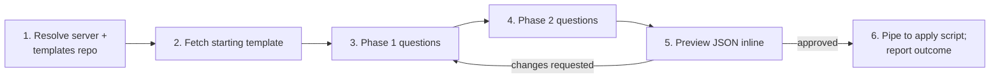

# Project creation — conversational flow

The walkthrough the `jfrog-project-creation` skill follows from "user
wants a new project" to "outcome JSON reported back". v2: no local
writes, templates fetched from Artifactory with a bundled fallback,
JSON piped to the apply script via stdin.

Stages 5 (preview), 6 (pipe + report), the re-apply loop, the
`--audit` opt-in, and the "what this flow does not do" rules are
shared with `jfrog-project-repo-structure` and live in
[`../../jfrog/references/project-skills-conversation-contract.md`](../../jfrog/references/project-skills-conversation-contract.md).
This file covers only the skill-specific stages (1-4).

## Six-stage shape



## Stage 1 — Resolve server and templates repo

1. Resolve the target server per the base SKILL.md *Server selection
   rules*. Capture the resolved `--server-id`.
2. Resolve the templates repo per
   `../../jfrog/references/project-templates-artifactory-repo.md`
   §*Resolving the templates repo*. The chain is:
   - Env var `JFROG_PROJECT_TEMPLATES_REPO` if set.
   - Conventional key `project-templates-generic-local` if it exists
     (probe with `GET /artifactory/api/repositories/<key>`).
   - Bundled fallback at
     `../../jfrog/assets/project-templates/` if neither resolves.
3. Tell the user which source resolved. One-liner the agent says back:
   "Using templates from `<repo>`" or "No org templates repo
   configured; using the bundled `team-default` / `delegated-admin`
   blueprints as the starting set."

## Stage 2 — Fetch a starting template

Ask which archetype best matches before fetching:

- `team-default` — single team, one workspace, OIDC optional.
- `delegated-admin` — heavy delegation to application owners;
  groups-only membership; OIDC required.

If the user names the project key first (e.g. `fin-1042`), the agent
tries the **per-project tier** before asking for an archetype:

```http
GET /artifactory/<repo>/fin-1042.json
```

200 → use it (skip archetype question; the org has curated this
project). 404 → continue.

Then walk the rest of the chain:

```http
GET /artifactory/<repo>/default.json         # org default
GET /artifactory/<repo>/<archetype>.json     # archetype
```

If the repo resolution returned "bundled fallback", read the
appropriate blueprint file directly from
`../../jfrog/assets/project-templates/<archetype>.json` and treat it
as the starting JSON in memory.

**Do not** write the fetched JSON to disk. It lives in the agent's
context window from here on.

## Stage 3 — Phase 1 questions

Customise the in-memory JSON by asking these in order. Skip a question
when the fetched template already has a value the user is happy with.

1. **`project.key`** — validate against the regex from
   `../../jfrog/references/projects-api.md` (2-32 chars, lowercase
   alphanumeric and hyphens, must start with a letter, immutable
   after creation, used as repo prefix). Cross-check against the
   project list fetched in the mandatory entry steps; collide → ask
   the user for a different key.
2. **`project.display_name`** — human-readable label, free text up to
   the platform's 64-char limit.
3. **`project.description`** — optional but recommended; mention the
   team or budget being represented.
4. **`project.quota_gb`** — number in GB or the string `"Unlimited"`.
   When the user picks a finite quota, warn that 100% may block
   deployments depending on platform version.
5. **`project.admin_privileges`** — three booleans:
   `manage_members`, `manage_resources`, `index_resources`. Defaults
   from the archetype are good; offer to flip them.
6. **`admins[]`** — list of group references (or user references,
   with a warning). Groups-first is the doctrine.

## Stage 4 — Phase 2 questions

Same in-memory customise pattern.

1. **`roles[]`** — start with the predefined set (`Project Admin`,
   `Developer`, `Contributor`, `Viewer`, `Release Manager`). Confirm
   the archetype's defaults. Offer to add CUSTOM roles with explicit
   `actions[]` — note that the action vocabulary varies by platform
   version and is best fetched live before committing.
2. **`members[]`** — bind groups to roles. Each entry is either a
   group reference or a user reference (groups preferred).
3. **`oidc`** — optional block:
   - `provider` — name, `provider_type` (`GitHub` / `GitLab` /
     `Generic`), `issuer_url`, `audience`.
   - `identity_mappings[]` — each entry binds a claim filter to a
     project-scoped scope (`applied-permissions/groups:<group>`) with
     a `priority` and `expires_in`.

   Skip the entire block if the user is not wiring CI right now; they
   can re-run later to add it.

## Stages 5-6, audit, recovery

Render the customised JSON inline, get user approval, pipe to
`scripts/jfrog-project-create-from-template.sh` (validate first via
`scripts/jfrog-project-validate-template.sh` if uncertain), capture
the outcome JSON, run post-apply checks. Full pattern (preview,
pipe-to-apply, capture outcome, run post-apply checks, summarise),
plus the re-apply-after-failure loop, the `--audit` flag, and the
"what this flow does not do" rules: see
[`../../jfrog/references/project-skills-conversation-contract.md`](../../jfrog/references/project-skills-conversation-contract.md).
