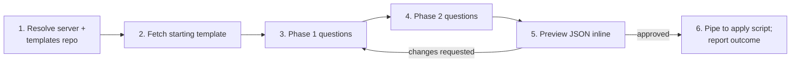

# Project creation — conversational flow

The walkthrough the `jfrog-project-creation` skill follows from "user
wants a new project" to "outcome JSON reported back". v2: no local
writes, templates fetched from Artifactory with a bundled fallback,
JSON piped to the apply script via stdin.

## Six-stage shape



## Stage 1 — Resolve server and templates repo

1. Resolve the target server per the base SKILL.md *Server selection
   rules*. Capture the resolved `--server-id`.
2. Resolve the templates repo per
   `../../jfrog/references/project-templates-artifactory-repo.md`
   §*Resolving the templates repo*. The chain is:
   - Env var `JFROG_PROJECT_TEMPLATES_REPO` if set.
   - Conventional key `project-templates-generic-local` if it exists
     (probe with `GET /artifactory/api/repositories/<key>`).
   - Bundled fallback at
     `../../jfrog/assets/project-templates/` if neither resolves.
3. Tell the user which source resolved. One-liner the agent says back:
   "Using templates from `<repo>`" or "No org templates repo
   configured; using the bundled `team-default` / `delegated-admin`
   blueprints as the starting set."

## Stage 2 — Fetch a starting template

Ask which archetype best matches before fetching:

- `team-default` — single team, one workspace, OIDC optional.
- `delegated-admin` — heavy delegation to application owners;
  groups-only membership; OIDC required.

If the user names the project key first (e.g. `fin-1042`), the agent
tries the **per-project tier** before asking for an archetype:

```http
GET /artifactory/<repo>/fin-1042.json
```

200 → use it (skip archetype question; the org has curated this
project). 404 → continue.

Then walk the rest of the chain:

```http
GET /artifactory/<repo>/default.json         # org default
GET /artifactory/<repo>/<archetype>.json     # archetype
```

If the repo resolution returned "bundled fallback", read the
appropriate blueprint file directly from
`../../jfrog/assets/project-templates/<archetype>.json` and treat it
as the starting JSON in memory.

**Do not** write the fetched JSON to disk. It lives in the agent's
context window from here on.

## Stage 3 — Phase 1 questions

Customise the in-memory JSON by asking these in order. Skip a question
when the fetched template already has a value the user is happy with.

1. **`project.key`** — validate against the regex from
   `../../jfrog/references/projects-api.md` (2-32 chars, lowercase
   alphanumeric and hyphens, must start with a letter, immutable
   after creation, used as repo prefix). Cross-check against the
   project list fetched in the mandatory entry steps; collide → ask
   the user for a different key.
2. **`project.display_name`** — human-readable label, free text up to
   the platform's 64-char limit.
3. **`project.description`** — optional but recommended; mention the
   team or budget being represented.
4. **`project.quota_gb`** — number in GB or the string `"Unlimited"`.
   When the user picks a finite quota, warn that 100% may block
   deployments depending on platform version.
5. **`project.admin_privileges`** — three booleans:
   `manage_members`, `manage_resources`, `index_resources`. Defaults
   from the archetype are good; offer to flip them.
6. **`admins[]`** — list of group references (or user references,
   with a warning). Groups-first is the doctrine.

## Stage 4 — Phase 2 questions

Same in-memory customise pattern.

1. **`roles[]`** — start with the predefined set (`Project Admin`,
   `Developer`, `Contributor`, `Viewer`, `Release Manager`). Confirm
   the archetype's defaults. Offer to add CUSTOM roles with explicit
   `actions[]` — note that the action vocabulary varies by platform
   version and is best fetched live before committing.
2. **`members[]`** — bind groups to roles. Each entry is either a
   group reference or a user reference (groups preferred).
3. **`oidc`** — optional block:
   - `provider` — name, `provider_type` (`GitHub` / `GitLab` /
     `Generic`), `issuer_url`, `audience`.
   - `identity_mappings[]` — each entry binds a claim filter to a
     project-scoped scope (`applied-permissions/groups:<group>`) with
     a `priority` and `expires_in`.

   Skip the entire block if the user is not wiring CI right now; they
   can re-run later to add it.

## Stage 5 — Preview JSON inline

Render the full customised JSON in the conversation as a single
```json fenced block. **Do not write it to disk yet.** Ask:

> "Apply this to `<server-id>` now? Reply `yes` to pipe it to the
> apply script, or tell me what to change."

If the user requests changes, return to Stage 3 or Stage 4 as
appropriate. Iterate until the user approves.

## Stage 6 — Pipe to the apply script; report

When the user approves:

1. **Validate offline first** (optional but recommended):

   ```bash
   echo "$CUSTOMISED_JSON" \
     | bash <skill_path>/scripts/jfrog-project-validate-template.sh
   ```

2. **Apply**:

   ```bash
   echo "$CUSTOMISED_JSON" \
     | bash <skill_path>/scripts/jfrog-project-create-from-template.sh \
         --server-id "$SERVER_ID"
   ```

   Pipe the in-memory JSON via stdin. The agent should construct the
   command in a single Shell call so the JSON does not have to be
   held in a temp file.

3. **Capture the outcome JSON** (printed on stdout). Re-read it
   instead of re-running the script.
4. **Run post-apply checks** per the *Post-apply checks* subsection
   in [`../SKILL.md`](../SKILL.md). For the per-resource state
   machine and recovery patterns, see
   [`../../jfrog/references/projects-verification-contract.md`](../../jfrog/references/projects-verification-contract.md).
5. **Summarise to the user**: per-resource status from the outcome
   JSON (`created`, `updated`, `already_exists`, `skipped` with
   reason, or `errored`).

## Re-applying after a failure

The apply script is idempotent. If a resource errors:

1. Show the user the error from the outcome JSON.
2. Fix the input (e.g. a missing group on the platform → user
   creates the group, or the agent edits the customised JSON to drop
   the group reference).
3. Re-pipe the corrected JSON to the apply script. Resources that
   succeeded the first time report `already_exists` on the rerun.

The agent never deletes or recreates a project to "clean up" a
partial apply. The script will refuse to recreate an existing
`project_key`, and the agent must surface that refusal verbatim.

## Audit trail (opt-in)

If the user wants every applied template archived in Artifactory,
pass `--audit` to the apply script:

```bash
echo "$CUSTOMISED_JSON" \
  | bash <skill_path>/scripts/jfrog-project-create-from-template.sh \
      --server-id "$SERVER_ID" --audit
```

After a successful apply, the script writes
`/artifactory/<templates-repo>/applied/<project-key>-<iso8601>.json`
through the platform — no local file write involved.

## What this flow does not do

- It does not write any file to local disk. Customised JSON lives in
  the agent's context window between fetch and apply.
- It does not probe the caller's role before starting. Permission
  errors come from the platform and are surfaced verbatim.
- It does not create the templates repo on the user's behalf. If the
  conventional repo is missing and no env var is set, the agent uses
  the bundled blueprints.
- It does not orchestrate API calls by hand. The apply script is the
  authoritative mutator.
