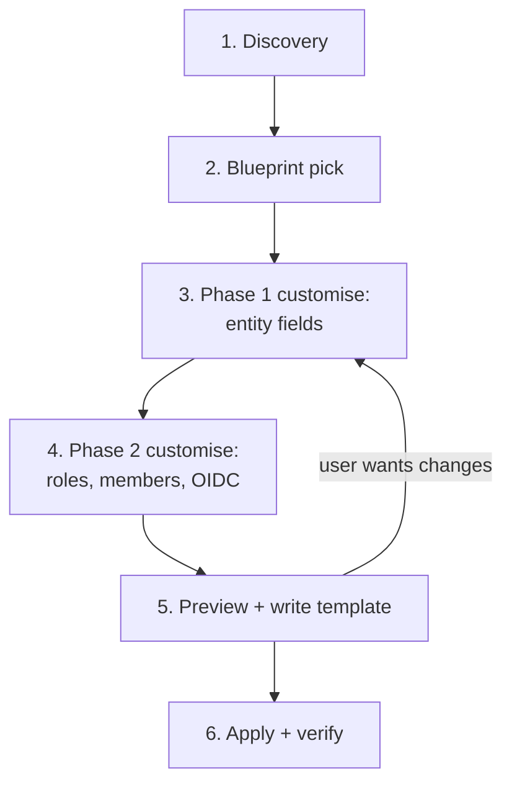

# Project creation flow (Phases 1+2)

The conversational walkthrough the agent follows when the user wants to
create a new JFrog Project. Read alongside
`../../jfrog/references/projects-best-practices.md` for the underlying
doctrine and `../../jfrog/references/projects-api.md` for endpoint details.

The flow has six stages. Stages 1-4 are read-only and conversational.
Stage 5 writes the customised template to disk. Stage 6 invokes the apply
script — the **only** stage that mutates the JFrog server.



## Stage 1 — Discovery

Confirm the operating context before showing options.

Ask in order, stopping at the first answer that resolves ambiguity:

- "Which JFrog server should this project go on?" — only ask if more than
  one server is configured. Apply the *Server selection rules* from the
  base SKILL.md.
- "Are you a Platform Admin on that server?" — required. If no, stop and
  explain that project creation needs platform-admin scope.
- "Do you already have a project template you want to apply, or should we
  build one together?" — branches between interactive and apply-only.

If the user has a template, jump to Stage 5 (preview) directly. Otherwise
continue to Stage 2.

## Stage 2 — Blueprint pick

Present the three blueprints with one-line summaries. Use multiple-choice
where the harness supports it; otherwise list:

- **`team-default`** — single team, default settings. Use when one team
  needs one workspace and you want the quickest path to working.
- **`enterprise-budget-id`** — project key tied to an immutable internal
  identifier (budget code, app catalog ID). Central IdP holds membership;
  OIDC required. Use for enterprise standardisation across many projects.
- **`delegated-admin`** — application owners hold Project Admin and
  manage their own users and resources; OIDC required. Use when the
  platform team is small and self-service is the goal.
- **(escape hatch)** — "I want to start from scratch / mix elements" →
  start from `team-default` and modify freely; warn the user that the
  blueprint field in the saved template will be set to `custom`.

Read the chosen blueprint with the Read tool to seed the customisation
conversation. Show the user a short summary of what the blueprint
prescribes by default and what is left to fill in.

## Stage 3 — Phase 1 customise (project entity)

Walk the user through the project entity fields. For each, surface the
blueprint default; let the user accept, override, or ask for clarification.

### Project key

- "What project key would you like? It is **immutable**, becomes the
  prefix on every repository in the project, and must be 2-32 lowercase
  alphanumeric characters and hyphens, starting with a letter."
- Validate with the regex from the base skill schema:
  `^[a-z][a-z0-9-]{0,30}[a-z0-9]$`. If invalid, explain the specific
  violation (length, leading digit, trailing hyphen, uppercase) and ask
  again.
- Check the project list captured in the entry steps to confirm the key
  is not already in use. If it is, surface that and ask for a different
  key — never offer to overwrite.

### Display name and description

- "What should the human-readable display name be?" — accept any UTF-8
  string up to 64 chars.
- "Anything to add as a description?" — optional. Encourage at least one
  sentence so future operators can understand the project's purpose.

### Storage quota

- "Storage quota in GB? Default for this blueprint is `<quota_gb>`. Reply
  `unlimited` to remove the quota."
- Warn when the user picks Unlimited: "JFrog recommends always setting a
  quota at creation time so a single project cannot exhaust shared
  storage. The quota notifies at 75% and errors at 100%; depending on
  your platform version it may also block deployments at 100%. You can
  raise the quota later, but raising it requires the project Update
  endpoint."

### Admin privileges

- Walk the three flags one by one. Each flag's recommended value depends
  on the blueprint:
  - `manage_members` — on for `team-default` and `delegated-admin`,
    off for `enterprise-budget-id` (central IdP).
  - `manage_resources` — on by default everywhere.
  - `index_resources` — on by default everywhere.
- For each flag the user toggles away from the blueprint default,
  capture *why* in the description so reviewers later can understand the
  decision.

### Project Admins

- "Which group(s) should hold Project Admin?" — recommend a group, not
  individual users. The blueprint default is the placeholder
  `<key>-admins` or `<key>-leads`; substitute the user's real group name.
- If the user insists on an individual user, accept it but warn: "Group
  membership is preferred — when this person leaves the team, you will
  have to remember to update Project Admins manually."

## Stage 4 — Phase 2 customise (identity and access)

This is where the project becomes usable for its members.

### Roles

- "What predefined roles should be available in this project?" — show
  the list from `../../jfrog/references/projects-api.md` (Project Admin,
  Developer, Contributor, Viewer, Release Manager, Security Manager,
  AppTrust Manager, Model Governor, Model Developer). Predefined roles
  do not need explicit creation; including them in the template is
  documentation only.
- "Any custom roles?" — for each, collect `name`, `description`,
  `environments` (uppercase), and `actions`. Cross-reference action
  names from the JFrog Projects API reference; do not invent action
  names. If the user is unsure, recommend skipping custom roles for the
  first project — most needs are covered by predefined roles.

### Members

- "Which groups (or users) should be members, and what role should each
  have?" — collect a list of `{ group | user, roles[] }` entries.
- Enforce groups-first: "Prefer groups; create a group in your IdP that
  represents the cohort, then assign that group to the role here. Adding
  individual users couples membership to manual onboarding."
- Cross-check that referenced groups exist (`GET /access/api/v2/groups/`)
  before writing the template. If a group does not exist, ask whether
  the user wants to create it now (out of scope for this skill — point
  them at `../../jfrog/references/platform-admin-api-gaps.md` §Groups for
  the create endpoint).

### OIDC

Skip this entire sub-stage if the user does not want OIDC right now.
Otherwise:

- "Which CI system are you wiring? GitHub Actions, GitLab CI, or
  generic OIDC?" — picks the `provider_type`.
- Provider:
  - `name` — alphanumeric/hyphen/underscore; recommend `<key>-<ci>`.
  - `issuer_url` — known issuers (GitHub:
    `https://token.actions.githubusercontent.com`; GitLab Cloud:
    `https://gitlab.com`).
  - `audience` — recommend the platform base URL
    (`https://mycompany.jfrog.io`).
  - Check whether a provider with that name already exists
    (`GET /access/api/v1/oidc/<name>`). If it does, ask: reuse the
    existing provider (just add new mappings) or pick a different name?
- Identity mappings:
  - "Which CI events should be allowed to publish into this project?"
    — typical answer: main-branch push and tagged release.
  - For each event, collect the claim filter (see
    `../../jfrog/references/oidc-integration.md` §"CI claim recipes"
    for the standard claim names per CI system).
  - For each event, set the `token_spec.scope` to
    `applied-permissions/groups:<group>` where `<group>` is one of the
    groups added as a member above. The mapping inherits the group's
    project role and stays project-scoped.
  - Default `expires_in` to 1800 (30 minutes). Warn if the user requests
    longer than 3600 seconds for CI use.

## Stage 5 — Preview and write

Render the customised template as JSON and show it to the user.

- Suggest a default save path: `./projects/<project-key>.json` inside the
  current working directory. The user can override.
- Ask: "Save this template to `<path>` and proceed to apply?"
  - **No** → loop back to Stage 3 or Stage 4 based on what the user wants
    to change.
  - **Yes** → write the file with the Write tool. Do not yet call any
    JFrog API.

This is the *cautious-execution gate* required by the base SKILL.md
*Cautious execution* section. Nothing on the JFrog server has been
mutated up to this point.

## Stage 6 — Apply and verify

Now the only stage that mutates state.

1. Run the validate script first as a sanity check:
   ```bash
   <skill_path>/scripts/jfrog-project-validate-template.sh <path>
   ```
   If validation fails, surface the error and loop back to Stage 5 (do
   not attempt a fix without showing the user what was wrong).

2. Run the apply script:
   ```bash
   <skill_path>/scripts/jfrog-project-create-from-template.sh <path> \
     --server-id <resolved-id>
   ```
   Capture stdout (structured outcome JSON) to a temp file per the base
   SKILL.md *Preserving command output* pattern. Echo the file path so a
   follow-up Shell call can re-read it.

3. Run the post-apply checks from
   `verification-and-idempotency.md`. Summarise the result:
   - Per-resource outcome (`created`, `already_exists`, `updated`,
     `skipped`).
   - Any warnings (groups not yet existing, predefined roles not assigned,
     OIDC provider reused vs created).
   - Next steps — typically pointing at the Phases 3+4 skill for
     repository structure.

If the apply step fails partway through, the script's output report is
the source of truth for what was created and what was not. Re-running
apply on the same template is safe (GET-before-write).

## Common deviations and how to handle them

- **User wants to skip Phase 2 entirely** — write a Phase-1-only template
  with empty `roles`, `members`, and no `oidc` block. Warn that the
  project will exist but have no members beyond Project Admins.
- **User wants to add many members at once** — collect them as a flat
  list, group by role, and emit one `members[]` entry per
  `(group, roles)` pair. The schema's `oneOf` constraint requires exactly
  one of `user` or `group` per entry — split combined entries
  accordingly.
- **User wants to reuse an existing OIDC provider** — set
  `oidc.provider.name` to the existing provider's name; the apply script
  detects the match and only creates new identity mappings.
- **User wants to apply the same template to two projects** — refuse and
  explain: project keys are unique; copy the template, edit the key, and
  apply each separately.

## What this flow does not do

- It does not edit existing projects. Use the JFrog API directly via
  `../../jfrog/references/projects-api.md` for updates.
- It does not provision repositories, stages, or sharing — those are
  Phases 3+4 in `jfrog-project-repo-structure`.
- It does not create users or groups. Referenced groups must already
  exist; the apply script reports missing groups but does not create
  them.
