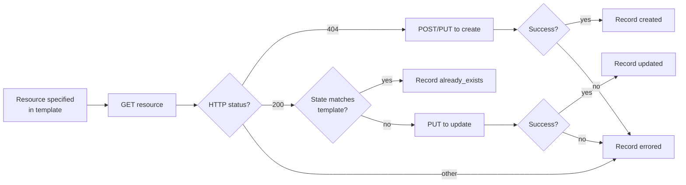

# Verification and idempotency contract

What the apply script guarantees, what the agent should check after
it runs, and how to recover from partial failures. v2: input flows
via stdin or `--template-url`; all output is on stdout; no local
files are emitted by the agent.

## Idempotency contract (per resource)

Every resource the apply script touches follows the same state
machine. This is what makes re-running safe.



Special cases:

- **PREDEFINED roles** are skipped at the create step (the platform
  ships them) but used at the member-assignment step. Outcome:
  `skipped` with `note: predefined`.
- **Missing platform principals** (group/user does not exist) are
  recorded as `skipped` with `error: principal_missing`. The script
  never creates users or groups; the user fixes that and re-runs.
- **`project_key` mismatch** between template and live project is a
  hard stop: outcome `skipped` with `error: key_mismatch`. The
  script never deletes a project to recreate it.
- **403 from the platform** (caller lacks rights) surfaces as
  `errored` on the offending resource. The script does not retry,
  does not fall back to a different server, and does not try a
  weaker operation. The agent reports the 403 verbatim.

## Outcome JSON shape (stdout)

The apply script writes a single JSON document to stdout summarising
every action it took. Re-read the captured value instead of re-running
the script.

```json
{
  "schema_version": "2.0",
  "server_id": "mycompany",
  "project_key": "team-x",
  "applied_at": "2026-05-10T12:34:56Z",
  "input_source": "stdin",
  "resources": [
    { "kind": "project",        "key": "team-x",                          "status": "created" },
    { "kind": "role",           "key": "team-x/Developer",                "status": "skipped", "note": "predefined" },
    { "kind": "role",           "key": "team-x/Release Approver",         "status": "created" },
    { "kind": "member",         "key": "team-x/developers->Developer",    "status": "already_exists" },
    { "kind": "oidc_provider",  "key": "github-mycompany",                "status": "already_exists" },
    { "kind": "identity_mapping","key": "github-mycompany/main-deploy",   "status": "updated" }
  ],
  "warnings": [],
  "errors": []
}
```

`status` values: `created`, `updated`, `already_exists`, `skipped`,
`errored`. `errored` entries carry an `error` field with the upstream
status code and short message.

`input_source` is one of `stdin` or `template-url`. With
`--template-url`, the URL is also recorded (no credentials embedded).

## Post-apply checks

After the apply script returns, run these read-only checks against
the live platform and confirm they match the template the agent
piped in. Save each response to a temp file per the base SKILL.md
*Preserving command output* pattern.

1. **Project exists.**

   ```http
   GET /access/api/v1/projects/<project_key>
   ```

   Expect 200 with `project_key`, `display_name`, `description`,
   `admin_privileges`, and `storage_quota_bytes` matching the
   template.

2. **Roles exist.**

   ```http
   GET /access/api/v1/projects/<project_key>/roles
   ```

   Expect every CUSTOM role in the template plus the predefined set.

3. **Members are bound.**

   ```http
   GET /access/api/v1/projects/<project_key>/groups
   GET /access/api/v1/projects/<project_key>/users
   ```

   Expect every `members[]` entry to appear with the right role.

4. **OIDC provider and mappings (when the template had an `oidc`
   block).**

   ```http
   GET /access/api/v1/oidc/<provider_name>
   GET /access/api/v1/oidc/<provider_name>/identity_mappings
   ```

   Expect the provider record and one entry per
   `identity_mappings[]` in the template.

5. **Repositories are still empty** (this skill does not create
   them). The repo-structure skill picks up from here.

   ```http
   GET /artifactory/api/repositories?project=<project_key>
   ```

   Expect `[]` unless the user has already run the repo-structure
   skill.

If any check fails, the agent reports the gap, names the resource,
and offers to re-pipe the (possibly edited) JSON to the apply
script.

## Re-applying

The apply script is safe to re-run with the same JSON:

- Project, custom roles, members, OIDC provider, identity mappings
  → `already_exists` on the second run.
- A field edited between runs (e.g. quota) → `updated` on the next
  run, only for the changed resource.

The script never deletes a resource that the template does not
explicitly mark for deletion. (v2 schema does not yet have a delete
flag; v3 might.)

## Recovery patterns

### "Group does not exist on the platform"

`skipped` with `error: principal_missing`. Two recovery paths:

1. **Create the group** outside this skill (Platform Admin operation
   on the IdP or via `/access/api/v2/groups`), then re-pipe the
   unchanged JSON to apply. The member assignment will succeed.
2. **Drop the group reference** from the in-memory JSON, re-pipe.
   The script will report `already_exists` on resources that
   succeeded the first time and create the now-correct member set.

### "OIDC provider already exists with a different config"

The script records `errored` on the provider with
`error: provider_conflict`. Recovery:

1. The user picks: update the provider in place (re-pipe with the
   new config; the script will `PUT`) or rename the provider in the
   template.
2. The script does not auto-replace platform-scoped providers
   because they may be in use by other projects.

### "Identity mapping payload rejected"

The platform's identity-mapping payload shape can vary by version.
The outcome JSON includes the rejection body verbatim. Recovery:

1. Compare the rejected payload against
   `../../jfrog/references/oidc-integration.md` for the current
   shape.
2. Edit the in-memory JSON and re-pipe.

## Verification on the bundled fallback path

When the agent used the bundled blueprints (no Artifactory templates
repo resolved), the verification flow is identical. The only
difference is that there is no Artifactory record of the input — the
JSON existed only in the agent's context. If the user wants a
durable record, they can opt into `--audit` (see
`creation-flow.md` §*Audit trail*) on the next apply or upload the
final JSON to their templates repo manually.
