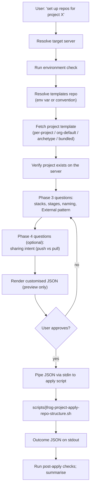

# JFrog Project Repository Structure

Stateless workflow skill. Continues the conversation that
`jfrog-project-creation` started: fetches the project's template,
customises the `stages`, `repositories`, and `sharing` sections in
memory, and pipes the result to an apply script that owns all
mutations. **The agent never writes any file to disk.**

## Prerequisites

- Read `../jfrog/SKILL.md` for JFrog Platform concepts, server
  selection rules, the `jf api` invocation pattern, and network
  permissions. Every API call below runs through `jf api` with
  `required_permissions: ["full_network"]` on the Shell tool.
- Read `../jfrog/references/project-templates-artifactory-repo.md` —
  same templates-repo contract as `jfrog-project-creation`.
- Read `../jfrog/references/projects-best-practices.md` for the
  doctrine the conversation enforces (4-part naming, virtual
  aggregator order, External-stage pattern, sharing decision tree).
- Read `references/repo-structure-flow.md` for the repository,
  stages, and sharing walkthrough.

The skill does **not** probe the caller's token for Project Admin or
Platform Admin scope. JFrog will return 403 if the caller lacks the
rights to create or share repositories; the agent surfaces that 403
verbatim rather than guessing the user's role up front.

## Flow



## Mandatory entry steps

Before any conversation about repository shape, run these steps **in
order**:

1. **Resolve the target server** per the base SKILL.md *Server
   selection rules*. Capture the resolved server-id.
2. **Run the environment check** if not already done in this session
   (`<base_skill_path>/scripts/check-environment.sh`).
3. **Resolve the templates repo** per
   `../jfrog/references/project-templates-artifactory-repo.md`. Use
   the same chain as `jfrog-project-creation`.
4. **Verify the project exists.** If it doesn't, route the user back
   to `jfrog-project-creation`:

   ```http
   GET /access/api/v1/projects/<project_key>
   ```

   Expect 200. On 404, tell the user the project must be created
   first.
5. **Fetch the existing repository list** so the conversation has the
   current state:

   ```http
   GET /artifactory/api/repositories?project=<project_key>
   ```

   Save to a temp file per the base SKILL.md *Preserving command
   output* pattern.

## Workflow

The full walkthrough — fetch chain, stages, repositories, External
RBAC, sharing, preview, apply, verify — lives in
`references/repo-structure-flow.md`. Read it once at the start of the
first repo-structure turn.

### Brief outline

1. Resolve the templates repo and **fetch the project's template**.
   Use the same three-tier chain as `jfrog-project-creation` so the
   in-memory JSON carries the project's identity (Phase 1+2
   sections) alongside whatever Phase 3+4 sections already exist.
2. **Phase 3 questions:** which technology stacks (Maven, npm, PyPI,
   Docker, Go, NuGet, Helm, etc.), which stages (default
   DEV/QA/PROD/External, can be customised), External-stage RBAC
   confirmation, virtual aggregator resolution order.
3. **Phase 4 questions (optional, skip if no cross-project sharing):**
   producer or consumer side; if producer, which repo to share and
   with which projects; if consumer, which producer repo to attach
   via push or Smart Remote.
4. Show the customised JSON inline. Confirm with the user — the
   cautious-execution gate.
5. Pipe to `scripts/jfrog-project-apply-repo-structure.sh` via stdin.
6. Run the **Post-apply checks** below and report.

### Post-apply checks

After the apply script returns, run these read-only checks against
the live platform and confirm they match the template the agent
piped in. Save each response to a temp file per the base SKILL.md
*Preserving command output* pattern.

- `GET /access/api/v1/projects/<project_key>` — sanity check that
  the project still exists.
- `GET /artifactory/api/repositories/<each repo key>` — expect 200;
  compare `rclass`, `packageType`, `url` (for remote),
  `repositories[]` (for virtual) against the template.
- `GET /artifactory/api/repositories?project=<project_key>` —
  expect every repo declared in the template plus any pre-existing
  repos.
- For each virtual repo with `resolution_order` in the template:
  confirm the live `repositories[]` array matches.
- `GET /access/api/v1/projects/<producer_project>/share/repositories`
  — expect every `sharing[]` producer entry.
- `GET /access/api/v1/projects/<project_key>/roles/<role>` (when
  `external_stage_rbac` is in the template) — expect
  `environments` and `actions` to reflect the template.

For the per-resource state machine, outcome JSON shape, recovery
patterns, and the `--audit` contract, see
[`../jfrog/references/projects-verification-contract.md`](../jfrog/references/projects-verification-contract.md).

## Reference files

Load these only when the situation calls for them. Avoid loading more
than 2-3 in a single conversation turn.

- `references/repo-structure-flow.md` — full conversational flow
  for stages, repositories, External-stage RBAC, virtual aggregator
  resolution; includes the push vs pull sharing decision tree and
  the read-only-consumer rule in its *Sharing patterns* section.
- `../jfrog/references/projects-verification-contract.md` —
  idempotency state machine, outcome JSON shape, recovery patterns,
  `--audit` contract (shared with `jfrog-project-creation`).
- `../jfrog/references/project-templates-artifactory-repo.md` —
  templates-repo discovery, fetch chain.
- `../jfrog/references/projects-best-practices.md` — the project
  doctrine, including repository structure (4-part naming, virtual
  order, External pattern, push vs pull sharing).
- `../jfrog/references/artifactory-entities.md` — repository concepts
  (local / remote / virtual / federated).

## Scripts

Both scripts are non-interactive and emit structured JSON outcome
reports on stdout.

- `scripts/jfrog-project-apply-repo-structure.sh [--server-id <id>] [--template-url <url>] [--dry-run] [--strict-naming] [--audit]`
  — apply the `stages`, `repositories`, `external_stage_rbac`, and
  `sharing` sections idempotently. Reads the template from stdin or
  fetches via `--template-url`. The project-entity sections
  (project, admins, members, oidc) are ignored — they belong to
  `jfrog-project-creation`.
- `scripts/jfrog-project-validate-repo-structure.sh [--server-id <id>] [--template-url <url>] [--check-platform] [--strict-naming]`
  — schema validation, 4-part-naming check, virtual-aggregator
  consistency check; `--check-platform` delegates to apply
  `--dry-run` for read-only platform lookups.

## Gotchas

- **The four-part naming convention is doctrine, not a platform
  constraint.** The platform accepts any repo name; the validate
  script flags violations. Use `--strict-naming` to fail apply when
  any repo name in the template violates the pattern.
- **Virtual aggregator order matters.** Resolution walks the list
  left-to-right; first hit wins. Doctrine order:
  `prod -> dev -> external -> smart-remotes`. The apply script
  always sets `repositories[]` explicitly rather than relying on
  insertion order.
- **External-stage RBAC needs developers to have read+write on
  External and read-only on internal stages.** The apply script
  enforces this through the project's role definitions when an
  `external_stage_rbac` block is present.
- **Cross-project sharing is one-direction.** Producer marks the
  repo Shared; consumer attaches it to their virtual aggregator.
  Consumers must hold **read-only** roles on the shared repo. The
  script refuses any sharing entry that would grant write
  cross-project.
- **Smart Remote vs direct share** trade-offs are documented in
  `references/repo-structure-flow.md` §*Sharing patterns*. Smart
  Remote isolates the consumer cache; direct share keeps
  producer-side lifecycle.
- **Existing-repo migration.** Many users have repos that predate
  this skill and don't follow the 4-part convention. Default mode
  warns and continues; `--strict-naming` fails. Never rename or
  delete an existing repo without explicit user instruction.
- **Action-vocabulary varies by platform version.** The apply
  script's External-stage RBAC block reads the live vocabulary from
  the platform when present rather than hard-coding action names.
- **Cross-call shell PIDs differ.** Save and echo temp file paths
  per the base SKILL.md *Preserving command output* pattern.
- **Permissions errors come from the platform, not from the skill.**
  No `system/permissions` preflight; the platform 403 is surfaced
  verbatim.
- **Test data hygiene.** Generic placeholder names only
  (`mycompany.jfrog.io`, `team-x`, `team-y`, `app-04217`).

## Out of scope (handled by other workflow skills)

- Creating the project itself, project members, project roles, OIDC
  → `jfrog-project-creation`.
- CI/CD pipeline templates that consume the repos → planned
  `jfrog-project-cicd`.
- AppTrust application creation against the project → planned
  `jfrog-project-application`.
- Curation indexing of the External-stage remotes → planned
  `jfrog-project-curation`.
- Unified gates and lifecycle policies across stages → planned
  `jfrog-project-policies`.
