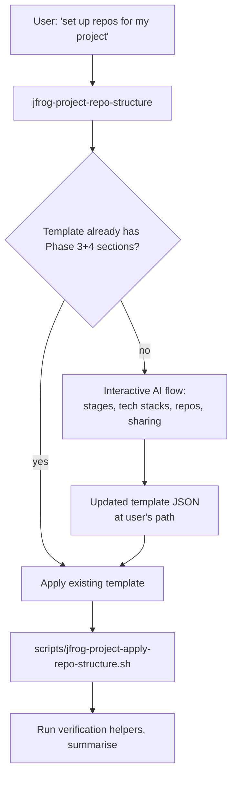

# JFrog Project Repository Structure (Phases 3+4)

## Prerequisites

- Read `../jfrog/SKILL.md` for JFrog Platform concepts, server selection
  rules, the `jf api` invocation pattern, network permissions, and
  cautious-execution rules. Every API call below runs through `jf api` with
  `required_permissions: ["full_network"]` on the Shell tool.
- The caller must be a **Project Admin** on the target project (Platform
  Admin also works — superset of permissions). The script fails fast if
  the active token lacks both.
- The target project must already exist (Phase 1 completed). The script
  refuses to start if the `project.key` in the template does not resolve.
- Read `../jfrog/references/projects-best-practices-repos.md` (Phase 3+4
  doctrine: 4-part naming, External-stage pattern, virtual aggregator
  ordering, sharing patterns) before starting the conversation.
- Read `../jfrog/references/projects-api.md` for endpoint shapes
  (repository assignment, environments).
- Read `../jfrog/references/artifactory-operations.md` for repo CRUD
  primitives.

## What this skill does and does not do

**Does:** declare and apply SDLC stages as project environments; create
local / remote / virtual repositories per the 4-part naming convention;
preconfigure remote repos for the External stage with canonical upstream
URLs; build virtual aggregators with explicit, deterministic resolution
order; apply the External-stage RBAC overlay; share producer-side repos
with consumer projects; create consumer-side direct references and Smart
Remotes; refuse any sharing entry that would grant write cross-project.

**Does not (handled elsewhere):** create the project entity itself,
configure project members, or wire OIDC (Phases 1+2 — handled by
`jfrog-project-creation`); create AppTrust applications, CI/CD pipeline
templates, curation policies, or unified gates (planned as separate
skills); rename or delete legacy repositories that don't match the 4-part
convention (the skill warns and accepts-as-is via `name_override`, never
destructively edits).

## Two-mode design

Same model as `jfrog-project-creation`. The agent never mutates the
JFrog server directly — it only edits the JSON template and hands off to
the script.

- **Interactive mode** — the agent walks the user through Phase 3+4
  questions, generates the `stages`, `repositories`, `external_stage_rbac`,
  and `sharing` template sections, and writes the updated JSON back to
  the same path used in Phase 1+2 (typically inside the user's own repo).
- **Script mode** —
  `scripts/jfrog-project-apply-repo-structure.sh` applies the template
  idempotently. Standalone, non-interactive, runnable from CI.

The agent **must** drop into script mode for any state change. Do not
PUT/POST repos, virtuals, or shares from the conversation directly: the
script carries the GET-before-write idempotency logic, the
4-part-naming derivation, and the read-only-consumer guard.

## Mandatory entry steps

Before any conversation about repo shape, run these in order:

1. **Resolve the target server** per the base SKILL.md *Server selection
   rules*. If the user did not name one and there is more than one, ask.
   Capture the resolved server-id for every later call.
2. **Run the environment check** if not already done this session
   (`<base_skill_path>/scripts/check-environment.sh`).
3. **Verify the project exists.** `GET /access/api/v1/projects/<key>`
   must return 200. On 404, stop and route the user to
   `jfrog-project-creation` instead.
4. **Verify caller has Project-Admin or Platform-Admin scope on the
   project.** Read `GET /access/api/v1/projects/<key>/users?username=<me>`
   and check that the response includes the `Project Admin` role, OR
   that the caller has platform-admin via
   `jf api /access/api/v1/projects` returning 200 for *all* projects
   (platform-admin signal). On 403 / role mismatch, stop and report.
5. **Locate the existing template** if any. Default search path is the
   user's repo root and `./projects/<project-key>.json` (the path
   `jfrog-project-creation` writes by default). If no template exists,
   the skill operates against a brand-new template seeded with just
   `template_version` and `project.key`.

## Workflow

The full conversational walkthrough — discovery, stage selection,
technology selection, repo plan, virtual aggregator, External-stage
RBAC, preview, write, apply — lives in `references/repo-structure-flow.md`.
The Phase 4 sharing decision tree and role mappings live in
`references/sharing-patterns.md`. The idempotency contract and the five
post-apply verification checks live in
`references/verification-and-idempotency.md`.

### Brief outline

1. Discovery — load the existing template (if any), confirm the
   project, list any pre-existing repos to flag for retrofit.
2. Stages — confirm or customise `DEV` / `QA` / `PROD` / `External`.
3. Technology stacks — multi-select per package type the project needs.
4. Repository plan — show the derived 4-part names; offer
   `name_override` for legacy repos.
5. Virtual aggregator — confirm explicit `resolution_order` per tech
   (default `prod → qa → dev → external → smart-remotes`).
6. External-stage RBAC — confirm the
   developer-write / release-manager-read overlay, or customise.
7. Sharing — optional. For each cross-project edge: producer or
   consumer, push (direct) or pull (smart-remote).
8. Preview the new template sections, confirm with the user.
9. Write the updated template to the same path (or a path the user
   names).
10. Run `scripts/jfrog-project-apply-repo-structure.sh` with
    `--server-id <id>` (and `--dry-run` if the user wants a preview).
11. Read the structured outcome JSON; surface any `errored` or
    `skipped` items with their reasons; run the post-apply verification
    helpers from `references/verification-and-idempotency.md`.

## When to read the reference files

- **Customising stages, picking technologies, or deriving 4-part repo
  names**: read `references/repo-structure-flow.md`.
- **Cross-project sharing, picking push vs pull, role assignments**:
  read `references/sharing-patterns.md`.
- **Understanding what the apply script will and will not do, mapping
  outcomes to remediation, post-apply verification**: read
  `references/verification-and-idempotency.md`.
- **Best-practice rationale, anti-patterns, External-stage RBAC table**:
  read `../jfrog/references/projects-best-practices-repos.md`.
- **Endpoint shapes** for repo assignment, environments, repo CRUD:
  read `../jfrog/references/projects-api.md` and
  `../jfrog/references/artifactory-operations.md`.

## Common gotchas

- **Project doesn't exist yet.** Route the user to
  `jfrog-project-creation` and resume Phase 3+4 once the project is in
  place. Do not attempt to create the project from this skill.
- **Pre-existing repos that don't follow the 4-part convention.** The
  apply script's default is *warn-and-continue*. Use `name_override`
  in the template to mark a legacy repo as accepted-as-is. Use
  `--strict-naming` only on greenfield projects or in CI gates.
- **Sharing a `dev-local` for cross-project consumption.** Refuse and
  steer the user to producer-side `prod-local`. Dev artifacts are not
  stable.
- **Granting write on a sharing entry.** The apply script refuses such
  entries and emits `error: writer_grant_cross_project`. Fix the
  template — never patch around the guard.
- **External-stage RBAC drift.** Roles not listed in
  `external_stage_rbac` are left untouched on the External stage —
  this is intentional. Listing every role explicitly in the template is
  the safest way to avoid drift.
- **Implicit virtual ordering.** Always set `resolution_order`. The
  script overwrites the virtual's `repositories[]` field with the
  declared order; insertion-order assumptions break across re-applies.
