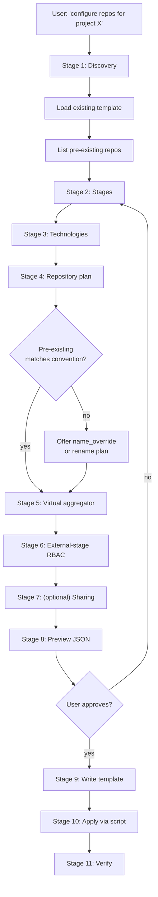

# Phase 3 walkthrough — repository structure

This file drives the conversational flow for the Project-Admin
configuring repository structure inside an existing project. The flow
is read-only and culminates in a JSON template the user owns; the
[`jfrog-project-apply-repo-structure.sh`](../scripts/jfrog-project-apply-repo-structure.sh)
script is the only thing that mutates the JFrog server.

For Phase 4 (cross-project sharing), see
[`sharing-patterns.md`](sharing-patterns.md). For the doctrine and
rationale behind the decisions made here, see
[`../../jfrog/references/projects-best-practices-repos.md`](../../jfrog/references/projects-best-practices-repos.md).

## When to follow this flow

The user has expressed any of:

- "Set up repos for my project."
- "Configure stages for project X."
- "Apply our 4-part naming convention."
- "Build a virtual aggregator for Maven / npm / Docker / ..."
- "Set up the External stage."

Mandatory entry steps from `SKILL.md` must already have run (server
resolved, environment check done, project exists, caller has
Project-Admin or Platform-Admin scope).

## Flow overview



Cautious-execution gate: stages 1–8 are read-only. The first state
mutation is in stage 10.

## Stage 1 — Discovery

Goal: understand what already exists so the new template doesn't
collide or destroy.

### Load existing template

Default search order:

1. The user's repo root, looking for `projects/<project_key>.json` or
   `<project_key>.json`.
2. A path the user names explicitly.

If the template exists, parse it; capture the `project.key`. If it
already has Phase 3+4 sections, treat them as the current intent and
ask whether the user wants to *update* (preserve, add to) or *redesign*
(start from scratch).

If no template exists, seed a minimal one:

```json
{
  "template_version": "1.0",
  "project": { "key": "<key>" }
}
```

### List pre-existing repos

```bash
jf api "/artifactory/api/repositories?project=<key>" --server-id <id> > /tmp/jf-repos-$$.json
echo /tmp/jf-repos-$$.json
```

Categorise each repo into:

- Matches the 4-part convention exactly: keep, no action.
- Matches with minor drift (case, separator): suggest in the preview.
- Doesn't match: offer `name_override` to accept-as-is, or note for
  later renaming (renaming is not done by this skill).

Surface this categorisation to the user before stage 2.

## Stage 2 — Stages

The default recommendation is `DEV`, `PROD`, `External` for a small
project; `DEV`, `QA`, `PROD`, `External` for one with a release
process. Confirm with the user; do not silently default.

Constraints:

- Names are uppercase by convention.
- `PROD` is mandatory.
- `External` is strongly recommended (warn the user if they decline).

Output: `stages: ["DEV", ...]` array on the template.

Implementation note: the apply script ensures each stage exists as a
project environment via
`POST /access/api/v1/projects/<key>/environments`. Existing
environments are detected via GET-before-POST and recorded as
`already_exists`.

## Stage 3 — Technologies

Multi-select prompt. Cover at minimum: `maven`, `npm`, `pypi`,
`docker`, `go`, `helm`, `nuget`, `generic`. Do not autoselect; ask the
user.

Per-tech canonical upstream URLs (used in stage 4's remote-repo plan):

| Tech     | Canonical upstream                                  |
| -------- | --------------------------------------------------- |
| maven    | `https://repo.maven.apache.org/maven2/`             |
| npm      | `https://registry.npmjs.org/`                       |
| pypi     | `https://pypi.org/`                                 |
| docker   | `https://registry-1.docker.io/`                     |
| go       | `https://proxy.golang.org/`                         |
| helm     | (no canonical aggregate; ask the user per chart)    |
| nuget    | `https://api.nuget.org/v3/index.json`               |
| generic  | (ask the user)                                      |

Do not invent URLs; if a tech doesn't have a canonical aggregate, ask.

## Stage 4 — Repository plan

For each selected tech, generate the standard set:

- One `local` per stage (excluding `External`).
- One `remote` on the `External` stage with the canonical upstream
  URL.
- One `virtual` aggregator with maturity `all`.

The 4-part name is **derived**, not stored, unless the user wants to
override:

```
<project_key>-<tech>-<maturity>-<locator>
```

Show the user the derived names. Ask whether any should be overridden
to keep an existing repo's name. For each override, record
`name_override: <existing-name>` on that template entry.

```json
{ "tech": "maven", "maturity": "dev", "locator": "local",
  "name_override": "team-x-maven-snapshots-local" }
```

Output: `repositories: [...]` array on the template, sized as
`(stages without External + 2) * techs`.

## Stage 5 — Virtual aggregator

For each tech's virtual entry, ask the user to confirm the resolution
order. Default:

```json
{
  "tech": "maven",
  "maturity": "all",
  "locator": "virtual",
  "aggregates": ["prod", "qa", "dev", "external"],
  "resolution_order": ["prod", "qa", "dev", "external"]
}
```

`aggregates` is the *set* of constituent repos (referenced by maturity
token); `resolution_order` is the explicit ordering. The apply script
expands these to full repo names via the 4-part rule and writes them
to the virtual's `repositories[]` field.

If the user has any direct-share consumer entries (Phase 4) that
should be exposed via this virtual, append them at the end of
`resolution_order` after the External stage. The sharing flow in
[`sharing-patterns.md`](sharing-patterns.md) handles this update.

## Stage 6 — External-stage RBAC

Read out the default overlay from the doctrine table in
`projects-best-practices-repos.md`:

| Role               | Internal stages | External stage |
| ------------------ | --------------- | -------------- |
| Developer          | read            | read + write   |
| Release Manager    | read + write    | read           |
| Security Manager   | read            | read           |
| Project Admin      | read + write    | read + write   |

Ask whether the user accepts the default or wants to customise. Map
the resulting policy into the template:

```json
{
  "external_stage_rbac": {
    "Developer":       ["READ_REPOSITORY", "ANNOTATE_REPOSITORY", "DEPLOY_CACHE_REPOSITORY"],
    "Release Manager": ["READ_REPOSITORY"],
    "Security Manager":["READ_REPOSITORY"]
  }
}
```

Roles not listed in `external_stage_rbac` are left untouched on the
External stage — list every role you care about explicitly to avoid
drift.

Action vocabulary varies by platform version. The apply script will
GET the live action vocabulary and warn on any unknown action token
rather than failing silently.

## Stage 7 — Sharing (optional)

If the user has cross-project sharing in mind, jump to
[`sharing-patterns.md`](sharing-patterns.md) and capture the entries
into the `sharing[]` array. Skip this stage entirely if the project
is self-contained.

## Stage 8 — Preview JSON

Render the new template sections (`stages`, `repositories`,
`external_stage_rbac`, optionally `sharing`) inline. Do **not** write
to disk yet.

Confirm:

- Repository name list (derived 4-part names + any overrides) — show
  one column per stage so the user can sanity-check.
- Virtual resolution order per tech.
- External-stage RBAC overlay.
- Sharing entries with role / via / counterparties.

If the user wants changes, loop back to the relevant stage. Only
proceed when the user explicitly approves.

## Stage 9 — Write template

Write the updated template back to the same path the user used in
Phase 1+2 (or a new path the user names). Confirm the path with the
user before writing.

After writing, run the validator to catch structural issues
*before* the apply script touches the platform:

```bash
./skills/jfrog-project-repo-structure/scripts/jfrog-project-validate-repo-structure.sh \
  <path-to-template>
```

If the validator reports errors, surface them and loop back; do not
proceed to apply.

## Stage 10 — Apply

Run the apply script with the resolved server-id:

```bash
./skills/jfrog-project-repo-structure/scripts/jfrog-project-apply-repo-structure.sh \
  --server-id <id> \
  <path-to-template>
```

Use `--dry-run` first if the user wants to preview the platform side
without mutations. The script emits a single structured JSON outcome
to stdout per the contract in
[`verification-and-idempotency.md`](verification-and-idempotency.md).
Capture stdout to a file and re-read it; do not parse it inline.

Add `--strict-naming` only when the project is greenfield or the user
wants the script to fail on any convention violation; the default is
warn-and-continue (safer for retrofits).

## Stage 11 — Verify

After the apply script finishes:

1. Re-read the outcome JSON; surface every `errored` or `skipped`
   entry with its reason.
2. Run the five post-apply checks from
   [`verification-and-idempotency.md`](verification-and-idempotency.md):
   stages exist, repos exist with correct project assignment, virtuals
   have correct order, sharing entries reflect template, External
   RBAC matches template.
3. Report a one-paragraph summary to the user; never claim success
   without the outcome JSON to back it up.
