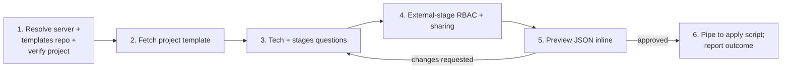
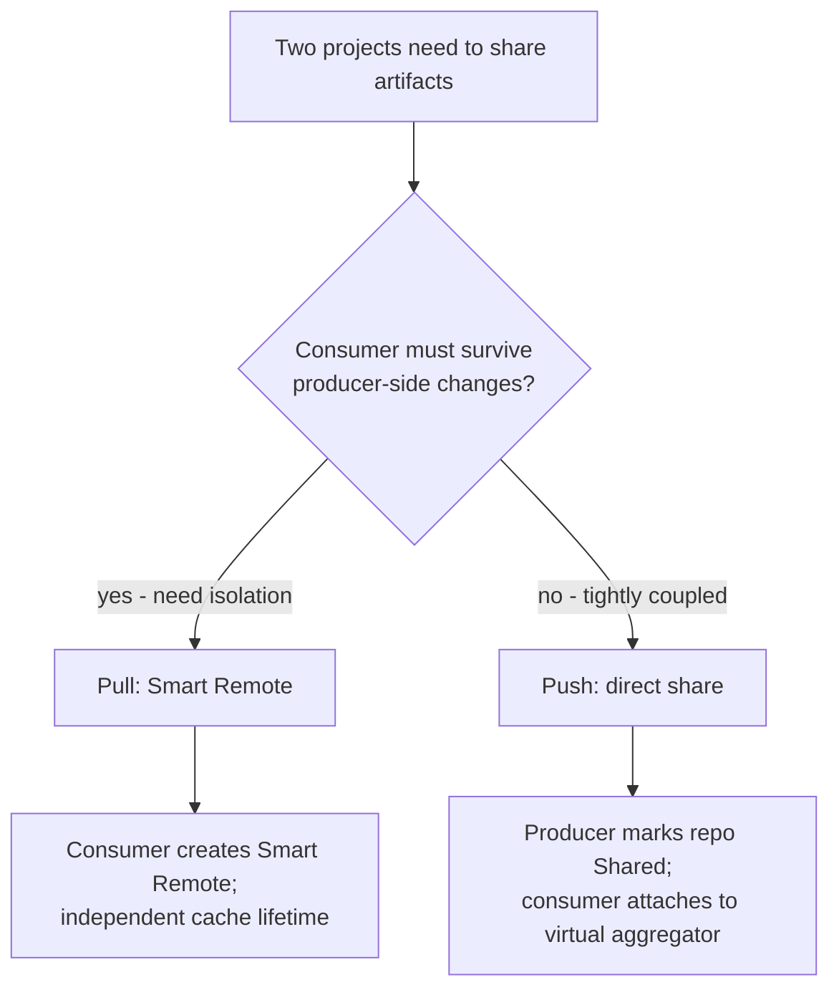

# Repository structure — conversational flow

The walkthrough the `jfrog-project-repo-structure` skill follows from
"user wants to set up repos for project X" to "outcome JSON reported
back". v2: no local writes, template fetched from Artifactory, JSON
piped to the apply script via stdin.

Stages 5 (preview), 6 (pipe + report), the re-apply loop, the
`--audit` opt-in, and the "what this flow does not do" rules are
shared with `jfrog-project-creation` and live in
[`../../jfrog/references/project-skills-conversation-contract.md`](../../jfrog/references/project-skills-conversation-contract.md).
This file covers only the skill-specific stages (1-4) plus the
Sharing patterns subsection.

## Six-stage shape



## Stage 1 — Resolve server, templates repo, and verify the project

1. Resolve the target server per the base SKILL.md *Server selection
   rules*. Capture the resolved `--server-id`.
2. Resolve the templates repo per
   `../../jfrog/references/project-templates-artifactory-repo.md`.
   Use the same chain as `jfrog-project-creation`.
3. Verify the project exists:

   ```http
   GET /access/api/v1/projects/<project_key>
   ```

   On 404, route the user back to `jfrog-project-creation`. The
   repo-structure skill never creates the project entity itself.
4. Fetch the existing repository list for the project so the
   conversation has the current state:

   ```http
   GET /artifactory/api/repositories?project=<project_key>
   ```

## Stage 2 — Fetch the project's template

Tell the user which template source the agent will use. Three-tier
fetch chain (same as `jfrog-project-creation`):

```http
GET /artifactory/<repo>/<project_key>.json
GET /artifactory/<repo>/default.json
GET /artifactory/<repo>/<archetype>.json
```

If the template already has `stages`, `repositories`,
`external_stage_rbac`, or `sharing` sections, treat them as the
current desired state and offer to edit. If those sections are
missing, the agent fills them from scratch through the conversation.

**Do not** write the fetched JSON to disk. It lives in the agent's
context window from here on.

## Stage 3 — Phase 3 questions

Customise the in-memory JSON by asking these in order.

### 3.1 Technology stacks

Multi-select: which package types does the project need? Defaults
from the archetype are good starting points. Examples:

- `maven`, `npm`, `pypi`, `docker`, `go`, `nuget`, `helm`,
  `gradle`, `terraform`, `generic`.

Each selected tech gets its own per-stage repository set rather than
reusing one global repo. Confirm with the user before adding many
techs — each one creates 3-4 repositories.

### 3.2 SDLC stages

Default set: `["DEV", "QA", "PROD", "External"]`. Ask which the
project needs; the user can rename or drop entries. `External` is
recommended for any project that pulls third-party packages.

The stages map to the `<maturity>` slot in the 4-part repo name:

- `DEV` → `dev`
- `QA` → `qa`
- `PROD` → `prod`
- `External` → `external`

### 3.3 4-part naming convention

The doctrine pattern, enforced by the validate script:

```
<project_key>-<tech>-<maturity>-<locator>
```

Examples:

- `team-x-maven-dev-local`
- `team-x-npm-prod-virtual`
- `team-x-docker-external-remote`

The validator emits a warning per name violation by default. Use
`--strict-naming` on the apply script when you want CI to fail on
any violation.

### 3.4 Per-tech repository blueprint

For each `(tech, stage)` pair, ask which `locator`s the project
needs. Defaults:

- One **local** per internal stage (`dev`, `qa`, `prod`).
- One **remote** for `external` (with the canonical upstream URL
  preconfigured per tech, e.g. Maven Central for `maven`).
- One **virtual** aggregator that resolves them in doctrine order.

The agent expresses each as an entry in `repositories[]`:

```json
{ "tech": "maven", "maturity": "dev",      "locator": "local"   }
{ "tech": "maven", "maturity": "prod",     "locator": "local"   }
{ "tech": "maven", "maturity": "external", "locator": "remote",
  "url": "https://repo.maven.apache.org/maven2/" }
{ "tech": "maven", "maturity": "all",      "locator": "virtual",
  "aggregates": ["prod", "dev", "external"],
  "resolution_order": ["prod", "dev", "external"] }
```

### 3.5 Virtual aggregator resolution order

The doctrine order is `prod -> dev -> external -> smart-remotes`. The
agent shows the resolved list before previewing the JSON. If the
user customises, validate that the order makes sense (e.g. `external`
before `prod` would let third-party packages shadow internal builds —
warn loudly).

## Stage 4 — Phase 4 questions (optional)

Skip this stage entirely if the project doesn't share or consume from
other projects.

### 4.1 External-stage RBAC

When the project has an `External` stage, ask whether to apply the
External-stage RBAC pattern:

- Developers get **read + write** on the External stage so they can
  pull and cache new third-party packages.
- Developers get **read-only** on internal DEV/QA/PROD so they
  cannot bypass the External flow with a manual upload.

If yes, the agent adds an `external_stage_rbac` block. The apply
script updates the project's role definitions accordingly.

### 4.2 Producer or consumer

Ask: is this project a **producer** (other projects consume our
packages) or a **consumer** (we pull from another project)?

#### Producer

For each producer repo (typically `prod` local), the agent asks:

- Which repo to share?
- Which consumer projects?

Schema fragment:

```json
{ "role": "producer",
  "repository": "team-x-maven-prod-local",
  "consumer_projects": ["team-y", "team-z"] }
```

#### Consumer

For each producer repo to consume, the agent asks:

- **Push or pull?**
  - **Push (direct share)** — fastest; producer manages lifecycle;
    consumer survives only as long as producer keeps the repo.
  - **Pull (Smart Remote)** — independent cache; consumer survives
    producer-side deletion; more storage but more isolation.
- The producer project + repo.
- The consumer repo name (must follow the 4-part convention).

Schema fragment (Smart Remote):

```json
{ "role": "consumer", "via": "smart-remote",
  "from_project": "team-platform",
  "from_repository": "team-platform-maven-prod-local",
  "into_repository": "team-x-platform-maven-remote" }
```

See *Sharing patterns* below for the decision tree and the
read-only-consumer guard.

## Sharing patterns

Push (direct share) vs pull (Smart Remote) for cross-project
artifact sharing. The apply script encodes the endpoint detail; the
agent decides which pattern fits via the conversation.

### Decision tree



### Push (direct share)

Best for tightly coupled internal sharing where the producer owns
the lifecycle. Mechanics:

- Producer marks its `prod` local repo as Shared.
- Consumers add the shared repo to their virtual aggregator.
- Producer-side deletion removes consumer access.

The apply script PUTs the share entry on the producer side and
updates the consumer's virtual aggregator to include the shared
repo in doctrine order (typically after `prod`).

### Pull (Smart Remote)

Best for stricter segregation or any case where the consumer must
survive producer-side changes. Mechanics:

- Consumer creates a smart-remote repo pointing at the producer's
  repo URL.
- Cache lifetime is independent.
- Network hop on first fetch; cached locally thereafter.

The apply script PUTs the consumer's remote repo with
`contentSynchronisation` enabled and updates the consumer's virtual
aggregator to include it.

### Read-only consumer rule

**Regardless of method**, consumers must hold read-only roles on
the producer's assets. The apply script refuses any sharing entry
that would grant cross-project write — outcome: `errored` with
`error: cross_project_write_forbidden`. Validate also flags this
ahead of apply.

Why: cross-project write would let consumer pipelines push into the
producer's stage and bypass the producer's gates.

### Naming for cross-project repos

The four-part convention extends to consumed repos. Two shapes:

- **Smart Remote into a producer's repo** —
  `<consumer_key>-<producer_key>-<tech>-remote`. Example:
  `team-x-platform-maven-remote`.
- **Direct-shared repo attached to a consumer virtual** — the repo
  keeps its producer-side name
  (`team-platform-maven-prod-local`). Only the consumer's virtual
  aggregator changes.

The `<consumer_key>` prefix on Smart Remotes is doctrine, not
enforced unless `--strict-naming` is set.

### When sharing is not the answer

- **Same team, multiple sub-projects** → one project with multiple
  repos, not two projects sharing.
- **Build-info across teams** → AppTrust applications (planned
  `jfrog-project-application` skill).
- **Multi-write (federation)** → out of scope here.

## Stages 5-6, audit, recovery

Render the customised JSON inline (preview can omit project-entity
sections and focus on `stages`, `repositories`,
`external_stage_rbac`, `sharing` plus a one-line project-key
reminder). Get user approval, pipe to
`scripts/jfrog-project-apply-repo-structure.sh` (validate first via
`scripts/jfrog-project-validate-repo-structure.sh --strict-naming`
if uncertain), capture the outcome JSON, run post-apply checks.
Full pattern, plus the re-apply-after-failure loop, the `--audit`
flag (suffix is `-repos-<iso8601>.json`), and the "what this flow
does not do" rules: see
[`../../jfrog/references/project-skills-conversation-contract.md`](../../jfrog/references/project-skills-conversation-contract.md).

This flow additionally never renames or deletes existing
repositories: naming-convention violations on existing repos are
reported as warnings (or errors in `--strict-naming` mode); the
user fixes them manually.
