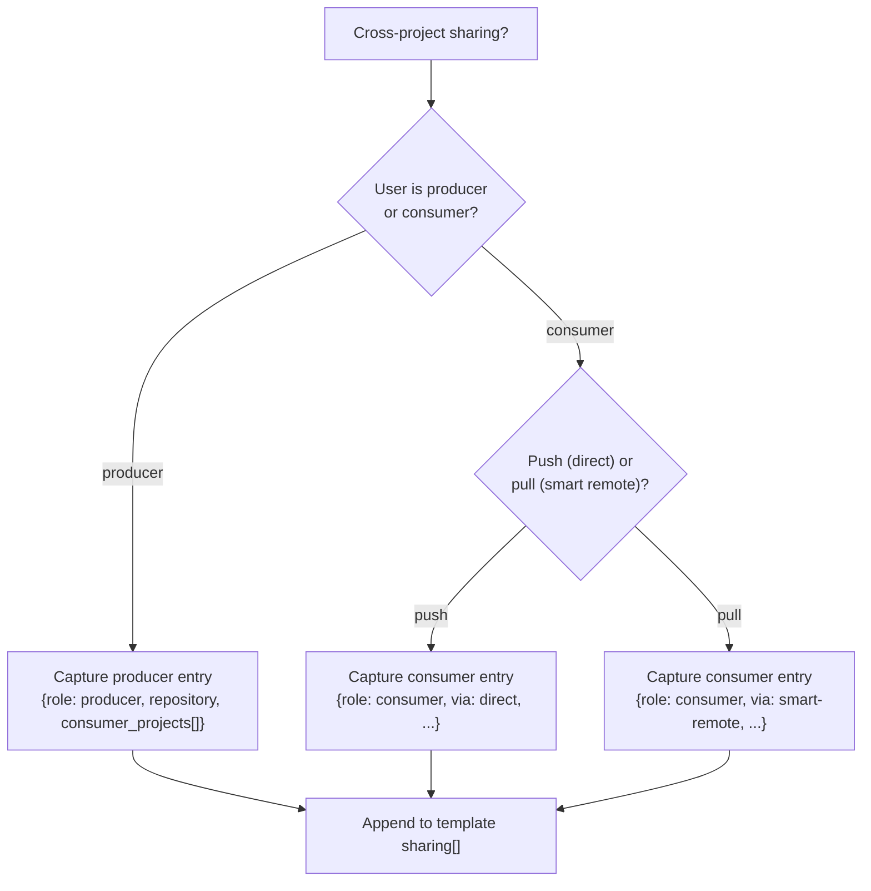

# Phase 4 walkthrough — cross-project sharing

This file drives the conversational flow for cross-project sharing.
It is invoked from stage 7 of
[`repo-structure-flow.md`](repo-structure-flow.md), or directly when
the user only wants to add a sharing relationship to an existing
project. For the underlying doctrine see
[`../../jfrog/references/projects-best-practices-repos.md`](../../jfrog/references/projects-best-practices-repos.md).

## When to follow this flow

The user has expressed any of:

- "Share my prod repo with team Y."
- "Let team Z consume our Docker images."
- "Set up a Smart Remote pointing at team-platform's Maven."
- "Pull from another team's repo."
- "Configure a producer / consumer relationship."

The project must already exist (Phase 1 done) and have at least its
`prod-local` repos in place (Phase 3 done for the producer side, or
the consumer-side virtual aggregator in place).

## Decision tree



The user may be both producer and consumer in the same project — the
flow runs once per relationship.

## Push vs pull — when to recommend each

| Question                                               | Push (direct) | Pull (smart remote) |
| ------------------------------------------------------ | ------------- | ------------------- |
| Should consumer survive producer outages?              |       no      |        yes          |
| Should consumer always see producer's latest state?    |      yes      |        no           |
| Is the producer's project run by a different org/team? |       no      |        yes          |
| Should consumer pay no extra storage?                  |      yes      |        no           |
| Will the producer's repo be deleted/replaced often?    |       no      |        yes          |

Default recommendation:

- **Push (direct)** for internal-platform → internal-team flows where
  the platform team owns the producer.
- **Pull (smart remote)** for cross-team or cross-org flows where
  contractual independence matters.

If the user is unsure, ask: "Do you want your build to survive if the
producer team accidentally deletes the repo?" — yes → smart remote;
no → direct.

## Producer-side flow

Goal: capture which repo to share and with which consumer projects.

Questions to ask:

1. Which producer repo? Default: the project's `<tech>-prod-local`.
   Refuse to share `dev-local` or `qa-local` (warn the user; require
   explicit override on a flag the script doesn't currently expose —
   i.e. don't accept it for now).
2. Which consumer projects? List by project key. Each must already
   exist on the platform (the apply script verifies this at apply time
   and records `error: principal_missing` for absent keys).
3. Read-only confirmation: state explicitly that consumers will get
   read-only on the shared repo. The apply script enforces this.

Template entry:

```json
{
  "role": "producer",
  "repository": "<producer-repo-name>",
  "consumer_projects": ["<consumer-key-1>", "<consumer-key-2>"],
  "description": "<optional human note>"
}
```

The apply script:

- GETs the producer repo's config. If `projectKey` does not match the
  template's `project.key`, refuses (the producer must own the repo).
- GETs the current share state. If a target consumer is already in the
  share list, records `already_exists`. If not, POSTs to add it.
- Refuses to remove consumers from the share list — this skill is
  additive only. Removals must be done out-of-band.
- Records the action in the structured outcome JSON.

## Consumer-side flow — direct (push)

Use when the producer has already configured the producer-side share
and the consumer just needs to consume.

Questions to ask:

1. Which producer project key?
2. Which producer repo (full name) to consume?
3. Which of *your* virtual aggregators should expose this repo?
   Default: the matching `<tech>-all-virtual` for the same tech.

Template entry:

```json
{
  "role": "consumer",
  "via": "direct",
  "from_project": "<producer-key>",
  "from_repository": "<producer-repo-name>"
}
```

The apply script:

- GETs the producer repo's share list. If the consumer project is not
  on it, records `error: not_shared_with_consumer`. The producer must
  add the consumer first; this skill never patches around producer
  consent.
- Adds the producer's repo to the consumer's matching virtual
  aggregator's `repositories[]` and rewrites `repositories[]` with
  the explicit resolution order from the template (producer entries
  trail external entries by default).
- If the producer repo is already in the virtual, records
  `already_exists`.

## Consumer-side flow — smart remote (pull)

Use when the consumer wants cache-decoupled consumption.

Questions to ask:

1. Which producer project key (informational; not used by the
   smart-remote URL).
2. Which producer repo to point at? Capture the full producer-side
   URL by deriving from the active server's URL +
   `/artifactory/<producer-repo-name>/`.
3. The name of the consumer-side smart-remote repo. Derived as
   `<consumer-key>-<producer-key>-<tech>-remote` by default; the user
   can override.
4. Which consumer-side virtual aggregator should include this smart
   remote? Default: the matching `<tech>-all-virtual`.

Template entry:

```json
{
  "role": "consumer",
  "via": "smart-remote",
  "from_project": "<producer-key>",
  "from_repository": "<producer-repo-name>",
  "into_repository": "<consumer-key>-<producer-key>-<tech>-remote"
}
```

The apply script:

- Resolves the producer-side URL from the active server's URL +
  `/artifactory/<producer-repo-name>/`.
- GETs the consumer-side smart remote. If absent, PUTs to create with
  the resolved URL, the producer's `tech` (matched against the
  Artifactory `packageType` vocabulary), and the consumer project's
  machine identity for upstream auth (project access token or OIDC
  mapping; see `../../jfrog/references/oidc-integration.md`).
- If present and matching, records `already_exists`. If present and
  differing (URL drift, auth drift), PUTs to update.
- Adds the smart remote to the consumer-side virtual aggregator's
  `repositories[]` (after External entries) and rewrites `repositories[]`
  with explicit ordering.

## Read-only consumer rule

Regardless of method, **consumers never get write on producer assets.**
The apply script enforces this in three places:

1. Producer-side: refuses to apply a producer entry whose grant set
   would include any write action (the `role: producer` shape doesn't
   even allow specifying actions; the share defaults to read).
2. Consumer-side direct: the entry adds the producer repo to the
   consumer's virtual but cannot PUT producer-side config.
3. Consumer-side smart-remote: a smart-remote is inherently read on
   the upstream side; the script verifies the consumer-side smart-remote
   does not have any push proxy enabled.

Any entry that violates the rule is recorded as
`error: writer_grant_cross_project` and the rest of the apply
continues. This is non-blocking by design — the rest of Phase 3+4 can
still apply while the user fixes the offending sharing entry.

## Common Phase 4 anti-patterns

- **Sharing `dev-local` for cross-project consumption.** Dev artifacts
  are not stable. Refuse and steer to `prod-local`.
- **Sharing an `external-remote` repo.** That repo is already a proxy
  upstream; re-sharing creates a chain that breaks credential trust.
- **Hard-coding producer credentials in the smart-remote.** Use the
  consumer project's machine identity instead (project access token
  or OIDC mapping).
- **Bidirectional sharing using a single direct-share entry.**
  Direct-share is one-directional. Capture two entries (one per
  direction).
- **Removing consumers via this skill.** This skill is additive. To
  remove a consumer from a share, do it out-of-band and re-run the
  apply script for verification.

## After the conversation

Append the captured entries to the template's `sharing[]` array and
return to stage 8 of
[`repo-structure-flow.md`](repo-structure-flow.md) for preview, write,
and apply.
