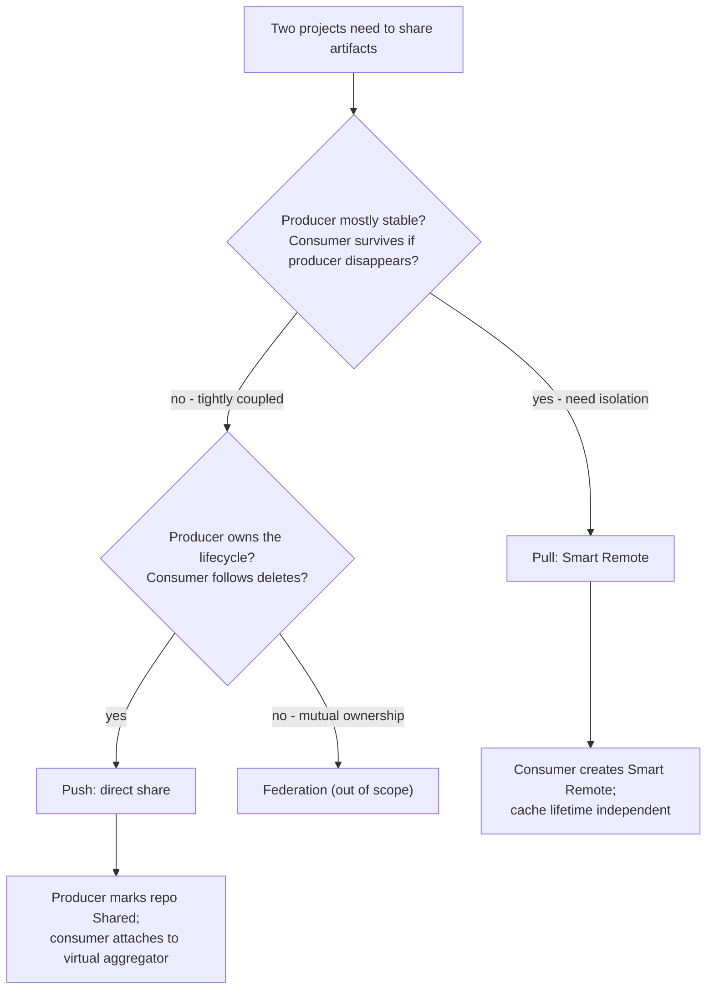

# Sharing patterns — push vs pull

How two JFrog Projects share repositories. The two patterns are
**push (direct share)** and **pull (Smart Remote)**. v2: the agent
collects the user's intent through the conversation; the apply
script writes the platform mutations.

## Decision tree



## Push (direct share)

Best for tightly coupled internal sharing where the producer is
authoritative.

**Mechanics:**

- Producer project marks its `prod` local repo as Shared via the
  Access API.
- Consumer projects add the shared repo to their virtual aggregator.
- Producer manages the entire lifecycle — if it deletes the repo,
  consumers lose access.

**Schema fragment (producer side):**

```json
{
  "role": "producer",
  "repository": "team-x-maven-prod-local",
  "consumer_projects": ["team-y", "team-z"]
}
```

**Schema fragment (consumer side):**

```json
{
  "role": "consumer",
  "via": "direct-share",
  "from_project": "team-x",
  "from_repository": "team-x-maven-prod-local",
  "attach_to_virtual": "team-y-maven-all-virtual"
}
```

**Apply script behaviour:**

- Producer side: GET current shares; if the target consumer project
  is not already listed, PUT the share entry.
- Consumer side: GET the consumer's virtual aggregator; if the
  shared repo is not in `repositories[]`, PUT the virtual with the
  shared repo added in the doctrine order (typically after `prod`).

**Endpoints:**

```http
GET /access/api/v1/projects/<producer_key>/share/repositories
PUT /access/api/v1/projects/<producer_key>/share/repositories/<repo>/<consumer_key>
DELETE /access/api/v1/projects/<producer_key>/share/repositories/<repo>/<consumer_key>
GET /artifactory/api/repositories/<consumer_virtual>
PUT /artifactory/api/repositories/<consumer_virtual>
```

## Pull (Smart Remote)

Best for stricter segregation, contractual independence between
teams, or any situation where the consumer must survive
producer-side changes.

**Mechanics:**

- Consumer creates a smart-remote repository pointing at the
  producer's repo URL.
- Cache lifetime is independent — consumer survives producer-side
  deletion of underlying artifacts.
- Network hop on first fetch; cached locally thereafter.

**Schema fragment:**

```json
{
  "role": "consumer",
  "via": "smart-remote",
  "from_project": "team-platform",
  "from_repository": "team-platform-maven-prod-local",
  "into_repository": "team-x-platform-maven-remote"
}
```

**Apply script behaviour:**

- GET the consumer's repo by `into_repository`; on 404, PUT a remote
  repo configuration with `url` pointing at the producer repo and
  `contentSynchronisation` enabled for Smart Remote semantics. On
  200, compare config and PUT-to-update only if it differs.
- Update the consumer's virtual aggregator to include the new
  remote in doctrine order.

**Endpoints:**

```http
GET /artifactory/api/repositories/<into_repository>
PUT /artifactory/api/repositories/<into_repository>
```

## Read-only consumer rule

**Regardless of method**, consumers must hold read-only roles on the
producer's assets. The apply script enforces this:

- Refuses any sharing entry that would grant write access
  cross-project.
- When updating consumer-side project members for a shared repo,
  uses the `Viewer` predefined role (or a custom read-only role)
  rather than any role with deploy/delete actions.
- The validate script flags violations as `errored` regardless of
  `--strict-naming`.

**Why:** cross-project write would let consumer pipelines push into
the producer's stage and bypass the producer's gates.

## Naming for cross-project repos

The 4-part convention extends naturally to consumed repos. Two
patterns:

- **Smart Remote into a producer's repo** —
  `<consumer_key>-<producer_key>-<tech>-remote`. Example:
  `team-x-platform-maven-remote`.
- **Direct-shared repo attached to consumer virtual** — the repo
  keeps its producer-side name (`team-platform-maven-prod-local`).
  Only the virtual aggregator changes on the consumer side.

The validate script accepts both shapes; the `<consumer_key>` prefix
on Smart Remotes is doctrine, not enforced unless
`--strict-naming` is set.

## When sharing is not the answer

- **Same team, multiple sub-projects.** Use one project with
  multiple repos rather than two projects sharing.
- **Build-info sharing across teams.** Build info is best handled by
  AppTrust applications — out of scope for this skill, see planned
  `jfrog-project-application`.
- **Federation (multi-write).** Two-way mirroring is a federation
  concern, not project sharing. Not handled by this skill.

## Anti-patterns

- **Granting consumer roles with write actions on producer repos.**
  The apply script refuses; surfacing the refusal verbatim to the
  user.
- **Attaching the same producer repo to a consumer's virtual via
  both direct-share and Smart Remote.** Pick one; the second adds
  noise without changing semantics.
- **Sharing a `dev` or `qa` local repo cross-project.** Doctrine is
  share `prod` only. Other stages may be marked Shared but the
  validate script warns; `--strict-naming` does not block this — it
  is a doctrine concern outside the naming rule.
- **Embedding the producer's access token in a consumer's Smart
  Remote config.** The platform handles authentication when both
  projects live on the same server. Cross-server Smart Remotes are
  out of scope here.
