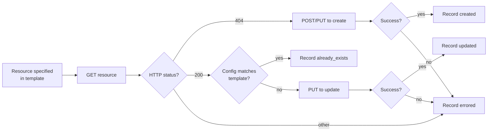

# Verification and idempotency contract (repo structure)

What the apply script guarantees, what the agent should check after
it runs, and how to recover from partial failures. v2: input flows
via stdin or `--template-url`; all output is on stdout; no local
files are emitted by the agent.

## Idempotency contract (per resource)

Every resource the apply script touches follows the same state
machine — same as `jfrog-project-creation`.



Resource-specific rules:

- **Local / remote / virtual repositories:**
  `GET /artifactory/api/repositories/<key>`; 404 → PUT to create
  with the desired config; 200 with matching config →
  `already_exists`; 200 differing → PUT to update.
- **Project assignment of a repo:** the apply script ensures the
  repo's `projectKey` matches the template. Repos created by the
  script are project-scoped from the start; pre-existing repos that
  don't have the right `projectKey` are reported as `errored` with
  `error: project_assignment_mismatch` — the script never silently
  reassigns a repo across projects.
- **Sharing:** `GET /access/api/v1/projects/<key>/share/repositories`;
  compare against template; PUT or DELETE only the difference. The
  script never deletes shares the template does not mention.
- **External-stage RBAC:** the relevant project roles are updated via
  `PUT /access/api/v1/projects/<key>/roles/<role>`. The action
  vocabulary is fetched live (not hard-coded) when present on the
  platform; on older platforms that don't expose it, the script
  falls back to a documented action set and records a warning.
- **403 from the platform** (caller lacks rights) surfaces as
  `errored` on the offending resource. The script does not retry,
  does not fall back to a different server. The agent reports the
  403 verbatim.

## Outcome JSON shape (stdout)

The apply script writes a single JSON document to stdout. Re-read
the captured value instead of re-running the script.

```json
{
  "schema_version": "2.0",
  "input_source": "stdin",
  "template_url": null,
  "template_version": "1.0",
  "blueprint": "team-default",
  "project_key": "team-x",
  "server_id": "mycompany",
  "dry_run": false,
  "strict_naming": false,
  "audit": false,
  "started_at": "2026-05-11T12:34:56Z",
  "finished_at": "2026-05-11T12:35:18Z",
  "summary": {
    "created": 5,
    "already_exists": 3,
    "updated": 1,
    "skipped": 0,
    "errored": 0
  },
  "resources": [
    { "kind": "environment",       "key": "External",                       "status": "created" },
    { "kind": "repo.local",        "key": "team-x-maven-dev-local",         "status": "created" },
    { "kind": "repo.local",        "key": "team-x-maven-prod-local",        "status": "created" },
    { "kind": "repo.remote",       "key": "team-x-maven-external-remote",   "status": "created",
      "extra": { "url": "https://repo.maven.apache.org/maven2/" } },
    { "kind": "repo.virtual",      "key": "team-x-maven-all-virtual",       "status": "created",
      "extra": { "repositories": ["team-x-maven-prod-local","team-x-maven-dev-local","team-x-maven-external-remote"] } },
    { "kind": "external_rbac",     "key": "Developer",                      "status": "updated" },
    { "kind": "share.producer",    "key": "team-x-maven-prod-local->team-y","status": "created" }
  ],
  "warnings": [],
  "errors": []
}
```

`status` values: `created`, `updated`, `already_exists`, `skipped`,
`errored`.

`input_source` is one of `stdin` or `template-url`. With
`--template-url` the URL is recorded (no credentials embedded).

## Post-apply checks

After the apply script returns, run these read-only checks against
the live platform and confirm they match the template. Save each
response to a temp file per the base SKILL.md *Preserving command
output* pattern.

1. **Project still exists** (sanity):

   ```http
   GET /access/api/v1/projects/<project_key>
   ```

2. **All template repos exist** with the right config:

   ```http
   GET /artifactory/api/repositories/<each repo key>
   ```

   Expect 200; compare `rclass`, `packageType`, `url` (for remote),
   `repositories[]` (for virtual) against the template.

3. **Project repository list matches:**

   ```http
   GET /artifactory/api/repositories?project=<project_key>
   ```

   Expect every repo declared in the template plus any pre-existing
   repos.

4. **Virtual aggregator order is doctrine-correct** (only when the
   template carries `resolution_order`):

   The virtual's `repositories[]` array should match the template's
   `resolution_order`. Any drift is a warning the agent reports.

5. **Sharing entries match:**

   ```http
   GET /access/api/v1/projects/<producer_project>/share/repositories
   ```

   Expect every `sharing[]` producer entry in the template.

6. **External-stage RBAC roles updated** (only when
   `external_stage_rbac` is in the template):

   ```http
   GET /access/api/v1/projects/<project_key>/roles/<role>
   ```

   Expect `environments` and `actions` to reflect the template.

If any check fails, the agent reports the gap, names the resource,
and offers to re-pipe the (possibly edited) JSON.

## Re-applying

Safe to re-run with the same JSON. Resources that succeeded the first
time report `already_exists` on the second run. Resources with a
single edited field report `updated` on the next run. The script
never deletes a resource the template does not explicitly mark for
deletion.

## Recovery patterns

### "Repository name violates the 4-part convention"

By default, a warning. With `--strict-naming`, an error. Recovery:

1. Edit the in-memory JSON to fix the name(s), re-pipe.
2. Or accept the warning and proceed; the script will create the
   repo with the non-conforming name.

The script will not rename existing repositories.

### "Repo exists but belongs to a different project"

`errored` with `error: project_assignment_mismatch`. The script will
not silently reassign. Recovery:

1. Delete the repo manually, re-run.
2. Or pick a different name in the template.

### "Sharing entry rejected because consumer lacks read access"

Validate flagged this; apply errors with
`error: cross_project_write_forbidden`. Recovery:

1. Edit the consumer's roles to include a read-only project role on
   the producer's stage.
2. Re-pipe.

### "Virtual aggregator order conflicts with doctrine"

Apply succeeds but the agent warns. Recovery is optional:

1. If the conflict is intentional (e.g. testing a new external
   source), leave it.
2. Otherwise, edit `resolution_order` in the template and re-pipe;
   the virtual will be `updated` to reflect doctrine order.

### "Action vocabulary mismatch on External-stage RBAC"

`warnings[]` will carry one entry per unknown action name. Recovery:

1. The script applies the actions it recognises and skips the rest.
2. Fetch the live action vocabulary from the platform and update the
   template (action names sometimes vary across platform versions).

## Verification on the bundled fallback path

When the agent used the bundled blueprints (no Artifactory templates
repo resolved), the verification flow is identical. The only
difference is no Artifactory record of the input — opt into
`--audit` on the next apply for a durable record.
