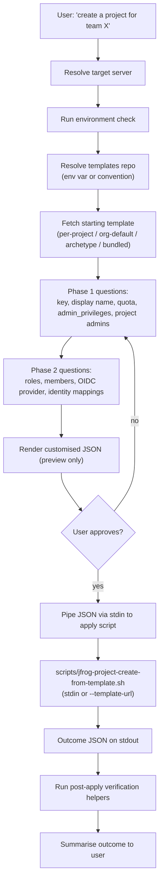
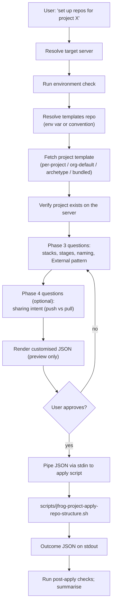

# JFrog Project Setup

Stateless workflow skill covering project creation, identity and
access, repository structure, and cross-project sharing. The agent
fetches a template, customises it in conversation, and pipes the
result to apply scripts that own all mutations. **The agent never
writes any file to disk.**

The skill bundles two phase groups behind one entry point:

- **Phase 1+2** — project entity + identity and access (project key,
  quota, admins, roles, members, OIDC). Covered by the
  `creation-flow.md` reference and applied by
  `jfrog-project-create-from-template.sh`.
- **Phase 3+4** — repository structure + cross-project sharing (SDLC
  stages, per-tech repos, virtual aggregators, External-stage RBAC,
  push/pull sharing). Covered by the `repo-structure-flow.md`
  reference and applied by `jfrog-project-apply-repo-structure.sh`.

Both phase groups share the same JSON template format, the same
conversation contract (preview, pipe-to-apply, re-apply,
`--audit`), the same verification contract (per-resource state
machine, outcome JSON v2 schema), and the same Artifactory
templates-repo discovery chain. The agent picks the right flow
based on user intent in the opening turn — see *Phase routing*
below.

## Prerequisites

- Read `../jfrog/SKILL.md` for JFrog Platform concepts, server
  selection rules, the `jf api` invocation pattern, and network
  permissions. Every API call below runs through `jf api` with
  `required_permissions: ["full_network"]` on the Shell tool.
- Read `../jfrog/references/project-templates-artifactory-repo.md` —
  it owns the templates-repo discovery and fetch chain that both
  phase groups consume.
- Read `../jfrog/references/projects-best-practices.md` for the
  doctrine the conversation enforces (Team = Project model, key
  conventions, RBAC-by-stage, group-first membership, 4-part
  naming, virtual aggregator order, External-stage pattern, sharing
  decision tree).
- Read `../jfrog/references/projects-api.md` for project / member /
  role endpoint shapes.
- Read `../jfrog/references/oidc-integration.md` when the user wants
  to wire OIDC for CI as part of project creation.

The skill does **not** probe the caller's token for Platform Admin
or Project Admin scope. JFrog will return 403 if the caller lacks
the rights to create a project, members, OIDC, repositories, or
sharing; the agent surfaces that 403 verbatim rather than guessing
the user's role up front.

## Phase routing

Listen for the *primary* user intent in the opening turn and pick
the right flow:

| User intent example | Phase group | Flow reference |
| --- | --- | --- |
| "Create a project for team X", "onboard team Y to JFrog", "set up OIDC for a project", "add a project admin", "bootstrap members and roles" | Phase 1+2 | `references/creation-flow.md` |
| "Set up repos for project X", "configure the virtual aggregator", "wire External-stage RBAC", "share our prod Maven repo with team Y", "create a Smart Remote pulling from project Z" | Phase 3+4 | `references/repo-structure-flow.md` |
| "Create a project AND set up its Maven + npm repos", "stand up a new project end-to-end" | Both, in order | run `creation-flow.md` first, then continue into `repo-structure-flow.md` on the same project |

Edge cases:

- **Repo intent against a non-existent project.** If the user asks
  for Phase 3+4 work but step 4 of *Mandatory entry steps* below
  returns 404 on `GET /access/api/v1/projects/<key>`, surface the
  missing project and offer to run the creation flow first.
- **Creation intent against an existing project.** If the user asks
  for Phase 1+2 work but the project already exists, the apply
  script will report `already_exists` per resource and only update
  what differs. The agent should preview the diff explicitly so the
  user knows what will change.

## Flow (Phase 1+2)



## Flow (Phase 3+4)



## Mandatory entry steps

Before any conversation about project shape or repository shape,
run these steps **in order**:

1. **Resolve the target server** per the base SKILL.md *Server
   selection rules*. Do not silently pick a default; if the user
   did not name a server and there is more than one, ask. Capture
   the resolved server-id for use in every later call.
2. **Run the environment check** if not already done in this session
   (`<base_skill_path>/scripts/check-environment.sh`).
3. **Resolve the templates repo** per
   `../jfrog/references/project-templates-artifactory-repo.md`
   §*Resolving the templates repo*. Use the first of: env var
   `JFROG_PROJECT_TEMPLATES_REPO`, the conventional key
   `project-templates-generic-local`, or the bundled fallback.
   Record the resolution outcome — the agent reports it to the user.
4. **Look up project state** appropriate to the routed phase:
   - **Phase 1+2 routing.** Fetch the existing project list so the
     conversation can avoid colliding on `project_key`:

     ```http
     GET /access/api/v1/projects
     ```

   - **Phase 3+4 routing.** Verify the target project exists; if
     not, route the user back to Phase 1+2:

     ```http
     GET /access/api/v1/projects/<project_key>
     ```

     Expect 200. On 404, surface the missing project and offer to
     run the creation flow first.

   Save responses to a temp file per the base SKILL.md *Preserving
   command output* pattern.

5. **(Phase 3+4 only) Fetch the existing repository list** so the
   conversation has the current state:

   ```http
   GET /artifactory/api/repositories?project=<project_key>
   ```

## Workflow

The full conversational walkthroughs live in the per-phase
reference files. Read the relevant one at the start of the first
turn that activates that phase.

- Phase 1+2 walkthrough — fetch chain, Phase 1 questions, Phase 2
  questions, preview, apply, verify — `references/creation-flow.md`.
- Phase 3+4 walkthrough — fetch chain, stages, repositories,
  External RBAC, sharing, preview, apply, verify —
  `references/repo-structure-flow.md`.

When a user signals both intents in one conversation, run the
Phase 1+2 walkthrough first, let the apply script return, then move
into the Phase 3+4 walkthrough on the same project. The template
extends; the agent re-customises the same JSON object across the
two flows.

### Post-apply checks (Phase 1+2)

After `jfrog-project-create-from-template.sh` returns, run these
read-only checks against the live platform and confirm they match
the template the agent piped in. Save each response to a temp file
per the base SKILL.md *Preserving command output* pattern.

- `GET /access/api/v1/projects/<project_key>` — expect 200 with
  `display_name`, `description`, `admin_privileges`, and
  `storage_quota_bytes` matching the template.
- `GET /access/api/v1/projects/<project_key>/roles` — expect every
  CUSTOM role in the template plus the predefined set.
- `GET /access/api/v1/projects/<project_key>/groups` and
  `/users` — expect every `members[]` entry with the right role.
- `GET /access/api/v1/oidc/<provider_name>` and
  `/identity_mappings` (when the template had an `oidc` block) —
  expect the provider record and one entry per
  `identity_mappings[]`.
- `GET /artifactory/api/repositories?project=<project_key>` —
  expect `[]` unless the user has already moved into the
  repo-structure flow.

### Post-apply checks (Phase 3+4)

After `jfrog-project-apply-repo-structure.sh` returns:

- `GET /access/api/v1/projects/<project_key>` — sanity check that
  the project still exists.
- `GET /artifactory/api/repositories/<each repo key>` — expect 200;
  compare `rclass`, `packageType`, `url` (for remote),
  `repositories[]` (for virtual) against the template.
- `GET /artifactory/api/repositories?project=<project_key>` —
  expect every repo declared in the template plus any pre-existing
  repos.
- For each virtual repo with `resolution_order` in the template:
  confirm the live `repositories[]` array matches.
- `GET /access/api/v1/projects/<producer_project>/share/repositories`
  — expect every `sharing[]` producer entry.
- `GET /access/api/v1/projects/<project_key>/roles/<role>` (when
  `external_stage_rbac` is in the template) — expect
  `environments` and `actions` to reflect the template.

For the per-resource state machine, outcome JSON shape, recovery
patterns, and the `--audit` contract (shared by both phase groups),
see
[`../jfrog/references/projects-verification-contract.md`](../jfrog/references/projects-verification-contract.md).

## Reference files

Load these only when the situation calls for them. Avoid loading
more than 2-3 in a single conversation turn.

- `references/creation-flow.md` — Phase 1+2 stages (resolution →
  Phase 1 → Phase 2) and per-archetype customisation prompts.
- `references/repo-structure-flow.md` — Phase 3+4 stages for
  stages, repositories, External-stage RBAC, virtual aggregator
  resolution; includes the push vs pull sharing decision tree and
  the read-only-consumer rule in its *Sharing patterns* section.
- `../jfrog/references/project-skills-conversation-contract.md` —
  Stage 5 (preview), Stage 6 (pipe + report), `--audit`, re-apply
  loop, "what these flows do not do" (shared across both phase
  groups).
- `../jfrog/references/projects-verification-contract.md` —
  idempotency state machine, outcome JSON shape, recovery patterns,
  `--audit` contract, shared gotchas (shared across both phase
  groups).
- `../jfrog/references/project-templates-artifactory-repo.md` —
  templates-repo discovery, fetch chain, seeding instructions.
- `../jfrog/references/projects-best-practices.md` — project
  doctrine: archetype definitions, RBAC-by-stage, 4-part naming,
  virtual order, External pattern, push vs pull sharing,
  anti-patterns.
- `../jfrog/references/projects-api.md` — endpoint shapes for
  project CRUD, members, roles, environments.
- `../jfrog/references/oidc-integration.md` — provider config and
  identity mappings (read when the user wants OIDC).
- `../jfrog/references/artifactory-entities.md` — repository
  concepts (local / remote / virtual / federated).

## Scripts

All scripts are non-interactive and emit structured v2 outcome JSON
on stdout. They source the shared runtime library at
`../jfrog/scripts/lib/project-template-runtime.sh`.

### Phase 1+2 script

- `scripts/jfrog-project-create-from-template.sh [--server-id <id>] [--template-url <url>] [--dry-run] [--audit]`
  — apply the project, roles, members, and OIDC sections
  idempotently. Reads the template from stdin by default, or
  fetches it via `--template-url` (Artifactory path like
  `/artifactory/<repo>/<file>.json`). GET-before-PUT/POST per
  resource. `--audit` opt-in writes a copy to
  `/artifactory/<repo>/applied/<key>-<timestamp>.json` after
  success. The `stages`, `repositories`, `external_stage_rbac`,
  and `sharing` sections are ignored — they belong to the Phase
  3+4 script.

### Phase 3+4 script

- `scripts/jfrog-project-apply-repo-structure.sh [--server-id <id>] [--template-url <url>] [--dry-run] [--strict-naming] [--audit]`
  — apply the `stages`, `repositories`, `external_stage_rbac`, and
  `sharing` sections idempotently. Reads the template from stdin or
  fetches via `--template-url`. The project-entity sections
  (project, admins, members, oidc) are ignored — they belong to
  the Phase 1+2 script. `--strict-naming` rejects any repo name
  that violates the four-part convention.

Both scripts source their input from stdin or from Artifactory;
neither reads from a local file path. Each apply does GET-before-write
per resource, so re-running after a partial failure is safe. Offline
schema validation is available out-of-band via `ajv` against
`../jfrog/assets/project-templates/schema.json` when the user wants
to lint a template without touching the platform.

## Gotchas

### Phase 1+2

- **`project_key` is immutable.** The script will refuse to update
  a key that differs from an existing project's. Confirm before
  piping the JSON to apply.
- **Predefined roles do not need creating.** The schema accepts
  `type: PREDEFINED` so the template can describe the project's
  role surface, but the script does not call `POST /roles` for
  predefined entries — it skips them and moves on to member
  assignment.
- **Membership is groups-first.** Templates that list users
  without groups will pass validation but the agent should warn
  the user during the walkthrough.
- **Storage quota at 100% may block deployments.** Surface this
  when setting `quota_gb`. Quotas are editable later; project keys
  are not.

### Phase 3+4

- **The four-part naming convention is doctrine, not a platform
  constraint.** The platform accepts any repo name. The apply
  script warns about violations and emits a `convention_violation`
  diagnostic for each. Use `--strict-naming` to fail apply when any
  repo name in the template violates the pattern.
- **Virtual aggregator order matters.** Resolution walks the list
  left-to-right; first hit wins. Doctrine order:
  `prod -> dev -> external -> smart-remotes`. The apply script
  always sets `repositories[]` explicitly rather than relying on
  insertion order.
- **External-stage RBAC needs developers to have read+write on
  External and read-only on internal stages.** The apply script
  enforces this through the project's role definitions when an
  `external_stage_rbac` block is present.
- **Cross-project sharing is one-direction.** Producer marks the
  repo Shared; consumer attaches it to their virtual aggregator.
  Consumers must hold **read-only** roles on the shared repo. The
  script refuses any sharing entry that would grant write
  cross-project.
- **Smart Remote vs direct share** trade-offs are documented in
  `references/repo-structure-flow.md` §*Sharing patterns*. Smart
  Remote isolates the consumer cache; direct share keeps
  producer-side lifecycle.
- **Existing-repo migration.** Many users have repos that predate
  this skill and don't follow the 4-part convention. Default mode
  warns and continues; `--strict-naming` fails. Never rename or
  delete an existing repo without explicit user instruction.
- **Action-vocabulary varies by platform version.** The apply
  script's External-stage RBAC block reads the live vocabulary
  from the platform when present rather than hard-coding action
  names.

Cross-phase gotchas (cross-call shell PIDs, permissions errors from
the platform, OIDC provider scoping, `--audit` behaviour, test data
hygiene) live in
[`../jfrog/references/projects-verification-contract.md`](../jfrog/references/projects-verification-contract.md)
§*Shared gotchas*.

## Out of scope (handled by other workflow skills)

- **AppTrust applications and version linking** → planned
  `jfrog-project-application`.
- **CI/CD pipeline templates and OIDC handshake wiring** → planned
  `jfrog-project-cicd`. (The OIDC *config* lives in Phase 2; the
  pipeline templates that consume it belong to that future skill.)
- **Curation indexing, policies, and dry-run analysis** → planned
  `jfrog-project-curation`.
- **Unified gates and lifecycle policies** → planned
  `jfrog-project-policies`.
