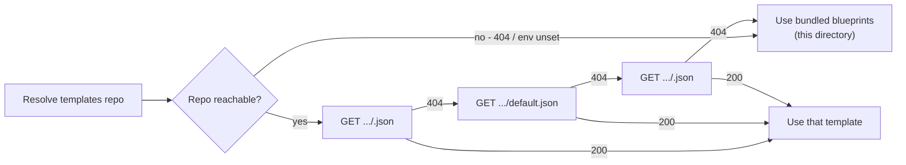

# Bundled project-template blueprints

**These files are last-resort fallbacks.** The agent prefers a
template fetched from the org's Artifactory templates repository
and falls back to one of the blueprints in this directory only
when no Artifactory templates repo is configured or every tier in
the fetch chain returns 404.

Read `../../references/project-templates-artifactory-repo.md` for
the discovery and fetch contract.

## Contents

- `schema.json` — JSON Schema (draft-07) used by the validate
  scripts in the `jfrog-project-creation` and
  `jfrog-project-repo-structure` workflow skills. The schema is the
  contract every template must satisfy whether it lives here or in
  Artifactory.
- `team-default.json` — single team, one workspace; OIDC optional;
  predefined roles. Smallest archetype.
- `enterprise-budget-id.json` — project key tied to an immutable
  budget identifier; central IdP holds membership; OIDC required;
  three-tier role split.
- `delegated-admin.json` — heavy delegation to application owners;
  groups-only membership; OIDC required.

## Treat as read-only reference patterns

The agent never edits these files on disk and never writes a
customised copy back to this directory. The workflow skills read
them as in-memory starting JSON when (and only when) the Artifactory
templates repo is unavailable.

If your org wants to customise the archetypes, do not edit them
here — copy them into your Artifactory templates repo and edit the
copies. See the *Seeding the Artifactory templates repo* section of
`../../references/project-templates-artifactory-repo.md`:

```sh
jf rt u team-default.json         project-templates-generic-local/team-default.json
jf rt u enterprise-budget-id.json project-templates-generic-local/enterprise-budget-id.json
jf rt u delegated-admin.json      project-templates-generic-local/delegated-admin.json
```

After the upload, the workflow skills will resolve them from
Artifactory; this directory becomes the safety net for environments
that haven't been seeded yet.

## When the bundled fallback is used



The agent reports which source resolved at the start of every
conversation so the user knows whether they are working from an
org-curated template or the bundled fallback.

## Updating the bundled blueprints

The blueprints will drift as JFrog publishes new best-practice
guidance. The contributor flow:

1. Update the bundled JSON here (this directory).
2. Bump `template_version` (semver). The apply script refuses any
   `template_version` whose major doesn't match `1.x`.
3. Update the doctrine references in `../../references/` if the
   change reflects new doctrine.
4. Note in the PR which archetype changed and why.

Orgs that have cloned these into Artifactory will see no automatic
update — they pull from their own copies. That is intentional: the
org's platform team decides when to adopt new defaults.
