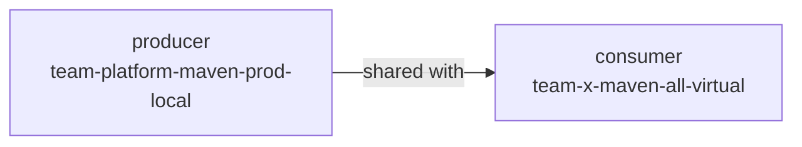
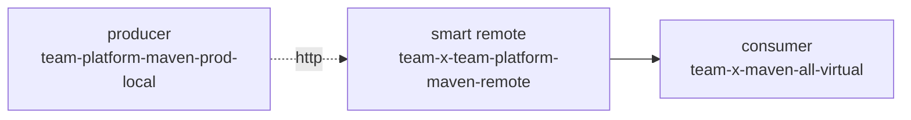

# JFrog Projects best practices — Phases 3+4 (repository structure and sharing)

When to read this file:

- Configuring repositories, stages, or virtual aggregators inside an
  existing project.
- Setting up the External-stage pattern for third-party packages.
- Sharing a project's repositories with another project, or consuming
  another project's repositories.
- Deciding between push (direct sharing) and pull (Smart Remote)
  collaboration.

This file is the doctrine consulted by the
[`jfrog-project-repo-structure`](../../jfrog-project-repo-structure/SKILL.md)
workflow skill. For Phase 1+2 (project entity, identity, OIDC) see
[`projects-best-practices.md`](projects-best-practices.md). For
endpoint-level call shapes see [`projects-api.md`](projects-api.md) and
[`artifactory-operations.md`](artifactory-operations.md).

Sources:
[Projects Setup Best Practices](https://docs.jfrog.com/projects/docs/projects-setup-best-practices),
[Repository naming convention](https://docs.jfrog.com/projects/docs/projects-repository-naming-convention),
[Aggregating repositories with virtual repositories](https://docs.jfrog.com/projects/docs/aggregating-repositories-with-virtual-repositories),
[Sharing repositories between projects](https://docs.jfrog.com/projects/docs/sharing-repositories-between-projects).

## Persona

Phase 1 and Phase 2 are **Platform Admin** work. Phase 3 and Phase 4 are
**Project Admin** work — they happen *inside* a project once the entity
exists. The Platform Admin's role here is to grant Project-Admin scope
and step away. A Platform Admin can still execute Phase 3+4 directly
(superset of permissions); the skill accepts both.

## Phase 3 — Repository structure

Performed by the **Project Admin** once the project entity exists.
Decisions made here determine how the team consumes packages, where
artifacts are promoted, and how external dependencies enter the
platform.

### Technology scoping (one repo set per package type)

A project rarely uses one package type. The standard pattern is **one
repository set per technology**:

- Maven, npm, PyPI, Docker, Go, NuGet, Helm, Conan, generic, etc.
- Each tech gets its own local/remote/virtual triplet — no kitchen-sink
  repository that mixes types.

Why: package managers expect tech-specific layouts. A `maven` virtual
cannot resolve npm metadata. Mixing also breaks per-tech storage
reporting and curation policies.

### SDLC stages

Stages are the project's **environment list** (in JFrog terminology) —
they are how RBAC is granted and how artifacts are promoted. Default
recommendation:

| Stage      | Purpose                                                              | Typical RBAC                           |
| ---------- | -------------------------------------------------------------------- | -------------------------------------- |
| `DEV`      | Day-to-day development artifacts                                     | Developer: read+write                  |
| `QA`       | Optional. Pre-release validation                                     | Developer: read; Release Manager: r+w  |
| `PROD`     | Releasable, immutable                                                | Developer: read; Release Manager: r+w  |
| `External` | Third-party / upstream packages cached through proxy / remote repos  | Developer: read+write (cache only)     |

Project Admins can rename, drop `QA`, or add stages (`STAGING`,
`HOTFIX`, etc.). Three constraints:

1. **Names are uppercase** by convention (the platform is case-sensitive
   here; mixed case works but breaks parity with `jf api` defaults).
2. **`PROD` is mandatory** (it is also the implicit destination for
   release-bundle promotion).
3. **`External` is strongly recommended** even for projects that don't
   plan to use third-party packages today — it is the only place where
   developers should have write access to remote-cached content. Adding
   it later is non-trivial because it is intertwined with RBAC.

### The four-part repository naming convention

Every repository inside a project follows:

```
<project_key>-<tech>-<maturity>-<locator>
```

| Part          | Allowed values                                        | Notes                                    |
| ------------- | ----------------------------------------------------- | ---------------------------------------- |
| `project_key` | as defined in Phase 1                                 | immutable; the prefix every repo carries |
| `tech`        | `maven`, `npm`, `pypi`, `docker`, `go`, `helm`, ...   | lower-case, no version suffixes          |
| `maturity`    | `dev`, `qa`, `prod`, `external`, ...                  | matches a stage, lower-case              |
| `locator`     | `local` \| `remote` \| `virtual`                      | matches Artifactory's repo-type concept  |

Examples for `project_key = team-x`:

```
team-x-maven-dev-local
team-x-maven-prod-local
team-x-maven-external-remote
team-x-maven-all-virtual
team-x-npm-dev-local
team-x-docker-prod-local
```

The convention is **doctrine, not API-enforced** — Artifactory will
accept any repo name. Convention violations should:

- Warn (not block) by default — many projects have legacy repos.
- Block (`--strict-naming`) in CI gates and on greenfield projects.

The validator emits the diagnostic `convention_violation: <repo>` for
each mismatch, with a suggested 4-part name.

### Per-tech repository blueprint

For each declared technology, the standard set is:

- One **local** per stage, e.g. `team-x-maven-dev-local`,
  `team-x-maven-qa-local`, `team-x-maven-prod-local`.
- Exactly one **remote** on the External stage, with the canonical
  upstream URL preconfigured per tech (Maven Central, npm registry,
  PyPI, etc.). Always proxy upstream; never let developers point to
  their own remotes ad-hoc.
- One **virtual** that aggregates all of the above with explicit
  resolution order. Developers point their package manager at this one
  URL and never touch the locals or remotes directly.

Project Admins can collapse or expand this blueprint — the doctrine is
the *shape*, not a fixed count.

### Virtual aggregator with explicit resolution order

The virtual repository is the single resolution endpoint developers
touch. The recommended order is:

```
prod  →  dev  →  external  →  smart-remotes  (if any)
```

Rationale:

- `prod` first so released artifacts shadow in-progress versions if a
  version collision happens.
- `dev` second so day-to-day work resolves locally.
- `external` last among internal repos so an internal artifact always
  wins over the same coordinate from a public source (supply-chain
  defence).
- Smart-remote consumers (Phase 4) trail at the end.

The apply script never relies on the insertion order of the
`repositories[]` field on the virtual config — it always rewrites the
field with the explicit order from the template.

### External-stage RBAC pattern

This is the rule that makes the External stage useful as a supply-chain
boundary:

| Role                | Internal stages (DEV / QA / PROD) | External stage   |
| ------------------- | --------------------------------- | ---------------- |
| Developer           | read                              | read + write     |
| Release Manager     | read + write                      | read             |
| Security Manager    | read                              | read             |
| Project Admin       | read + write                      | read + write     |

Why developers get write on External: pulling a new public package the
first time triggers a cache write into the remote repo. If developers
have no write here, the cache fails and developers are blocked. If
developers have write on internal stages, they can bypass the External
flow by hand-uploading a malicious package that masquerades as a
dependency. The External stage is the only place this is acceptable.

### Common Phase 3 anti-patterns

- **A single `prod` local for all tech.** Defeats per-tech tooling and
  policy. Always one repo set per tech.
- **No External stage.** Forces developers to either lose access to
  third-party packages or get write on internal stages.
- **Implicit virtual ordering.** Insertion order is fragile across
  re-deploys; always set `repositories[]` explicitly.
- **Naming-prefix-only convention enforcement.** Rely on the
  `project=<key>` query parameter for project membership, not on the
  prefix. The 4-part rule is for *human* readability and tooling
  hooks, not platform-side enforcement.
- **Renaming an existing repo to fit the convention.** Renames break
  every consumer. Use `name_override` in the template to mark a
  legacy name as accepted-as-is, or migrate via dual-publish, never
  via in-place rename.

### Verifying Phase 3 apply

After the apply script runs:

- `GET /artifactory/api/repositories?project=<key>` lists every repo
  declared in the template, with the right `type` and `packageType`.
- Each virtual's `repositories[]` matches the declared
  `resolution_order[]` exactly.
- Each remote's `url` matches the canonical upstream for its tech.
- Member roles reflect the External-stage RBAC table above.
- `bash -n` on the apply script and `jq -e .` on the emitted outcome
  JSON pass.

## Phase 4 — Cross-project sharing

When teams need to consume each other's artifacts, JFrog offers two
patterns. They are not interchangeable; pick per consumer.

### Direct sharing (push)

The producer marks one of its locals (typically the `prod` local) as
**Shared** with one or more consumer projects. The consumer adds the
shared repo directly into its own virtual aggregator's
`repositories[]`. Resolution is live — the consumer always sees the
producer's current state.



Properties:

- **Producer-controlled lifecycle.** If the producer deletes the repo
  or revokes the share, the consumer loses access immediately.
- **Live resolution.** No caching layer — consumer's resolution is the
  producer's state at request time.
- **Best for:** tightly-coupled internal teams (platform team and its
  internal consumers, monorepo-adjacent projects).

API shape:

```bash
# Producer side: mark repo as shared with target projects
jf api /access/api/v1/projects/<producer-key>/share/repos \
  -X POST -H "Content-Type: application/json" \
  -d '{"repository": "<repo>", "target_projects": ["<consumer-key>"]}'
```

```bash
# Consumer side: add producer's repo to consumer's virtual
jf api /artifactory/api/repositories/<consumer-virtual> \
  -X POST -H "Content-Type: application/json" \
  -d '{"repositories": ["...existing...", "<producer-shared-repo>"]}'
```

The exact endpoint shape for the share-with-projects flag has changed
across platform versions — always GET the producer's repo config first
and compute the diff.

### Smart Remote (pull)

The consumer creates a **smart remote** repository that points at the
producer's URL. Artifactory caches what the consumer pulls; the
consumer's cache is independent of the producer.



Properties:

- **Consumer-controlled lifecycle.** Producer-side deletion does not
  immediately break consumer (cached artifacts remain).
- **Cached resolution.** Consumer pays a small storage cost; gets
  deterministic builds even during producer outages.
- **Best for:** stricter segregation, contractual independence, or
  cross-org boundaries.

The smart-remote URL is the producer's repository URL on the JFrog
platform. Authentication uses the consumer's machine identity (a
project access token or OIDC mapping) — never the producer's token.

### Read-only consumer rule

**Regardless of method, the consumer must hold read-only permission on
the producer's assets.** This rule has two enforcement points:

1. The producer's share/grant call should specify only read actions for
   the consumer project. If the producer's call would grant write to
   the consumer, the apply script refuses to apply that sharing entry
   (`error: writer_grant_cross_project`).
2. The consumer's virtual aggregator references the producer's repo,
   never an alias that would expose write paths.

### Picking between push and pull

| Question                                               | Push (direct) | Pull (smart remote) |
| ------------------------------------------------------ | ------------- | ------------------- |
| Should consumer survive producer outages?              |       no      |        yes          |
| Should consumer always see producer's latest state?    |      yes      |        no           |
| Is the producer's project run by a different org/team? |       no      |        yes          |
| Should consumer pay no extra storage?                  |      yes      |        no           |
| Will the producer's repo be deleted/replaced often?    |       no      |        yes          |

Most internal-platform → internal-team sharing is push. Most
cross-org or cross-cluster sharing is pull.

### Common Phase 4 anti-patterns

- **Granting write cross-project.** Removes the supply-chain
  boundary. Always read-only.
- **Hard-coding producer credentials in the smart-remote.** Use the
  consumer project's machine identity.
- **Sharing an `external-remote` repo.** That repo is already a proxy;
  re-sharing creates a chain that breaks credential trust. Share the
  producer's `prod-local` instead.
- **Sharing a `dev-local` for external consumption.** Dev artifacts
  are not stable. Share `prod-local` only.

### Verifying Phase 4 apply

- For each producer entry: the producer repo's config shows the target
  consumer projects in the share list.
- For each consumer entry (direct): the consumer's virtual aggregator
  includes the producer's repo with read-only effective permission.
- For each consumer entry (smart remote): the consumer-side smart
  remote exists, points at the producer's URL, and has read-only
  effective consumer permission.
- No sharing entry grants write cross-project (the apply script's
  audit is part of its outcome JSON).

## Further reading

- [`projects-best-practices.md`](projects-best-practices.md) —
  Phases 1+2 doctrine.
- [`projects-api.md`](projects-api.md) — endpoint reference for
  project repo-assignment, environments, and roles.
- [`artifactory-operations.md`](artifactory-operations.md) — repo
  CRUD primitives the apply script wraps.
- [Sharing repositories between projects](https://docs.jfrog.com/projects/docs/sharing-repositories-between-projects)
  — the canonical source for Phase 4 endpoint behaviour.
