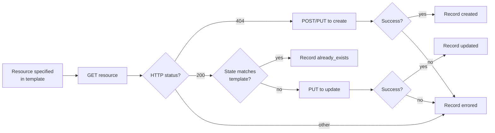

# Project skills — verification and idempotency contract

Shared by both `jfrog-project-creation` and
`jfrog-project-repo-structure`. What the apply scripts guarantee,
what the agent should check after a run, and how to recover from
partial failures.

v2 invariants:

- Input flows via stdin or `--template-url`. The agent never writes a
  template file to disk.
- All output is on stdout as a single JSON document.
- Mutations are GET-before-PUT/POST per resource; re-running the
  same JSON is always safe.

## Idempotency contract (per resource)

Every resource the apply scripts touch follows the same state
machine:



`status` values written to the outcome JSON: `created`, `updated`,
`already_exists`, `skipped`, `errored`.

### Special cases — creation

- **PREDEFINED roles** are skipped at the create step (the platform
  ships them) but used at the member-assignment step. Outcome:
  `skipped` with `note: predefined`.
- **Missing platform principals** (group/user does not exist) are
  recorded as `skipped` with `error: principal_missing`. The script
  never creates users or groups.
- **`project_key` mismatch** between template and live project is a
  hard stop: outcome `skipped` with `error: key_mismatch`. The
  script never deletes a project to recreate it.

### Special cases — repo structure

- **Project assignment mismatch:** a pre-existing repo whose
  `projectKey` doesn't match the template is `errored` with
  `error: project_assignment_mismatch`. The script never silently
  reassigns repos across projects.
- **Sharing:** PUT or DELETE only the diff against
  `GET /access/api/v1/projects/<key>/share/repositories`. The script
  never deletes shares the template doesn't mention.
- **External-stage RBAC:** action vocabulary is fetched live from
  the platform when present; on older platforms the script falls
  back to a documented set and records a warning.

### Permission errors

**403 from the platform** (caller lacks rights) surfaces as
`errored` on the offending resource. The script does not retry,
does not fall back to a different server, and does not try a weaker
operation. The agent reports the 403 verbatim.

## Outcome JSON shape (stdout)

A single JSON document. Re-read the captured value instead of
re-running the script.

```json
{
  "schema_version": "2.0",
  "input_source": "stdin",
  "template_url": null,
  "template_version": "1.0",
  "blueprint": "team-default",
  "project_key": "team-x",
  "server_id": "mycompany",
  "dry_run": false,
  "audit": false,
  "started_at": "2026-05-11T12:34:56Z",
  "finished_at": "2026-05-11T12:35:18Z",
  "summary": { "created": 5, "already_exists": 3, "updated": 1, "skipped": 0, "errored": 0 },
  "resources": [
    { "kind": "project",           "key": "team-x",                          "status": "created" },
    { "kind": "role",              "key": "Developer",                       "status": "skipped",        "note": "predefined" },
    { "kind": "member.group",      "key": "team-x-developers",               "status": "already_exists" },
    { "kind": "oidc_provider",     "key": "github-mycompany",                "status": "updated" },
    { "kind": "identity_mapping",  "key": "github-mycompany/main-deploy",    "status": "created" },
    { "kind": "environment",       "key": "External",                        "status": "created" },
    { "kind": "repo.local",        "key": "team-x-maven-prod-local",         "status": "created" },
    { "kind": "repo.virtual",      "key": "team-x-maven-all-virtual",        "status": "created" },
    { "kind": "share.producer",    "key": "team-x-maven-prod-local->team-y", "status": "created" }
  ],
  "warnings": [],
  "errors": []
}
```

`kind` values produced by the creation apply script: `project`,
`role`, `member.user`, `member.group`, `oidc_provider`,
`identity_mapping`, `audit`.

`kind` values produced by the repo-structure apply script:
`environment`, `repo.local`, `repo.remote`, `repo.virtual`,
`external_rbac`, `share.producer`, `share.consumer`, `audit`.

`errored` entries carry an `error` field with the upstream status
code and short message.

`input_source` is `stdin` or `template-url`. With `--template-url`
the URL is also recorded (no credentials embedded).

`audit: true` indicates `--audit` was set; on success the script
PUTs a copy of the input to
`/artifactory/<templates-repo>/applied/<project-key>-<iso8601>.json`
(or `-repos-<iso8601>.json` for the repo-structure script). Audit
upload failures are reported as warnings, not errors.

## Re-applying

Both apply scripts are safe to re-run with the same JSON:

- Resources that succeeded the first time report `already_exists`.
- A field edited between runs reports `updated` only for the
  changed resource.
- The scripts never delete resources the template doesn't
  explicitly mark for deletion.

## Recovery patterns

### "Group or user does not exist on the platform"

`skipped` with `error: principal_missing`. Either create the
principal outside this skill (Platform Admin operation on the IdP
or via `/access/api/v2/groups` / `/access/api/v2/users`) and
re-pipe the unchanged JSON, or drop the reference from the
in-memory JSON and re-pipe.

### "OIDC provider already exists with a different config"

`errored` with `error: provider_conflict`. The user picks: update
in place (re-pipe with the new config; the script PUTs) or rename
the provider in the template. Platform-scoped providers are never
auto-replaced.

### "Identity mapping payload rejected"

Payload shape varies by platform version; the outcome JSON
includes the rejection body verbatim. Compare against
[`oidc-integration.md`](oidc-integration.md) for the current
shape, edit the JSON, re-pipe.

### "Repository name violates the four-part convention"

Default: warning. With `--strict-naming`: `errored`. Fix the names
and re-pipe, or accept the warning. The script will not rename
existing repositories.

### "Repo exists but belongs to a different project"

`errored` with `error: project_assignment_mismatch`. Delete the
repo manually and re-run, or pick a different name in the
template.

### "Sharing entry rejected — consumer would have write access"

`errored` with `error: cross_project_write_forbidden`. Edit the
consumer's roles to read-only on the producer's stage; re-pipe.

### "Virtual aggregator order conflicts with doctrine"

Apply succeeds; agent warns. Optional fix: edit `resolution_order`
in the template and re-pipe — the virtual is `updated`.

### "Action vocabulary mismatch on External-stage RBAC"

`warnings[]` carries one entry per unknown action. The script
applies what it recognises and skips the rest. Fetch the live
vocabulary from the platform and update the template if needed.

## Bundled fallback path

When the agent used the bundled blueprints (no Artifactory
templates repo resolved), verification is identical. The only
difference is no Artifactory record of the input — opt into
`--audit` on the next apply for a durable record, or upload the
final JSON to the templates repo manually.

## Shared gotchas

These apply to both `jfrog-project-creation` and
`jfrog-project-repo-structure`; the workflow SKILL.mds carry only
their skill-specific gotchas and point here for the rest.

- **Cross-call shell PIDs differ.** Save and echo temp file paths
  per the base SKILL.md *Preserving command output* pattern when
  handing state between Shell calls.
- **Permissions errors come from the platform, not from the
  skill.** Neither apply script probes caller permissions; a 403
  from the platform is recorded `errored` on the offending resource
  and surfaced verbatim. Do not add a `system/permissions`
  preflight to either agent flow.
- **OIDC provider is platform-scoped.** Two projects sharing the
  same GitHub org typically share one provider; the creation apply
  script checks for an existing provider with the same name before
  creating and adds new identity mappings non-destructively.
  Identity-mapping scopes can still be project-specific.
- **`--audit` is opt-in.** Off by default. When set, a successful
  apply PUTs a copy of the input to
  `/artifactory/<templates-repo>/applied/<key>-<ts>.json` (or
  `-repos-<ts>.json` for repo-structure). Audit upload failures are
  warnings, not errors.
- **Test data hygiene.** Every example, comment, and prompt uses
  generic placeholder names (`mycompany.jfrog.io`, `team-x`,
  `team-y`, `app-04217`, `fin-1042`). Do not introduce real
  customer or internal names.
